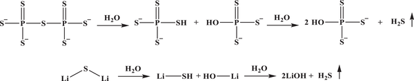

1 Introduction
--------------

The worldwide decarbonization revolution continues to drive the construction of renewable energy networks in modern life. Li-ion batteries (LIBs), as the predominant electrochemical energy storage technology, have been expanded for deployment into emerging decarbonized areas such as transportation electrification and grid-scale energy storage systems, where higher energy density and safer power sources are desired. However, owing to the intrinsic constraints imposed by material chemistry, existing commercial LIBs incorporating transition metal oxide cathodes and graphite anodes are approaching their upper limit of theoretical energy density, which causes “range anxiety” in electric vehicle (EV) application scenarios. Meanwhile, the flammable organic liquid electrolytes are leakage-prone and pose formidable safety concerns, such as ignition and explosion. Thus, for widespread market penetration, there are urgent demands for constant innovation toward next-generation energy storage devices with increasing energy density (>350 Wh kg−1) and safety.

All-solid-state lithium batteries (ASSLBs) that employ a solid electrolyte (SE) supplanting organic liquid electrolytes have attracted intensive attention as alternative post-LIBs. The non-flammable nature of SEs endows batteries with intrinsic safety and allows them to operate more efficiently at elevated temperatures. Besides, the resulting ASSLBs could offer substantially increased energy density by enabling the combination of high-specific-energy lithium (Li)-metal anodes (3860 mAh g−1) and prevalent high-voltage layered oxide cathodes (LiNiaCobMncO2, a+b+c = 1; NCM-abc). Other benefits, such as simplified and flexible packing design, are also considered potential approaches that promise a stepwise improvement in energy density and safety.

SEs lie at the heart of the ASSLB technology, serving as the medium of ion transport across the whole battery system. Up to now, various types of SEs have been explored and could be classified into two categories: polymer and inorganic SEs, while inorganic SEs can be further divided into oxide-, sulfide-, and halide- based SEs. The pros and cons of different SEs have been well covered in the previous reviews. Among these SE candidates, sulfide-based SE displays the significant advantage of combining high ionic conductivity with favorable mechanical deformability, allowing ASSLBs to operate efficiently over wider temperature ranges after a simple cold-pressing procedure. In particular, some newly discovered materials (e.g., Li10GeP2S12and Li9.54Si1.74P1.44S11.7Cl0.3) show ultrahigh ionic conductivity reaching 10−2 S cm−1 competitive with the level of liquid electrolytes, which has propelled many companies in the automobile and battery industries to draw up blueprints for sulfide-based ASSLBs.

Despite breakthroughs in solid-state ionics, the widespread adoption of sulfide SEs to accommodate the growing demands of the battery manufacturing industry is still marred by difficulties. At present, because of mechanical limitations of sulfide materials and noncommittal processing protocols, lab-level sulfide-based ASSLBs are typically fabricated as a pellet-type configuration with a thick (>200 µm) and small (≈1.5 cm2) SE separator that aims to understand and evaluate material chemistries. Based on this configuration, significant efforts are being directed toward addressing numerous interfacial instability issues (e.g., chemical degradation, mechanical failure, dendrite evolution, etc.) to decrease internal resistance, and significant progress has been made in this regard. From a scalable manufacturing perspective, this protocol is difficult to scale up because its bulky cell configuration and time-consuming processes lead to below-par energy density (<100 Wh kg−1) and expensive production costs. Instead, to achieve the scalable application of sulfide-based ASSLBs in the near term, it is therefore crucial to integrate sulfide-based SE membranes of close thickness as the polymeric separators utilized in conventional LIBs, while processing them via a cost-effective protocol. The manufacturing process for sulfide-based SE membranes is expected to be compatible with existing methodology in the conventional LIB industry involving slot die coating and roll-to-roll processes, which allows the ASSLB configuration to transition from pellet to sheet and achieve competitive energy density at a reasonable cost via feasible technology.

Nonetheless, the implementation of scalable and manufacturable thin SE membranes throughout the whole manufacturing chain confronts several practical challenges, violating their original intention of cost-effective processing and energy-dense integration. First, the low-throughput synthesis and air-sensitive nature of sulfide SEs restrict their availability as the feedstock material for SE membranes, hence providing a significant source of cost and processing uncertainty. Second, sulfide SEs have limited chemical compatibility with potent solvents and binders due to unique thiophosphate chemistry, which raises issues surrounding the screening of exact and effective solvent–binder pairs to fabricate high-quality thin SE membranes. Third, various compatibility issues at electrode/SE interfaces and uncertain cell fabrication processes complicate the energy-dense integration of sulfide SE membranes into practical large-format ASSLBs. As a result, the collective effects and trade-offs of these major impediments lead to a wide gulf between the reality and the promise of sulfide-based SE membranes.

In this review, we begin by introducing the history and development of sulfide-based SE materials. Then, based on the energy-dense and techno-economic-efficient considerations, we expound on why implementing a thin membrane-based separator is the priority for scalable production of ASSLBs and identify critical criteria for capturing a high-quality thin sulfide SE membrane in the context of high-throughput manufacturing. Following that, we extensively discuss challenges and associated strategies for achieving these criteria throughout the whole manufacturing chain that covers the aspects of material availability, membrane processing, and cell integration, as displayed in Figure . Finally, the future research directions of sulfide-based SE membranes applied to ASSLBs are outlined.

Figure 1

A systematic overview of the challenges and related strategies for large-scale preparation of membrane-based all-solid-state cells in terms of material availability, membrane processing, and cell integration.

2 Sulfide-Based Solid Electrolyte
---------------------------------

### 2.1 History

Historically, the development of inorganic solid-state ion conductors could be dated back to the 1960s, when β-Al2O3was proposed as the electrolyte in sodium–sulfur batteries. Since then, Li3N, Li3PO4, LiI, etc., have been thoroughly studied as Li+ ionic conductors. In 1973, it was found that incorporating Al2O3into LiI could significantly enhance its ionic conductivity. Subsequently, the usage of additives became prevalent to boost the ionic conductivity of Li+ ionic conductors. Following this principle, the starting study on sulfide SEs emerged in the 1980s, principally concentrating on glassy multicomponent systems (i.e., Li2S–GeS2, Li2S–SiS2, Li2S–P2S5–LiI), which commonly displayed an ionic conductivity about 10−4 S cm−1 at room temperature (RT) (Figure ). The research on sulfide-based SEs slowed down in the following decade along with the commercialization of LIBs. Fortunately, the first crystalline sulfide SEs of Li3.25Ge0.25P0.7S4with an ionic conductivity of 2.2 × 10−3 S cm−l was discovered by Prof. Kanno's group in 2001, sparking a revival of interest in developing sulfide SEs. This material and its analogs are referred to as “thio-LISICON” because the anion packing is similar to that of a LISICON-type γ-Li3PO4material. Besides, the partial crystalline phase of Li7P3S11with a conductivity of 3.2 × 10−3 S cm−l was identified from the glassy Li2S–P2S5system by Tatsumisago et al. in 2005, pioneering a brand-new class of research on glass-ceramic sulfide SEs. Afterward, inspired by the argyrodite-type ion conductor of Ag8GeS6with a high Ag+ ionic conductivity and mobility, lithium argyrodite Li6PS5X (X = Cl, Br, I) was first reported by Deiseroth et al. in 2008, as another family of superionic crystals. Among them, Li6PS5Cl presented the highest ionic conductivity of 4.96 × 10−3 S cm−l by routine solid-state reaction methods.

Figure 2

Chronological history of developments in sulfide ionic conductors. Room-temperature conductivity and publication year are indicated for representative material groups.

In succession, the exploration of sulfide SEs advanced to the 10−3 S cm−1 era to align the ionic conductivity benchmark of organic liquid electrolytes. In 2011, the discovery of superionic Li10GeP2S12SEs by Kanno et al. was considered a milestone in the development of Li+ ionic conductors, as its ultrahigh ionic conductivity of 1.2 × 10−2 S cm−1 at RT, a level comparable to or even exceeding that of the conventional aprotic electrolytes in state-of-the-art LIBs. This groundbreaking discovery greatly pushed the exploration of superionic crystals to a climax and therefore boosted them going through a period of rapid development. In 2014, Tatsumisago et al. further raised the ionic conductivity of the Li7P3S11SEs to 1.7 × 10−2 S cm−l by optimizing the heat-treatment procedure. Impressively, the Li7P3S11glass-ceramic electrolyte synthesized from acetonitrile (ACN) by the liquid-phase approach exhibited a high ionic conductivity close to 10−3 S cm−1 at RT. In addition, with continuous efforts devoted by Kanno et al., Li9.54Si1.74P1.44S11.7Cl0.3superionic crystal was reported in 2016, which displayed the highest ionic conductivity among existing SEs (2.5 × 10−2 S cm−l). Additionally, Iwasaki et al. observed that single-crystal Li10GeP2S12displayed an ultrahigh ionic conductivity of 2.7 × 10−2 S cm−l in the direction. Furthermore, the argyrodite-based SEs have also made tremendous progress in conductivity. In 2019, Nazar et al. reported a chlorine-rich lithium argyrodite Li5.5PS4.5Cl1.5exhibiting an ionic conductivity of 1.2 × 10−2 S cm−l on sintering, which was comparable to metastable superionic Li7P3S11under identical processing conditions. Furthermore, halide-rich argyrodites Li5.5PS4.5Cl1.5prepared from a mixture solvent of THF/ethanol showed ionic conductivity up to 3.9 × 10−3 S cm−1. Based on the halide-rich structure, Patel. et al. reported a mixed-halide argyrodite Li6−xPS5−xClBrx(0 ≤ x ≤0.8) with an exceedingly high ionic conductivity of 2.4 × 10−2 S cm−1 via tuning Li+ transport. Remarkably, a novel family of argyrodite lithium superionic conductors (Li6+xMxSb1−xS5I (M = Si, Ge, Sn)) was discovered by Nazar et al., which presented a high ionic conductivity of 1.48 × 10−2 S cm−1 for cold-pressed pellets and 2.4 × 10−2 S cm−1 for sintered pellets. In addition, several promising lithium argyrodites, such as Li6.75Sb0.25Si0.75S5I (1.31 × 10−2 S cm−1), Li6.5Sb0.5Ge0.5S5I (1.61 × 10−2 S cm−1), and Li5.35Ca0.1PS4.5Cl1.55(1.02 × 10−2 S cm−1), and LGPS-type sulfide SEs, such as Li10.35Ge1.35P1.65S12(1.42 × 10−2 S cm−1), Li10Ge(Sb0.075P0.925)2S12(1.73 × 10−2 S cm−1), were demonstrated with an ultrahigh conductivity surpassing 10−2 S cm−1.

### 2.2 Classification and Structure

Based on the above-mentioned key events representing breakthroughs in sulfide-based ionic conductors, a series of subsequent studies on exploratory synthesis for their derivatives have been spurred. Consequently, the sulfide SEs family has grown substantially and can be classified into five types according to their crystalline state and specific crystal structure, including glasses, glass-ceramic,thio-LISICON, LGPS-type, and argyrodite‑type. And the crystal structures of some typical sulfide SEs are shown in Figure . This section highlights the current progress of various sulfide SEs and summarizes the relevant characteristic parameters in Table .

Figure 3

The main category of sulfide SEs and the crystal structure of their typical examples. A) Glass-ceramic: crystal structure of the Li7P3S11. B)Thio-LISICON: crystal structure of the Li4GeS4. C) LGPS-type: crystal structure of the Li10GeP2S12. D) Argyrodite-type: crystal structure of the Li6PS5Cl.

Table 1.
 Summary of the characteristic parameters of the representative sulfide SEs.

| Category | Electrolyte | Conductivity | Activation energy | Features | Reference |
| --- | --- | --- | --- | --- | --- |
| Glasses | 50Li2S–50GeS2 | 0.04 | 0.51 eV | – |  |
|  | 60Li2S–40SiS2 | 0.5 | 0.25 eV | – |  |
|  | 60Li2S–40SiS2 | 0.15 | 30 kJ mol−1 | Mechanochemical synthesis |  |
|  | 75Li2S–25P2S5 | 0.2 | 34 kJ mol−1 | – |  |
|  | 37Li2S–18P2S5–45LiI | 1 | 30 kJ mol−1 | Melt-quenching |  |
|  | 30Li2S-26B2S5–44LiI | 1.7 | 0.30 eV | – |  |
|  | 36Li2S–24SiS2–40LiI | 1.8 | 0.28 eV | – |  |
|  | 63Li2S–36.5SiS2–1Li3PO4 | 1.5 | 0.30 eV | – |  |
|  | 57Li2S–38SiS2–5Li4SiO4 | 2 | 36 kJ mol−1 | – |  |
|  | 22.5Li2S–22.5GeS2–5Ga2S3-50LiI | 1.7 | 30 kJ mol−1 | – |  |
| Glass ceramic | 70Li2S–30P2S5 | 3.2 | 12 kJ mol−1 | Quenching |  |
|  | 70Li2S–30P2S5 | 17 | 17 kJ mol−1 | Quenching and hot pressing |  |
|  | Li7P3S11 | 0.27 | N/A | Prepared in DME solvent |  |
|  | Li7P3S11 | 0.97 | 31.2 kJ mol−1 | Prepared in ACN solvent |  |
|  | 70Li2S–30P2S5 | 11.6 | N/A | Spark-plasma sintering |  |
|  | Li7P2.9Ce0.2S10.9Cl0.3 | 3.2 | 21.2 kJ mol−1 | – |  |
|  | Li7P2.9S10.85Mo0.01 | 4.8 | 22.7 kJ mol−1 | – |  |
|  | Li7P2.9Mn0.1S10.7I0.3 | 5.6 | 20.8 kJ mol−1 | – |  |
|  | 70Li2S–27P2S5–3P2O5 | 4.6 | N/A | – |  |
|  | 70Li2S–29P2S5–1Li3PO4 | 1.87 | 18 kJ mol−1 | – |  |
|  | 98(70Li2S–30P2S5)–2GeS2 | 5.4 | N/A | – |  |
| Thio-LISICON | Li4GeS4 | 0.0002 | N/A | – |  |
|  | Li3.25Ge0.25P0.75S4 | 2.2 | 20 kJ mol−1 | Highest ionic conductivity ofthio-LISICON SEs |  |
|  | Li3.4Si0.4P0.6S4 | 0.64 | 27.6 kJ mol−1 | – |  |
|  | Li3.325P0.935S4 | 0.15 | 22 kJ mol−1 | – |  |
|  | Li3PS4 | 0.003 | 0.49 eV | – |  |
|  | β‑Li3PS4 | 0.16 | 0.36 eV | Prepared in THF solvent |  |
|  | Li4SnS4 | 0.07 | 0.41 eV | Prepared in H2O and MeOH solvents |  |
|  | 0.4LiI–0.6Li4SnS4 | 0.41 | 42 kJ mol−1 | – |  |
|  | Li3.833Sn0.833As0.166S4 | 1.39 | 0.21 eV | – |  |
|  | Li3.85Sn0.85Sb0.15S4 | 0.85 | 0.50 eV | – |  |
| LGPS-type | Li10GeP2S12 | 12 | 0.25 eV | First report of LGPS structure |  |
|  | Li10GeP2S12single crystal | 27  7 | 0.30 eV | Ultrahigh diffusion path |  |
|  | Li10GeP2S12 | 0.74 | N/A | Prepared in EDA–EDT solvents |  |
|  | Li10SnP2S12 | 4 | 0.60 eV | Reduce material cost |  |
|  | Li10SiP2S12 | 2.3 | 0.20 eV | – |  |
|  | Li10Si0.3Sn0.7P2S12 | 8 | 0.29 eV | – |  |
|  | Li11Si2PS12 | >12 | 0.19 eV | High-pressure synthesis |  |
|  | Li10.35Ge1.35P1.65S12 | 14.2 | 26 kJ mol−1 | – |  |
|  | Li10Ge(Sb0.075P0.925)2S12 | 17.3 | 0.27 eV | – |  |
|  | Li10GeP2S11.4O0.6 | 8.4 | 21 KJ mol−1 | – |  |
|  | Li10SiP2S11.3O0.7 | 3.1 | 31 kJ mol−1 | – |  |
|  | Li9.54Si1.74P1.44S11.7Cl0.3 | 25 | 23 kJ mol−1 | The highest ionic conductivity of sulfide SEs |  |
| Argyrodite-type | Li7PS6 | 0.0016 | 0.16 eV | – |  |
|  | Li6PS5Cl | 1.9 | 0.22 eV | – |  |
|  | Li6PS5Br | 6.8 | 0.27 eV | – |  |
|  | Li6PS5I | 0.00046 | 0.32 eV | – |  |
|  | Li6PS5Cl | 4.7 | 0.33 eV | Solid-state reaction |  |
|  | Li6PS5Cl | 0.014 | 33 kJ mol−1 | Prepared in EtOH solvents |  |
|  | Li5.5PS4.5Cl1.5 | 9.4 | 0.29 eV | Halide-rich SEs |  |
|  | Li5.5PS4.5Cl1.5 | 3.9 | N/A | prepared in THF/ethanol solvents |  |
|  | Li6PS5Cl0.5Br0.5 | 3.9 | N/A | Prepared in THF/ethanol solvents |  |
|  | Li5.3PS4.3Cl1.7 | 17 | 0.22 eV | – |  |
|  | Li5.3PS4.3ClBr0.7 | 24 | 0.16 | Mixed-halide SEs |  |
|  | Li5.35Ca0.1PS4.5Cl1.55 | 10.2 | 0.30 eV | – |  |
|  | Li6.6Ge0.6P0.4S5I | 5.4 | 0.23 eV | Ge-substituted Li6PS5I phase |  |
|  | Li6.6Si0.6Sb0.4S5I | 14.8 | 0.25 eV | – |  |
|  | Li6.75Si0.75Sb0.25S5I | 13.1 | 0.17 eV | – |  |
|  | Li6.5Ge0.5Sb0.5S5I | 16.1 | 0.18 eV | – |  |

#### 2.2.1 Glasses

In general, the basic structure of glass sulfide systems consists of network modifier Li2S plus glass formers, such as GeS2, SiS2, B2S3, P2S5, etc. These glass sulfide SEs commonly possess a more open structure and a larger free volume than their corresponding crystalline counterparts, thereby eliminating the grain boundary impedance to enhance Li+ transport. The maximum ionic conductivity of this type of SEs is in the order of 10−3 S cm−1 since the 1980s. Besides, the isotropic structure and conduction of amorphous glasses facilitate modification by allowing for a variety of composition ranges. For example, in the widely studied pseudo-binaryxLi2S·(100−x)P2S5systems, the different Li2S content accounts for different building blocks. The di-tetrahedral P2S74− units and mono-tetrahedral PS43− units dominate the glass phase with lower and higher Li2S contents, respectively (Figure ).

Figure 4

A) Raman and 31P MAS NMR spectra, and main P–S polyhedral with different Li2S content in (Li2S)x(P2S5)100−xglasses. Reproduced with permission. Copyright 2017, Royal Society of Chemistry. B) SEM images and complex impedance plots at −35 °C of the 70Li2S–30P2S5glass-ceramic material from a cold-pressed sample and the heat-treated sample. Reproduced with permission. Copyright 2014, Royal Society of Chemistry. C) Framework structure and conduction pathways of Li ions. Reproduced with permission. Copyright 2011, Springer Nature. D) Photograph of typical LGPS crystals of a few millimeters in size and schematic drawing illustrating the possible conducting paths of Li ions in LGPS. Reproduced with permission. Copyright 2019, American Chemical Society. E) Li diffusion analyzed Li6−xPS5−xClBrx(x= 0, 0.50, and 0.75) using AIMD simulations. Reproduced with permission. Copyright 2021, American Chemical Society.

As the ion transfer kinetics is highly correlated to the concentration and mobility of the charge carriers in the glassy structure, doping glass matrix with halide salts (e.g., LiCl, LiBr, LiI) and lithiumortho-oxosalt (e.g., Li3PO4, and Li4SiO4), which act as a network former, is effective to raise the Li+ concentration and facilitate the rapid hopping by coordinating the polyhedral. Among them, 37Li2S–18P2S5–45LiI glass showed an ionic conductivity of 1 × 10−3 S cm−1, and 0.98(60Li2S–40SiS2)–0.02Li3PO4 glass exhibited an ionic conductivity of 1.5 × 10−3 S cm−1 at RT. The “mixed-anion effect” was observed in the Li2S–SiS2–LixMOy(M = Si, Ge, P) system, where the introduction of oxides changed the glass transition and crystallization temperatures and improved the conductivity and stability. For example, a small amount (5 mol%) of Li4SiO4doping to the 60Li2S·40SiS2approximately doubled the ionic conductivity compared to the pristine. Moreover, tuning the chemo-mechanophysical properties of glasses is another approach to improving their ionic conductivity. Cold-pressing has been proven to reduce the presence of voids and grain boundaries in glass matrix effectively. Pressing 80Li2S·20P2S5glass pellets at a pressure up to 360 MPa was shown to increase the ionic conductivity by nearly an order of magnitude. Albeit glasses show inferior ionic conductivity compared to the later emergence of superionic crystals, their synthesis procedures are compatible with a wide range of techniques and have the potential to be extended to multiple scenarios for commercial adoption.

#### 2.2.2 Glass-Ceramic

Glass-ceramic consists of a crystalline phase embedded in a glass matrix. Generally, the crystallization of the glass phase will reduce the conductivity due to the presence of grain boundary resistance; yet in specific cases, some superionic metastable phases can be highly conductive, which are crystallized from glassy matrices by appropriate mechanical milling or heating treatment. Tatsumisago et al. first found that the precipitation of metastable crystals from the glass phase with the composition of 70Li2S–30P2S5(mol%) delivered a high ionic conductivity of 3.2 × 10−3 S cm−1 heating at 360 °C. In contrast, the same matrices used for solid-state synthesis showed a low ionic conductivity of 2.6 × 10−5 S cm−1 as a result of the formation of Li4P2S6and Li3PS4phases. The abnormal superionic conduction phenomenon of recrystallization is attributed to the precipitation of later determining Li7P3S11phase belonging to theP-1 space group, which consists of corner-sharing PS43− tetrahedra and P2S74− di-tetrahedra units, surrounded by Li sites coordinated by a different orientation of PS43− tetrahedra (see the crystal structure in Figure ). In such a superionic structure, the high concentration of interstitial sites and large open volume are formed by the interconnection of tetrahedra and di-tetrahedra units, thereby resulting in the fast Li+ diffusion tunnels. In addition, a low-energy barrier conduction path with zigzag jumps along theb-axis of neighboring Li+ cations was found by calculation. The crystalline phases precipitated in glassy matrices are controlled by the composition of startingxLi2S–(100−x)P2S5(mol%) and the heat treatment conditions. Specifically, the anionic building units (PS43− to P2S74−) pose a critical influence on cation mobility and thermal stability and can be changed with the temperature and compositions.

Similar to the glassy sulfide SEs, LiCl, LiI, Li3PO4, etc., were also added to the matrix to improve the ionic conductivity of the Li7P3S11phase. In addition to the improvement of Li concentration, element substitution (e.g., Mo, Mn, Sn, Ge, O) was also an effective strategy to reduce the diffusion activation energy by widening ion-transport channels or creating more defects. For instance, Minami et al. demonstrated that incorporating 1 mol% P2S3and 3 mol% P2O5into the Li7P3S11glass-ceramic would create sulfur defects in the crystal structure, resulting in an increase in conductivity from the original 4.2 × 10−3 to 5.4 × 10−3 and 4.6 × 10−3 S cm−1, respectively. Besides, the densification of glass-ceramic materials can further increase their ionic conductivity. In 2014, Seino's group found that hot pressing of 70Li2S–30P2S5glass powder by optimum heat treatment (i.e., 280 °C) could effectively eliminate grain boundaries and voids, and obtain an ultrahigh ionic conductivity of 1.7 × 10−2 S cm−1 at RT (Figure ).

#### 2.2.3Thio-LISICON

Li+ superionic conductor (LISICON) was first used to describe the γ-Li3PO4structured Li14Zn(GeO4)4, which possesses an ion diffusion pathway along thec-axis. Due to the low ionic conductivity of LISICON materials at RT (e.g., 10−7 S cm−1 for Li14Zn(GeO4)4), the sulfur element with a more polarizable character and lower electronegativity was used to substitute oxygen in the LISICON framework to further decrease Li+ diffusion barrier, producing the derivation of the so-calledthio-LISICON materials (space group P21/m). In succession, a series of new materials formed by tetrahedral building blocks (e.g., PS4, SnS4, GeS4, and SiS4) joined thethio-LISICON family (e.g., Li5GaS4, Li2GeS3, Li4GeS4, Li4−2xZnxGeS4, Li4ZnGeS4, and Li4+x+y(Ge1−x−yGax)S4). In the structure ofthio-LISICON, S atoms are hexagonally closely packed, while Li atoms are in disordered octahedral lattices, and heavy-metal atoms (or Ge atoms) are located in tetrahedral sites. However, thesethio-LISICON materials commonly show limited ionic conductivity below 10−4 S cm−1 at RT.

Based on the Li4GeS4framework shown in Figure , Kanno et al. introduced Li vacancies in the orthorhombic structure via phosphorus aliovalent substitutions, resulting in the new crystallinethio-LISICON Li4−xGe1−xPxS4−xmaterials (P21/m space group). It can be identified as three types of the (1−x)Li4GeS4−xLi3PS4solid solution depending on different constituents: orthorhombic type I (x< 0.6), monoclinic type II (0.6 <x< 0.8) and monoclinic type III (x> 0.6). Li3.25Ge0.25P0.75S3.25(whenx= 0.75) showed the highest ionic conductivity of 2.2 × 10−3 S cm−1 at RT among thethio-LISICON Li4−xGe1−xPxS4−xfamily. Subsequently, thethio-LISICON family extended to a general formula LixM1−yM′yS4(M = Si, Ge, Sn and M′ = P, Al, Zn, Ga, Sb) based on similar substitution by other elements. Among them, phosphorus-free and As-substituted Li4SnS4thio-LISICON material (e.g., Li3.833Sn0.833As0.166S4) is attractive because of its excellent air stability with an ionic conductivity as high as 1.39 × 10−3 S cm−1 at RT.

#### 2.2.4 LGPS-Type

In 2011, Kanno and co-workers first reported a new Li10GeP2S12superionic crystal with a remarkably high ionic conductivity of 1.2 × 10−2 S cm−1 at RT. In the crystal structure, (Ge0.5P0.5)S4tetrahedra, PS4,and LiS4tetrahedra, in combination with LiS6octahedra, construct a 3D framework. As illustrated in Figure , the unique ordering of (Ge0.5P0.5)S4tetrahedra makes it different fromthio-LISICONs. Specifically, the edge-sharing (Ge0.5P0.5)S4tetrahedra and LiS6octahedra form 1D chains alongside thec-axis of LGPS, and these chains are connected by PS4tetrahedra to form the 3D framework. As a result, the Li atoms in LiS4tetrahedra are mobile and allow fast zigzag ionic conduction running alongside thec-axis. Besides, based on the density functional theory (DFT) calculation, the anionic topology arrangements contribute to a body-centered cubic structure, which enables Li+ hopping to be nearly an isotropic process between interconnected tetrahedral sites with a low activation barrier of ≈0.25 eV. Initially, Li+ ionic conduction in Li10GeP2S12was recognized to present a purely 1D diffusion along thec-axis at RT. But later, both experiment and computation have demonstrated thatc-axis conduction is predominant but not exclusive and that a cross-channel in-plane (abplane) Li diffusion is also important which offers the robustness of the quasi-isotropic 3D conduction to circumvent the blockage in the presence of certain crystal defects. In addition, Hiroi et al. also confirmed this anisotropic mechanism by the Li+ diffusion demonstration in single-crystal Li10GeP2S12(Figure ), in which the Li+ diffusions in the and directions of the Li10GeP2S123D framework are slightly different, and the ionic conductivity in the direction was observed to be 2.7 × 10−2 S cm−1.

Despite the remarkably high ionic conductivity of Li10GeP2S12, the element Ge is expensive and rare, and is unstable with metallic lithium, thus limiting its practical use. Instead, many cheaper elements (i.e., Si, Sn, Al) have been applied to partially or completely substitute Ge in Li10GeP2S12to reduce the cost. Theoretical studies predicted that the diffusion activation energies are in the order of Sn > Ge > Si in the Li11−xM2−xP1+xS12(M = Si, Sn, Ge) system. Experimentally, the Li10Si2PS12 and Li10SnP2S12 prepared by iso-valent cation substitutions for Li10GeP2S12showed a slight impact on the Li+ diffusion in the tetragonal structure with a high ionic conductivity of 2.3 × 10−3 and 4.0 × 10−3 S cm−1, respectively. Anion substitutions also make advances: for example, Sun et al. prepared a novel electrolyte of Li10GeP2S12−xOx(0 <x< 1.5), and the partial substitution of sulfur elements with oxygen elements (0.3 <x< 0.6) can combine the high ionic conductivity of sulfides and the high electrochemical stability of oxides well, resulting in an ionic conductivity higher than 8.4 × 10−3 S cm−1 at RT. Moreover, the newly reported Li9.54Si1.74P1.44S11.7Cl0.3by Kanno et al. combined both cation and anion substitutions, which exhibited the highest conductivity of 2.5 × 10−2 S cm−1 among sulfide-based SEs and improved stability against metallic lithium.

#### 2.2.5 Argyrodite‑Type

The representative mineral argyrodite Ag8GeS6has attracted attention for its high Ag+ ionic conductivity and mobility, and other argyrodite analogs have been developed by substituting Ag+ with other ions (i.e., Cu). Inspired by this, Li7PS6was explored as a lithium argyrodite, which presents a cubic phase with high ionic conductivity at high temperatures while an orthorhombic phase at low temperatures. As shown in Figure , Deiseroth et al. further replaced sulfur with halogen anions to stabilize the cubic structure and proposed a series of Li-substituted argyrodite Li6PS5X (X = Cl, Br, I) materials that worked as a new class of sulfide SEs. Li6PS5X has cubic structures withF-43m space groups, in which the halide anions X− can occupy a face-centered cubic lattice (4a) with isolated PS4tetrahedra on octahedral sites (P on 4b) and free S in half of the tetrahedral sites (4d). As a result, the 3D diffusion pathways are constructed by the interconnected pathway cages around anion sites, and Li+ is randomly distributed over the tetrahedral interstices.

The Li6PS5Cl and Li6PS5Br compounds demonstrated high ionic conductivity of 1.9 × 10−3 and 6.8 × 10−3 S cm−1, respectively, whereas the ionic conductivity of Li6PS5I is only 4.6 × 10−7 S cm−1. The disparate difference in ionic conductivity of Li6PS5X is attributed to anion disorder. In terms of Li6PS5Cl and Li6PS5Br, due to the partial swapping between the S2− and X− sites, the S2−/X− anion is almost disordered, which facilitates the Li+ diffusion. However, I− (2.20 Å) cannot be swapped with S2− (1.84 Å) due to its larger radius, thus resulting in a more ordered anion framework. Such an ordered structure is considered to have a higher activation barrier and lower long-range ionic conduction.

To further achieve a high degree of anion disorder arrangement in the lithium argyrodite framework, halide-rich lithium argyrodites (Li6−xPS5−xX1+x) have been explored due to their potential for higher ionic conductivity. Recently, Nazar et al. innovatively prepared superionic Cl-rich Li5.5PS4.5Cl1.5argyrodites, exhibiting a high ionic conductivity of 9.4 × 10−3 S cm−1 after cold-pressing and 1.2 × 10−2 S cm−1 for sintered pellets. They found that a high degree of S2−/Cl− site disorder modifies the anionic charge and triggers faster Li+ diffusivity. By adjusting the Cl content to synthesize Li5.3PS4.3Cl1.7, the ionic conductivity could be further enhanced to 1.7 × 10−2 S cm−1. In addition, multi-halide-substituted Li6PS5Cl0.25Br0.75argyrodites showed a remarkably high ionic conductivity of 2.4 × 10−2 S cm−1 at RT (Figure ). Very recently, Adeli et al. reported that Li5.35Ca0.1PS4.5Cl1.55has an ionic conductivity as high as 1.02 × 10−2 S cm−1, and the increased Li+ sites effectively enhance Li+ diffusion. Moreover, in addition to controlling anion disorder, aliovalent doping of Li6PS5I with Ge4+, Si4+, and Sb5+ to expand the unit cell and improve Li concentration is also an effective strategy. For example, Kraft et al. systematically explored Ge4+ substitution in Li6PS5I and the resulting Li6.6Ge0.6P0.4S5I showed widened diffusion pathways and high ionic conductivity of 1.84 × 10−2 S cm−1 for sintered pellets. Zhou et al. further discussed the reason for the three orders of magnitude increase in ionic conductivity of Li6.6Si0.6Sb0.4S5I (2.4 × 10−2 S cm−1) over Li6SbS5I. In addition to the effect of anion disorder, more importantly, the additional increased Li+ carrier concentration facilitates their long-range diffusion.

### 2.3 Li+ Conduction Mechanism

A fundamentally understanding of the Li+ transport mechanism is vital to optimize existing sulfide SEs and develop novel superionic conductors to meet the rigorous requirements of prospective applications. The Li+ conductivity of SEs can be presented as the following Equation ():

(1)

whereq,n, and μ are the elementary charge, concentration, and mobility of charge carriers, respectively;A0is the pre-exponential factor;KBis the Boltzmann constant;Eaand T are the activation energy and the temperature in Kelvin, respectively. Based on the theoretical formula, it is known that the ionic conductivity of sulfide SEs is closely correlated with the concentration of mobile carriers and corresponding activation energy in the crystal structure framework.

Crystalline SEs generally consist of immobile coordination polyhedra and a spatial arrangement of mobile species. Such a coordination polyhedron builds a long-range ordered structure, providing many point defects distributed among the framework. The concentration of mobile species in sulfide SEs is closely related to point defects in the crystal framework. Four different types of representative point defects, including interstitials, vacancies, Schottky defects, and Frenkel defects are presented in Figure . The point defects distributed among the conduction network determine the ion-diffusion type and carrier concentration, which affect the ionic conductivity of sulfide SEs. Generally, the ion-diffusion types of crystalline SEs comprise i) direct vacancy jumping accompanied by carrier migration; ii) interstitial jumping directly between adjacent sites; and iii) interstitial knock-off where the mobile interstitial ion sustainably occupies adjacent sites (Figure ). Unlike the crystalline sulfide SEs with a long-range ordered structure, glassy sulfides possess short-range and medium-range ordered structures. The ion-diffusion process in amorphous glassy sulfides SEs can be depicted as follows: ordered lattice ions on local sites are motivated initially to adjacent sites and then collectively transfer on a macroscopic scale. The weak interaction between the structural skeleton and mobile species contributes significantly to ionic conductivity when a large number of defects are present in amorphous glass electrolytes.

Figure 5

A,B) Schematic diagram of point defects (A) and ion-migration mechanism (B) in sulfide SEs. C) Li-ion migration path (left panels) and calculated energy path (right panels) in the bcc lattice framework. Reproduced with permission. Copyright 2015, Springer Nature. D) Schematic illustration of single-ion migration (upper insets) versus multi-ion concerted migration (lower insets). Concerted migrations of multiple ions possess a lower energy barrier compared to single-ion migration hopping. Reproduced with permission. Copyright 2017, Springer Nature.

In addition, the activation energy of sulfide SE is closely correlated with its crystal structure. Specifically, the strength of the interaction between the Li-ion sublattice and immobile anion frameworks within the SE structure directly determines the activation energy required for carrier jumping. The weak interaction is conducive to the conduction of Li ions within the electrolyte, which is widely observed in the conductive difference between the sulfide and oxide SEs. Furthermore, the spatial arrangement of the motionless anion framework also dictates the Li+ migration path inside the sulfide SEs, as carriers always tend to transport through paths with lower activation energies. For instance, Wang et al. identified that a body-center cubic anion framework in the crystal structure prefers direct Li hops between face-sharing tetrahedral sites with low activation energy rather than tetrahedral–octahedral hops with high activation energy (Figure ). Several known fast Li+-conducting sulfide SEs, such as Li7P3S11or Li10GeP2S12, can be well matched to the body-centered-cubic anion arrangement. Besides crystal structural features, Mo et al. confirmed a unique diffusion mechanism in superionic conductors by directly observing the real-time dynamics of Li+ conduction during ab initio molecular dynamics simulations. Ionic conduction in superionic conductors would proceed by concerted migrations of multiple ions with low energy barriers instead of single-ion migration hopping (Figure ).

Based on the above understanding of the ion transport mechanism, several basic criteria should be fulfilled to design sulfide SEs with fast ionic conduction: i) continuous ion-diffusion pathway built with interconnected vacancies and interstitial sites, and the adjacent sites should possess a low diffusion barrier energy for ion hopping; ii) weak interaction between the anion framework skeleton and mobile carriers; and iii) open transmission channel available for mobile ions with disordered sublattices to fit through.

### 2.4 Mechanical Characteristics

In addition to the higher ionic conductivity compared to other SEs, the unique mechanical properties are one of the reasons why sulfide SEs have attracted much attention, which is a key consideration for evaluating the processibility of SE materials. Moreover, the mechanical evolution of SE separators during processing and operation has a great influence on the mechanical stability and electrochemical performance of ASSLBs. The SEs are expected to have a certain mechanical strength to resist the volume change of the electrode material during cycling and the pressure generated during cell integration, which also poses strict requirements on the hardness, stiffness, brittleness, and strength of the SE materials.

The parameters of mechanical properties for sulfide, oxide, and polymer electrolytes as well as nitrides, including Young's modulus, shear modulus, hardness (plastic behavior), and fracture toughness (fracture behavior), are summarized in Figure  and Table (Supporting Information). Generally, the elastic modulus of the polymer electrolyte is 3 orders of magnitude lower than that of the inorganic electrolyte and stays in the megapascal range or even lower, which means it cannot effectively inhibit the growth of Li dendrites. Oxide SEs are stiff ceramics with high hardness (6–10 GPa) and great Young's modulus (100–200 GPa), which indicates those SEs have a high elastic modulus and are less susceptible to elastic deformation. Therefore, achieving conformal contact between the oxide SEs and electrode components is difficult, which requires a high-temperature sintering process to reduce the interface impedance. Such high-temperature processing would cause undesirable side reactions at the electrode/SE interface, resulting in capacity degradation of ASSLB cells. Although oxide SEs generally display high Young's modulus, they are hard and brittle by nature and may crack or fracture upon applied pressure. Moreover, stiff oxide SEs with high Young's modulus are subjected to larger stresses during volume changes, which can result in contact loss between the SE and electrode materials during cell operation.

Figure 6

Overview of the mechanical properties for sulfide, oxide, and polymer electrolytes as well as nitrides, including Young's modulus, shear modulus, hardness (plastic behavior), and fracture toughness. Corresponding data of mechanical properties are available in Table (Supporting Information).

Compared with oxide and polymer SEs, sulfides are regarded as soft materials with excellent ductility due to their high Pugh's ratio, intermediate Young's modulus (10–20 GPa), and low hardness. Such inherently soft property of sulfide SEs is conducive to forming an intimate solid–solid interface contact in ASSLBs via cold pressing technology at indoor temperature. Considering that the SE layer is responsible for the mechanical stability of the entire cell, sulfide powders are generally pressed into thick and dense pellets to compensate for the inherent brittleness of the sulfide SEs. Even in this case, the obtained thick pellets are still fragile, and the brittleness of sulfide SE separators further deteriorates upon the thickness thinning down, which increases the risks of cell failures and even safety concerns. Therefore, the inherent brittleness of sulfide SE makes it infeasible to obtain a thin electrolyte layer by a cold pressing process.

3 Priorities and Criteria for the Thin Sulfide Electrolyte Membrane
-------------------------------------------------------------------

Albeit remarkable breakthroughs have been made in achieving competitive transport properties of sulfide SEs, their scalable adoption beyond lab-based research remains a looming challenge. The battery manufacturing industry scale is now exceeding 150 GWh and is expected to reach 1500 GWh by 2030. Propelled by this, the quest for scalable and manufacturable ASSLBs to accommodate giga-scale capacities relevant to the energy storage market continues to intensify. Broadly, the widespread adoption of sulfide-based ASSLBs is reliant on cost-effective processing and competitive energy-dense integration to supplant the current state-of-the-art technologies. Nonetheless, lab-level sulfide-based ASSLBs are typically fabricated as a pellet configuration using a tailor-made mold, with the primary goal being to understand and evaluate cell chemistries. In this configuration, sulfide SE separators are also pelletized with a high thickness (>200 µm) and a small area (≈1.5 cm2), which is constrained by the fragility of sulfide materials and the small format of the manufacturing mold. This approach is unlikely to scale up to industrial production because its bulky cell configuration and time-consuming processes represent low energy density and expensive fabrication costs. Instead, the evolution of the battery configuration from pellet-type to sheet-type utilizing a sulfide SE membrane with thickness approaching the range for LIB separators could offer substantial opportunities for their practical application. On the one hand, fabricating thin SE membranes requires less raw material, allowing cells to integrate energy densely and reduce material costs. On the other hand, based on technology–feasibility–cost deliberation, thin SE membrane processing could utilize existing LIB manufacturing processes (e.g., slurry-casting and roll-to-roll technologies), which can substantially cut processing costs and avoid possible technological bottlenecks.

Therefore, to achieve the scalable application of sulfide SEs in the near term, transitioning pelletized configuration of sulfide SE separators to a thin membrane is realistic, which could provide competitive energy densities at a reasonable cost by feasible production technology. In this section, we expound on why adopting a thin sulfide SE membrane is the priority for scalable production of ASSLBs from the perspective of energy-dense integration, cost-effective manufacturing, and resilient processing technology. Besides, we identify critical criteria for capturing a high-quality thin sulfide SE membrane that aims to understand relevant challenges toward attaining these criteria.

### 3.1 Internal Resistance and Energy-Dense Considerations

The SE thickness is closely related to the internal resistance and the specific energy of ASSLBs. As for an established cell configuration, the conduction range and time of the charge carriers, alongside the intrinsic ionic transport properties of the conductor materials, are also crucial parameters for targeting an efficient conduction system at a spatial scale. These factors can be reflected by the measured area-normalized resistance value, namely area-specific resistance (ASR), defined asR×S=L/σ (Ω cm2) (whereR,S, andLare the resistance, area, and thickness of measured SE layer, respectively). Hence, the thinner SE layer presents a lower ASR contributed by the single SE layer within the ASSLBs, which implies a faster ion transit time across the SE layer (according tot=L2/D, in whichL,D, andtstand for SE layer thickness, Li+ diffusion constant, and Li+ diffusion time, respectively). For example, despite the low ionic conductivity (≈2 × 10−6 S cm−1) of LiPON, it allows a long lifetime of thin-film batteries at RT due to the rather thin thickness of LiPON (below 1 µm), producing an ASR of 50 Ω cm2. Concerning the ≈25-µm-thick separators in current LIBs, imagining an ionic conductivity of 20 mS cm−1 renders a low ASR value of 0.125 Ω cm2. Given the high ionic tortuosity due to the porous property of the separator, the apparent ASR is reasonably increased to 3.75 Ω cm2. Using this value as the ASR baseline, sulfide SEs with relatively high ionic conductivity (10−3 S cm−1) should be as thin as 40 µm to attain a competitive ASR with liquid electrolytes, as depicted in Figure . Ideally, if the thickness of a given sulfide SE is reduced to a quarter of the original, the diffusion timetfor Li+ diffusion through the SE layer will be shortened to 1/16, and the ASR of the SE layer will consequently be decreased by quadruple. Thus, the practical application of sulfide SEs as an efficient ion transport medium should be considered synchronously in terms of their ionic conductivity and actual usage thickness.

Figure 7

Internal resistance and energy-dense considerations for a thin sulfide SE membrane. A) Area-specific resistance of different types of sulfide SEs with varying ionic conductivity as a function of SE thickness. B) Evaluations displaying the gravimetric energy density of ASSLB cells with various CAMs as a function of SE thickness extending from 10 to 1000 µm. C) The calculated SE thicknesses in ASSLBs cells incorporate various material chemistries to achieve the target energy density. D) Evaluations displaying the volumetric energy density of ASSLBs cells with different cell configurations. E) Sensitivity factors for key variables for cell-level gravimetric and volumetric energy densities in the SolidPAC model. Reproduced with permission. Copyright 2022, Elsevier.

In addition to the implications for internal resistance, thinning down the SE layer is critical to fulfilling the promise of the high energy density of ASSLBs. Recently, Oak Ridge National Laboratory developed an interactive experimental toolkit, “SolidPAC,” to correlate the cell energy density output with the material component design and cell integration inputs. On this model foundation, we further reasonably appraise and extrapolate the effect of varying SE thickness on the energy density of ASSLBs. Initial calculations of cell-level energy densities (both gravimetric and volumetric) of ASSLBs using four types of cathode active materials (CAMs, including NCM811, LiCoO2, LiFePO4, and sulfur) were performed. Here, metallic lithium and representative Li6PS5Cl sulfide SE were considered as anode and separator, respectively. As illustrated in Figure , under the given input parameters of chemical composition, component configuration, and processing condition (Table , Supporting Information), thinner sulfide SEs contribute to higher gravimetric and volumetric specific-energy outputs in all cases of using a variety of CAMs. Since the approximate material density for NCM811, LiCoO2, and LiFePO4, their gravimetric energy densities are proportional to their nominal capacity in the order of NCM811 > LiCoO2> LiFePO4. In contrast, the sulfur CAM, which holds a remarkably high nominal capacity (1675 mAh g−1) and a relatively low density (2.07 g cm−3), displays a more significant rise in the gravimetric energy density along with a reduced SE thickness. Specifically, the gravimetric energy densities of ASSLBs incorporating sulfur or NCM811 cathodes “break even” at a SE thickness of 100 µm, which implies that the sulfur cathode can only be paired with a thin SE layer to exert its high specific-energy characteristic in practical ASSLB cell systems. In addition, to align with the target cell-level gravimetric energy density of 350 Wh kg−1 of EV-loaded batteries instituted by the US Department of Energy (DOE), the thickness of the sulfide SE layer below 60 µm for NCM811|Li cell, 29 µm for LiCoO2|Li cell and 80 µm for sulfur|Li cell are necessary; while sulfide-based ASSLB cells incorporating LiFePO4cathodes still fall short of this energy benchmark under the given input parameters. To further clarify the correlation between SE layer thickness and target energy density (350 Wh kg−1), we extended the simulations to other scenarios with various cell chemistries (e.g., Li7La3Zr2O12(LLZO) and Li10GeP2S12(LGPS) for NCM811|Li cells, and Li6PS5Cl for NCM811|Silicon cells). As shown in Figure , under the same condition of CAM fraction and cathode areal loading in the composite cathodes, all these cell configurations necessitate a thin SE layer of which thickness ranges from 18 to 83 µm to yield the gravimetric energy density of 350 Wh kg−1.

Concerning the target volumetric energy density of 750 Wh L−1 proposed by DOE, it is apparent that all of these configurations employing conventional monopolar stacking cannot satisfy the required benchmark (see Figure ). This is because a basic prismatic cell enclosure design was chosen for calculation in SolidPAC, and the volumetric contributions of ancillary battery components (e.g., the thicknesses of battery pack insulation, cell container Al layer, terminal materials, and current collector tabs) were fully considered in the simulation. However, it is certain that the volumetric energy density increases gradually with the decrease in SE thickness. Alternatively, transitioning from conventional to bipolar stacking can easily achieve the DOE target. Because of the simplification in volume from the absence of the packaging, sealing, and electrical connections, bipolar stacking leads to a significant increase in the volumetric energy density. Furthermore, according to the sensitivity analysis of the SolidPAC model carried out by Belharouak et al., the critical parameters tunable to maximize energy densities can be clarified (Figure ). The CAM fraction and areal capacity are the most sensitive factors to increasing gravimetric and volumetric energy densities, respectively. In the case where fraction and loading of the composite cathodes are optimized (e.g., 70 vol% for fraction and 5 mAh cm−2 for area capacity), SE thickness shows higher sensitivity than other design parameters (e.g., N/P ratio, catholyte fraction, cell thickness target) to increase energy density.

### 3.2 Techno-Economic Considerations

Current techno-economic-efficient considerations for sulfide-based SE processing are an essential prerequisite to achieving their widespread deployment in ASSLBs, which are generally governed by the availability, scaling capacity, and price volatility of the material constituents and the manufacturing processes needed to integrate the chosen materials into cells. At present, the sulfide SEs are being applied at a laboratory or pilot scale without any publicly available demonstrations about their commercial production. This state of affairs results from high material and processing costs, as well as uncertain technological protocols. Based on the precursor prices per kilogram at the laboratory scale (Table , Supporting Information), synthesis costs of sulfide SEs are forecasted to be 6.03, 7.85, and 26.79 $ g−1 for Li7P3S11, Li6PS5Cl, and LGPS, respectively, which are too high to compete with LIB-grade liquid electrolytes and separators of ≈12–20 $ kg−1. In particular, the high cost of the Li2S precursor certainly makes all types of sulfide SEs prohibitively expensive. According to the battery architecture employed in the SolidPAC model, the mass ratio of sulfide SEs makes up 59% of total cell weight, assuming an SE layer with a thickness of 200 µm, which corresponds to a dominative cost ratio of 94.4% for preparing an ASSLB cell at laboratory scale ( Figure ,). If the thickness of the SE layer is reduced by an order of magnitude to 20 µm, its mass ratio can be shrunk to 19%, which corresponds to a 36% increase in CAM mass loading and hence, leads to high energy output. Moreover, the cost ratio of the SE layer can likewise be pushed below 62.9% of the total cell costs as the SE thickness is thinned due to the decrease in SE materials usage. In addition, for a given battery production volume (e.g., 100 GWh yr−1, annual EV production in 2030), the cost per kWh decreases with the increasing energy content because the higher the energy density of a cell configuration, the fewer cells are required to be manufactured for the target amount of energy stored. Hence, the increasing energy density induced by thinning down the SE layer simultaneously contributes to a reduction in production costs for a specific production volume. As a result, despite the relatively high price of sulfide SE materials, thinning SE thickness is a substantial cost reduction driver by decreasing SE materials usage and concomitant increase in cell energy density.

Figure 8

Techno-economic considerations for a thin sulfide SE membrane. A) Weight ratios of cell components in the pellet-type and sheet-type ASSLB cells. B) Material cost ratios of sulfide SE separators in the pellet-type and sheet-type ASSLB cells. C) Estimated cost projection for ASSLBs to be competitive with the target cost proposed by DOE and a commercial LIB based on Li6PS5Cl estimations and material costs. D) Percentage of cost per component for varying ASSLBs manufacturing process speeds (bar graph) and normalized manufacturing costs for conventional LIBs and ASSLBs as a function of coating speeds. Reproduced with permission. Copyright 2021, Springer Nature.

Driven by technological evolution, the cost of EV batteries has continuously declined in recent years. The current DOE cost target for advanced high-performance batteries for EVs is 100 $ kWh−1 (at the cell level). To reach the DOE cost target, a cost guideline for the cell repeat layer of an ASSLB is projected to be ≈10–12 $ m−2, in which rough estimated costs for the composite cathodes, Li anode, and SE layer are 7, 1, and 4 $ m−2, respectively. Given the high material cost of the sulfide SE layer forecasted above at lab scale (e.g., 241 $ m−2 of a 20 µm fully dense Li6PS5Cl SE layer) and uncertain processing costs (assuming 50% of total manufacturing costs), a large cost gap between academia and industry desiderates to be closed (Figure ). Potential cost savings can be realized by the sizable deployment of ASSLBs to optimize economies of scale, which is linked mainly to high production volumes of materials and high throughput processing. Large-production quantities of materials will result in a well-established and stable supply chain (including mining, processing, refining, and transportation), thereby leading to lower unit costs. For example, according to the price P-quantity Q correlation proposed by Sommerfeld et al., an up-scaling yield of Li2S precursor to 1000 kg (amount purchased) can reduce its unit price to 732 $ kg−1. Hence, the cost disparity resulting from the production scale promises further reductions in material costs. Cost-effective synthesis technologies (e.g., solution-based synthesis) of sulfide SE materials also leave ample room to meet the envisioned material costs even further. In fact, some production-chain cost projections have been made to assess the mass production of sulfide-based ASSLBs suggesting that material costs dominate the overall manufacturing costs of sulfide-based ASSLBs and that the price of LPS as low as 50 $ kg−1 would result in economically viable ASSLBs with a manufacturing cost of 113 $ kWh−1, which could reach price parity with the LIBs employing Si/C anodes. In addition, the high-throughput processing relevant to processing technologies is paramount in further reducing the manufacturing costs at the pack level. As illustrated in Figure , the forecasted cost distribution for sulfide-based ASSLBs is dependent on the coating speeds. In the case of low coating speed (1 m min−1), annualized machine and building investment dominate the overall manufacturing costs, while high coating speed (100 m min−1) results in material costs dominating and a remarkable reduction in overall manufacturing costs. Under a specific manufacturing capacity with a fixed overall material cost, increasing coating speed is accompanied by a reduction in the production duration of each cell unit, which is associated with reduced processing costs, including annual investment in machines, the parasite costs relevant to plant footprint, manpower and machine maintenance. In this sense, the throughput capability of various processing technologies toward thin SE separators requires thorough evaluation. While pulsed laser and aerosol deposition approaches are potential processing protocols to achieve the desired thickness and have been validated in lab-scale cells, slow manufacturing speeds will drive up their scalable production costs.

In addition, with the aim of application in EVs, large-format ASSLBs with bulk-type configuration are desired; however, these vacuum-based deposition approaches are hard to realize adequate quality control and comparative performance in a large format. Slurry-based processing (e.g., slot die coating), enabling working speeds up to 25–50 m2 min−1 and potentially up to 100 m2 min−1, stands out among the various technological candidates and seems to be a promising option to scale-up sulfide SEs as soon as possible. In addition, it would be advantageous to utilize the established manufacturing platform of LIBs involving slurry casting and roll-to-roll technologies to fabricate ASSLBs, from which the existing battery manufacturing infrastructure and know-how can be inherited, thus promising the opportunity to attain a competitive cost for ASSLBs.

### 3.3 Criteria of a High-Quality Sulfide SE Membrane

As described, the priority within the practical sulfide-based ASSLB technology has been aimed at developing a thin sulfide SE membrane to achieve competitive energy density and an efficient techno-economic paradigm. Herein, the main criteria of a high-quality sulfide SE membrane to be considered (Figure ), based on the principle of both cost-effective and high throughput manufacturing aspects, are identified as follows:
 * i) High ionic conductivity

Figure 9

Schematic representation of critical criteria to be considered for a high-quality thin sulfide SE membrane.

An ionic conductivity close to 10−3 S cm−1 is necessary to operate at reasonable charge–discharge rates at RT. In addition, to achieve the target ASR, the tough technical hurdle of thinning SE thickness (e.g., <40 µm) may be somewhat bypassed by increasing the ionic conductivity of SE membranes, hence leaving ample room for optimizing the required thickness.* ii) Robust mechanical properties

Both high mechanical strength and toughness are desirable for a high-quality thin SE membrane. Defect-free SE membrane with a high mechanical modulus (e.g., 6 GPa) is suggested to prevent Li dendrite growth, while proper toughness allows the SE membrane to be flexible and compliant, even with a freestanding style, which facilitates integration convenience for large-format cells and maintains mechanical integrity during cell fabrication and operation.* iii) High material availability

Material costs dominate the manufacturing costs of ASSLBs. Decreasing the price of sulfide SE materials can significantly reduce the overall costs of processing SE membranes and, thereby, the manufacturing costs of ASSLBs, which are mainly linked to the precursor costs, material selection, and throughput synthesis of sulfide SEs. A sufficiently low material cost (e.g., 50 $ kg−1) may allow the manufacturing cost of ASSLBs to achieve price parity with conventional LIBs.* iv) Air-stable

Moisture-sensitive sulfide SEs require inert manufacturing infrastructure during their synthesis, storage, and processing. The infrastructure investment cost for an inert gas environment (>13000 $ cm−3) is six times higher than that of a dry room. Using air-stable sulfide SEs can significantly reduce the extra processing costs associated with atmosphere control.
 * v) Equipment-compatible

It is techno-economically feasible for scalable SE membrane processing to utilize existing or similar infrastructure to conventional LIB technologies. Therefore, processing approaches and corresponding parameters for SE membranes compatible with currently available equipment (e.g., slot die and roll-to-roll coating machines) are essential to increase machine availability, thus allowing for the installation of fewer machines along the whole production line.
 * vi) Electrode-compatible

When SE membranes are integrated into cells, their chemical and mechanical compatibility with electrodes should be considered. The electrode/SE interfaces with good mechanical bonding and low-area specific resistance are crucial to achieving a long-lasting ASSLB, which requires SE membranes with large electrochemical windows and good adhesion to ensure ionic contact.

As it turns out, it is technically challenging to produce a thin sulfide-based membrane that can meet all these criteria. The relevant barrier factors are often coupled and interact by trade-offs. In the following sections, we will extensively discuss the challenges of meeting these criteria for a high-quality thin sulfide SE membrane in terms of material availability, thin membrane processing, and cell integration. Besides, strategies and prospects associated with overcoming these barriers are also provided.

4 Material Availability
-----------------------

The synthesis of high-performance sulfide SEs is the basis for achieving large-scale preparation of SE membranes. However, in practical synthesis procedures, the poor air stability of sulfide feedstock and SEs makes the synthesis, storage, and post-processing of the materials tedious and costly. Furthermore, it is still unclear how different synthesis conditions affect the structure, chemistry, and ionic transport of SEs. A fundamental understanding of material availability and relevant knowledge is essential to subsequent membrane processing. In this section, we focus on the effects of different fabrication protocols on the properties of sulfide SE materials to better assess the feasibility of scalable preparation of sulfide SEs based on different synthetic routes. In addition, we elucidate the causes of air instability and provide some recent strategies for improving air stability, aiming to overcome the environmental challenges of processing sulfide SEs as soon as possible.

### 4.1 Preparation Approaches

From a manufacturing viewpoint, pre-synthesized sulfide SEs play a key role in processing sulfide SE membranes and subsequent fabrication of ASSLBs. Several methods so far reported for the preparation of sulfide SEs will be summarized. Common techniques for synthesizing sulfide SEs, such as solid-state synthesis, mechanochemical synthesis, or liquid-phase synthesis, have been employed. On the one hand, the synthetic routes greatly affect the structure and microstructure of the electrolyte, which in turn affects its ion transport characteristics. Some of the changes in materials’ structures, chemistry, and transport features related to synthetic conditions include grain size, particle morphology, crystalline and amorphous content, local or bulk chemical composition, structural disorder, etc. On the other hand, synthesis and treatment protocols of sulfide materials are important considerations for upscaling their processing routes for industrial production.

#### 4.1.1 Solid-State Synthesis

Solid-state synthesis is one of the most accessible and straightforward methods to prepare sulfide solid materials, where the atomic rearrangement and bond-breaking of the reagents are purely driven by thermal energy input. As such, given the limited atom-diffusivity in solids, the starting grinding procedure (performed by either hand-milling or mechanical ball-milling) is crucial to ensure the intimate mixing of the precursor powders and, likewise, to help tune the particle sizes. After grinding, the precursor mixtures are commonly densified into pellets sealed with a reaction vessel (e.g., an evacuated silica ampoule) to implement the subsequent high-temperature solid-state reaction (Figure ). It should be clarified that synthetic reactions can be driven by high-energy mechanical ball-milling directly in certain cases, which belongs to another category of synthetic routes known as mechanochemical synthesis, and we will specifically discuss it later.

Figure 10

A–C) Schematic diagram illustrating preparation protocol for sulfide SE materials by the solid-state synthesis (A), the mechanochemical synthesis (B), and the liquid-phase synthesis (involving suspension synthesis (left) and solution process (right)) (C). D) Radar plot of the performance of the electrolytes synthesized by the solid-state synthesis, the mechanochemical synthesis, and the liquid-phase synthesis.

The high-temperature sintering is the core process for solid-state synthesis, in which target temperature, annealing time, and heating and cooling rate are the key parameters to determine the proceeding status of reactions. The high target temperature helps to promote disordered reactant atom diffusivity and therefore favors the formation of the single-phase solid solution depending on the phase diagram. Manipulating and tailoring such a solid solution is crucial to tuning the charge carrier concentration in solids and hence controlling the ionic conductivity of SEs. Yu et al. studied the optimum annealing temperature for the solid-state synthesis of Li6PS5Cl argyrodite, and the most crystalline phase pure material was obtained with an ionic conductivity of 4.96 × 10−3 S cm−1 after annealing at 550 °C for 10 h, which was higher than that prepared by the traditional mechanical alloying approach. For some final products that are thermodynamically stable at the target temperature, longer annealing time and slower cooling rates endow sulfide SEs with better crystallinity by promoting grain growth and releasing mechanical strain, thereby affecting the crystal structure and ion transport of solids. Kraft et al. used direct heating precursors (Li2S, P2S5, GeS, S, and LiI) at 550 °C for up to 2 weeks to ensure a completely solid-state reaction, and the resulting Li6.6Ge0.6P0.4S5I presented almost no amorphous phase with high ionic conductivity of 5.4 × 10−3 S cm−1. However, rapid cooling rates to RT can help kinetically stabilize the phase of some desired products, which are thermodynamically unstable below the reaction temperature, referred to as quenching. Quenching can freeze the desired configurations at high temperatures if the kinetics of necessary atomic rearrangements are limited at lower temperatures. The melt quenching method was first used for preparing glassy sulfide SEs. The starting materials are uniformly mixed in a certain stoichiometric ratio and heated to the melting point, then rapidly quenched to obtain the final products. The different cooling rates depend on the thermal conductivity and heat capacity of the cooling medium (e.g., water, oil, liquid nitrogen, or even RT air), which will affect the crystal structure and ionic conductivity of the electrolyte. Such effects have recently been confirmed by the quenching synthesis of Li6PS5Br. Gautam and co-workers systematically studied the effect of cooling rates on argyrodite Li6PS5Br; the fast quenching in liquid nitrogen could kinetically trap the desired degree of S2−/Br− site disorder and contribute to high ionic conductivity, which was just kept at 823 K for 1 min.

In general, solid-state synthesis is advantageous in the preparation of highly crystalline sulfide SEs, where the melting of a reaction mixture facilitates the homogeneous mixing of elemental constituents, thus increasing reaction rates. Nonetheless, such high-temperature melting is not always desirable in some cases. Specifically, melting reactants under high temperatures inevitably promotes reactivity with the reaction container, volatilization of the reagents (i.e., S and Li-precursors), and incongruent crystal during solidification. For example, the starting materials of Li10GeP2S12will irreversibly convert to a phosphorus-rich liquid at temperatures above 600 °C. As such, accurate determination of reactants’ melting points by phase diagrams is significant to rational synthesis optimization of target sulfide SEs. In addition, the cooling procedure is also prone to impurity segregation that decreases the conductivity of grain boundaries in polycrystalline solids. Moreover, the phase-diagram-guided high-temperature solid-state synthesis makes it difficult to introduce certain non-equilibrium features (e.g., disorder and charged defects) to solids; while these features are required for superionic conductors in some long-range conduction cases. The batch preparation of sulfide SEs by solid-state synthesis remains challenging because of the obvious size limitation of the sealable vessel. Except for the poor batch yield of solid-state synthesis, the high temperature and long annealing time are associated with large energy expenditure, thereby limiting its upscale application.

#### 4.1.2 Mechanochemical Synthesis

An alternative and attractive synthetic protocol for the preparation of sulfide SEs is mechanochemical synthesis, which mainly relies on mechanical energy to drive the chemical or physicochemical transformations. It was originally developed to synthesize alloys through mechanical energy like compression, shear, or friction. Subsequently, mechanochemical synthesis is extended to prepare various solid materials (i.e., metal–organic frameworks, catalysts, and biomaterials) by utilizing mechanical force to control the reactivity of solids. During the mechanochemical synthesis, the reactants can be well ground, amorphized, and mixed, and therefore, the evolution of crystal defects and interphases can be effectively driven by mechanical energy to facilitate the non-equilibrium product formation, which is often amorphous variations or metastable polymorphs of known compounds. Since such non-equilibrium phases with increased concentrations of vacancies and defects are required for long-range ion conduction, mechanochemical synthesis is widely adopted for the preparation of sulfide superionic conductors. Morimoto et al. initially prepared amorphous Li2S–SiS2sulfide SEs via a mechanochemical method and the obtained samples presented ionic conductivities of ≈10−4 S cm−1 at RT after 20 h milling. In succession, various classes of non-equilibrium sulfide SEs were prepared by mechanochemical synthesis, such as 75Li2S–25P2S5(2 × 10−4 S cm−1), 95Li3PS4–5Li4GeS4(4 × 10−4 S cm−1), and Li6PS5Cl (1 × 10−3 S cm−1).

The amorphization process is carried out by a solid-state inter-diffusion reaction, driven by the kinetic energy during the mechanical interaction between the reactant particles and the working media. Since the amount of energy transferred is a function of the mass and velocity of the colliding bodies, the weight ratio of the ball-to-precursor, the rotation speed, and the milling time are the most critical parameters that affect the structure of the final products by controlling the energy transfer and chemical reactivity. Rao et al. found that even after 24 h of ball milling, the corresponding samples remained a similar phase composition as the precursors (Li2S, P2S5, and LiCl). In contrast, Boulineau et al. directly obtained crystallized argyrodite Li6PS5X phases by ball milling and deduced that the differences are associated with the number and sizes of balls. The overall mass of the balls of 29.8 g was more than double that used in Rao's experiment, which provides more transferred kinetic energy at the same rotational speed. In addition, the milling speed and time play a key part in determining the total amount of energy transferred during the milling process. For example, with a lower milling speed of 110 rpm, mixed samples similar to the starting materials Li2S, LiBr, and P2S5were obtained by Yu's group. After increasing the ball milling parameters to 500 rpm for 8 h, the crystalline phase of Li6PS5Br gradually appeared, which is attributed to the gradual rise in the total energy transfer, and the ionic conductivity of the resulting samples was 6.2 × 10−4 S cm−1. The type of ball-milling equipment also has a great influence on the products because of the greater centrifugal force that can be supported by the revolution of the vessel in the center of the high-speed ball-milling equipment. Recently, the ultimate-energy mechanical alloying (UEMA) equipment was used to directly synthesize the argyrodite Li5.6PS4.6I1.4glass-ceramic SEs with ultrahigh-speed ball milling parameters (1500 rpm, 1 h), leading to an ionic conductivity of 2 × 10−3 S cm−1 at RT without further annealing process.

Except for the direct solid-state synthesis, another typical synthetic route for crystalline sulfide SEs is achieved through the utilization of high-speed mechanical ball-milling followed by a post-heat treatment process (Figure ). Generally, it is believed that the ion transport in the sulfide SEs mainly occurs within the grains due to the excellent bulk ionic conductivities of these materials. Although high-speed ball milling can directly obtain certain nonequilibrium phases with the desired defects and distortions, it may introduce a large number of grain boundaries and partial amorphization that lead to a decrease in ionic conductivity. As such, the additional post-annealing process is effective in eliminating grain boundaries and boosting the completion of reactions. It is worth noting that the mechanochemical method can strikingly reduce the crystallization temperature and post-annealing time duration compared with the diffusion-mediated solid-state synthesis of sulfide SEs. For example, the utilization of high-speed mechanical milling for 50 h facilitates probable nucleation clusters of the reaction of Li2S with P4S10to form Li6PS5X, and crystalline argyrodites can be obtained just with heat-treatment of 1 min at 823 K, which bypasses the commonly long diffusion-mediated reaction.

Overall, mechanochemical synthesis significantly decreases annealing temperature and time compared with solid-state synthesis, which ultimately endows its reproducibility, relatively high production efficiency, and efficient utilization of energy and materials, and allows the possibility of tuning transport properties of solids under basic operating conditions. Nonetheless, with respect to industrial-scale production, the typical ball-milling protocols (e.g., planetary milling) are still difficult to scale up. The requirements for continuous operation with continuous feeding of materials, as well as cooling larger apparatuses and general temperature control, remain problematic. In addition, setting accurate evaluation parameters for mechanochemical synthesis correlated with crystal structure and resulting conduction properties is challenging due to its complicated mechanism. So far, the majority of mechanochemical synthesis for sulfide SEs is based on experimental trial and error optimization of milling conditions; thereby, a more detailed understanding and control of the complex interactions of variables is necessary on an industrial scale.

#### 4.1.3 Liquid-Phase Synthesis

The liquid-phase synthesis is more promising in terms of whether as a synthetic protocol for new soft-chemistry-guided sulfide superionic conductors or as a processing medium for the scalable application in electrodes. According to the state of SEs in the solvent, wet synthesis of sulfide SEs mainly includes suspension synthesis and solution processing. (Figure ). Specifically, suspension synthesis is a bottom-up method where target SEs are synthesized from an inhomogeneous suspension comprising intermediate (or their complexes) resultant and supernatant. Regarding the solution process, the preformed sulfide SEs, rather than the precursors, are fully solubilized in the organic solvent to form a transparent and homogenous solution. In both cases, the evaporation of the residual solvent and subsequent low-temperature heat treatment is required to obtain the target sulfide SEs.

Liang et al. first reported the low-temperature synthetic β-Li3PS4via a wet-chemistry route where anhydrous tetrahydrofuran (THF) was used as a synthetic medium. Li2S and P2S5precursors were continuously stirred and reacted in the solvent to form the Li3PS4·3THF complex. The ionic conductivity of the resulting nanoporous β-Li3PS4was 1.6 × 10−4 S cm−1 after heat treatment at 140 °C, which was nearly 3 orders of magnitude higher than that of the bulk γ-Li3PS4(3.0 × 10−7 S cm−1). In previous reports, the Li3PS4with the γ phase was observed at <300 °C, while the Li3PS4with the β phase existed in the 300–485 °C interval. This means that some thermodynamically metastable phases can be preserved by the liquid-phase synthesis. Likewise, a series of metastable phases ionic conductors have been prepared by the solution-engineered synthesis, such as Li4PS4I (1.2 × 10−4 S cm−1 at RT), Li7P3S11(9.7 × 10−4 S cm−1 at RT), and Li7P2S8I (6.3 × 10−4 S cm−1 at RT). It is well known that Li7P3S11consists of highly stable PS43− and P2S74− units, while the additional P2S74− unit is only formed at high temperatures in the range of 200–260 °C. Ito et al. first synthesized Li7P3S11using dimethyl ether (DME) as a solvent and then demonstrated the formation of the Li7P3S11phase after a heat treatment proceeding at 200 or 250 °C. Besides, Tu et al. explored the impacts of varying solvents, such as THF, acetonitrile (ACN), or their mixed solvents (THF&ACN), on the preparation of glass-ceramic Li7P3S11. They found that ACN is the most applicable reaction solvent in preparing Li7P3S11SEs, and the obtained samples were almost free of impurity peaks and presented a high ionic conductivity of 9.7 × 10−4 S cm−1 at RT.

To date, only a few sulfide/solvent combinations can be obtained using the solution process. It is generally believed that sulfide SEs may undergo chemical degradation when exposed to highly polar and protic solvents due to their high reactivity. The first solution-processable sulfide SE was obtained by dissolving Li3.25Ge0.25P0.75S4in anhydrous hydrazine, and the resulting Li+ conductivity of the thin film was 1.82 × 10−4 S cm−1 at 30 °C. However, the use of highly toxic anhydrous hydrazine limits its practical application. Impressively, the argyrodites Li6PS5Cl were synthesized from ethanol solution involving a dissolution-reprecipitation process, and the resulting products exhibited no impurity peaks and a total Li+ conductivity of 1.4 × 10−5 S cm−1 at RT. It is speculated that the dissolution of Li2S in anhydrous ethanol (EtOH) may reduce the proton activity of the solvents and inhibit the decomposition of PSxin the Li6PS5X/EtOH solutions. In previous views, some metal sulfides such as GeS2possess a limited dissolving power in less polar aprotic solvents and are vulnerable to highly polar and protic solvents. Recently, a mixture solvent of 1,2-ethylenediamine (EDA) and 1,2-ethanedithiol (EDT) or ethanethiol (ET) with exceptional dissolving power by nucleophilic thiolate anions was applied to fully dissolve sulfide conventional SE precursors, including Li2S, P2S5, and metal sulfides GeS2, and the obtained Li10GeP2S12exhibited a Li+ conductivity of 7.4 × 10−4 S cm−1 at 30 °C. Another breakthrough is that Li4SnS4could be prepared from a homogeneous solution (e.g., EtOH and water), and the obtained Li4SnS4possesses high air stability with a negligible quantity of H2S release toward moisture in the air. After that, a series of Li4SnS4derivatives have been prepared with high air-stability in the solution process, such as 0.4LiI-0.6Li4SnS4(4.1 × 10−4 S cm−1), Li3.85Sn0.85Sb0.15S4(8.5 × 10−4 S cm−1). It is worth noting that combining the advantages of suspension synthesis and the solution process could be an ideal method to synthesize sulfide SEs. Zhou and co-workers developed a mixture solvent of THF/EtOH to form argyrodite SEs. Li2S and P2S5precursors were dispersed in a low melting point (THF) to form Li3PS4·3THF firstly and then added to ethanol solvents together with Li2S, and LiX (X = Cl, Br, I) precursors to form a homogeneous solution, which eliminates the possibility of an attack of ethanol solvents to P4S10and the process of producing SEs by high-energy milling. The resulting Li5.5PS4.5Cl1.5showed the highest RT Li+ conductivity of up to 3.9 × 10−3 S cm−1.

Herein, the radar plots of the performance of sulfide SEs prepared by the three methods are presented in Figure . As opposed to conventional protocols of solid-state synthesis and mechanochemical synthesis, liquid-phase synthesis methods can provide many advantages in the large-scale preparation of sulfide SEs, including the possibility to synthesize new metastable phases, the controllable size of SE materials, a mild heat treatment temperature, and decreased energy costs for precursor mixing in the mass production. However, most of the sulfide electrolytes synthesized via the liquid-phase method exhibited an ionic conductivity of 10−4 to 10−5 S cm−1, which could be attributed to the low crystallinity of the particles and residuals (solvents and incomplete reactants precipitated at the grain boundaries) hindering the transport of Li+. In addition, the toxicity and cost of the solvent should not be ignored, and finding appropriate solvents to mediate the wet-chemical reactions rather than introducing an irreversible nucleophilic attack reaction between SEs and solvents is crucial. Though impressive progress has been achieved in liquid-phase synthetic routes, elucidating the mechanism of these complex reactions in the wet synthesis of sulfide SEs remains challenging.

### 4.2 Air Stability

The chemical stability of sulfide SEs to ambient air is paramount to their storage and processing conditions, which could directly determine the ease of processability during battery assembly and the costs of manufacturing the membrane-based ASSLBs. Unfortunately, even a trace amount of moisture in the air can trigger spontaneous hydrolysis reactions of most sulfide SEs (thiophosphates), leading to irreversible structural changes and reduced ionic conductivity. Moreover, these chemical reactions will inevitably generate poisonous H2S gas, which induces additional safety and environmental concerns. Consequently, the synthesis, storage, and processing of most sulfide SEs require stringent anhydrous conditions to maintain safety standards, which significantly increases the complexity and cost of the production process and limits their large-scale commercialization. In this subsection, we will elucidate the origin of air instability and summarize the current strategies and recent research advances to boost the air stability of sulfide SEs.

#### 4.2.1 Origin of Poor Air Instability

By far, the majority of sulfide SEs present low chemical stability in the humid air. The root of the air instability of sulfide SEs can be well understood by the hard and soft acid–base (HSAB) theory, which is based on the principle that hard acids are prone to bond with hard bases while acids tend to bond with soft bases. Specifically, central atoms with small volumes, high positive charge values, tightly distributed electrons, and less susceptibility to polarization are known as hard acids, whereas their soft acid counterparts exhibit a larger central atomic radius, more dispersed electron distribution, and low positive charge number and are therefore prone to polarization. Likewise, ligand atoms with high electronegativity and low polarizability, which are difficult to oxidize, are called hard bases, while the opposite is true for soft bases. According to HSAB theory, the central atom P of most sulfide SEs, being a strong acid, prefers to combine with the strong base O in humid air rather than forming weak PS bonds. At the same time, S preferentially combines with the H element to generate H2S gas, eventually leading to structural collapse and a dramatic deterioration of electrolyte properties. Based on the same logic, upon some metal atoms form strong bonds with the surrounding sulfur atoms (MS bonds), the substitution of sulfur by oxygen is remarkably restrained (Figure ). For instance, Zhao et al. confirmed by calculation that the bonding energy of (P/Sn)S in the (P/Sn)S4tetrahedron is much stronger than that of PS in the PS4tetrahedron when the S was replaced by O. In other words, the introduction of some metal atoms can effectively enhance their bonding with S and thus enhance the hydrolysis resistance of sulfide SE. Recently, Zhu and Mo carried out extensive thermodynamic analyses and calculations based on a first-principles computation database to systematically investigate the moisture stability of sulfide SEs. Their results revealed trends in the stability of different sulfide SEs and identified the effects of cations, anions, and chemical components on air stability. As shown in Figure , the portion of metalloid ions associated with periods 4–6, including Bi3+, Ga3+, Ge4+, Pb4+, Sn4+, and Sb5+, displayed positive hydrolysis reaction energies, indicating that sulfide SEs containing these ions are stable, which is in accordance with HASB theory.

Figure 11

A) Schematic diagram of reaction mechanism between sulfide SEs and water: hard cation P and weak PS bond case and soft metal cation and strong MS bond case. B) Hydrolysis reaction energy of sulfides SEs. Reproduced with permission. Copyright 2020, Wiley-VCH.

Besides, the susceptibility of sulfide SE to moisture has been confirmed to be tightly associated with the structural units that make up the crystals. The structural changes of the Li2S–P2S5system in humid air were first explored by Tatsumisago et al. They identified that structural units such as S2− (Li2S) or P2S74− (Li7P3S11) units undergo severe hydrolysis along with generating large amounts of H2S by as following reactions:

In contrast, the Li3PS4glass SEs, built on PS43− unit only, present slight structural changes and release less H2S gas relative to the Li7P3S11glass and Li2S crystal samples. Furthermore, Saienga et al. concluded that the hydrolysis resistance of glassy SEs was closely related to the type and strength of the chemical bonding as well as the number of non-bridging sulfur units within the glass framework. They found glass sulfide SEs modified with higher alkali content would boost their chemical stability to air due to an increase in the overall chemical bond strength by decreasing the number of non-bridging sulfur units. Such results also provide powerful support for explaining the difference in chemical stability between Li3PS4and Li7P3S11. Specifically, sulfide SEs constructed with PS43− unit (e.g., Li3PS4) are relatively stable when exposed to humid air due to the absence of a sulfur bridge in the PS43− units; in contrast, the pyro-thiophosphate P2S74− (e.g., Li7PS11) is very susceptible to hydrolysis despite its high ionic conductivity. In addition, poor ionic conductors (e.g., hypo-thiophosphate P2S64− and meta-thiophosphate P2S64− units) formed during hydrolysis reactions are responsible for the deteriorative ionic conductivity of sulfide SEs upon exposure to ambient air.

To gain more insight into the hydrolysis of sulfide electrolytes, Kim et al. explored the initial reaction steps of the atmospheric deterioration phenomena in Li7S3S11SEs. Through computational analysis, they confirmed the spontaneous adsorption-dissociation of sulfide SEs against water as their initial reaction step. In addition, Li-ion loss from the sulfide SEs was observed by analyzing the change in the S2pbinding energy during air exposure. Such Li-ion loss would allow anionic clusters such as PS43− and P2S74− to merge through structural polymerization to form larger anionic clusters such as PaSb(5a−2b), which have a lower energy barrier standing for H2S generation and allow the entire hydrolysis process to occur, thus .facilitating the spontaneous H2S generation. Recently, Chen et al. studied the chemical evolution of Li6PS5Cl in humid air and the chemical reactions that occurred during the recovery process. When Li6PS5Cl is exposed to ambient air, hydrolysis, hydration, and carbonate reactions would occur. In addition, hydrolysis leads to irreversible sulfur loss and, therefore, the crystal structure of Li6PS5Cl cannot be fully recovered in the subsequent thermal treatment with the formation of impurities such as Li2S, LiCl, and Li3PO4. Although the hydrolysis process of sulfide SEs has been preliminarily understood, the detailed degradation mechanism of SEs has not been fully elucidated and further studies are needed in the future.

#### 4.2.2 Strategies to Improve Air Stability

To increase the usefulness of sulfide SEs, it is crucial to boost their air stability. So far, various constructive proposals have been made lately, mainly including the following four strategies: physical modification, elemental doping under the guidance of HSAB theory, protective structural design, and optimized preparation method.

Physical modification can be interpreted as the physical interaction of sulfide SEs with specific compounds capable of absorbing or reacting with H2S. The incorporation of metal oxides as H2S absorbents has been demonstrated to be effective in boosting the hydrolysis resistance of sulfide SEs and decreasing the release of H2S. Metal oxides can react spontaneously with H2S due to a large negative value of Gibbs energy change (ΔG) for the following Equation ():

(2)

For instance, Hayashi et al. confirmed that incorporating metal oxides (e.g., Fe2O3, ZnO, and Bi2O3) into Li3PS4glass SEs can effectively boost the air stability by reacting with H2S. (Figure ). Notwithstanding that the addition of metal oxides to sulfide SEs can inhibit the release of H2S, it inevitably induces ion-resistant interfaces in bulk SE. Hood et al. confirmed that the ionic conductivity of sulfide SEs declined significantly with higher oxide additive content, which was attributed to the increased energy barrier caused by the blocking effect of the oxide filler. In addition to oxide fillers, zeolite additives are also highly promising candidates because their porous structure allows them to act as molecular sieves for the physical adsorption of H2O and H2S. Lee and co-workers investigated the addition of zeolite into argyrodite Li6PS5Cl to study its inhibitory effect on the inhibition of H2S release. They demonstrated that zeolite-embedded Li6PS5Cl showed a high degree of chemical stability toward moisture and dramatically reduced the generation of H2S gas even when stored in humid air with relative humidity up to 50%. The exposure of Li6PS5Cl in moist air would induce a spontaneous hydrolysis reaction, resulting in the generation of toxic H2S gas. In sharp contrast, in the zeolite incorporating case, the porous zeolite structure allows effective adsorption of H2O and H2S molecules, thereby preventing the spontaneous hydrolysis reactions between Li6PS5Cl and moisture. As a result, the loss of ionic conductivity can be minimized when storing Li6PS5Cl in the humid air. Furthermore, recent reports have demonstrated that blending lithium halide with sulfide SEs could boost their hydrolysis resistance. For example, Calpa et al. confirmed that incorporating LiI into Li3PS4can effectively inhibit the release of H2S, and the generated LiI-H2O can act as a protective barrier between the PS43− unit in SE and the H2O molecules in the air. Notably, similar results have been found for other types of electrolytes with halide additives. For instance, Goodenough et al. demonstrated that mixing lithium halide LiF with garnet Li6.5La3Zr1.5Ta0.5O12significantly boosted the chemical stability of the SEs to humid air, which was ascribed to the inhibition of the diffusion of water and carbon dioxide into the pellet by LiF in the garnet grain boundaries.

Figure 12

A) The amounts of released H2S generated from the Li3PS4glass SEs incorporated with metal oxides (Fe2O3, ZnO, and Bi2O3) after exposure to humid air. Reproduced with permission. Copyright 2013, Royal Society of Chemistry. B) Arrhenius plots of LPSI-20Sn electrolyte before and after exposure to moisture and subsequently post-heating process; C) schematic diagrams of the ease of reaction of PS4and (P/Sn)S4tetrahedra with water based on density functional theory calculations. Reproduced with permission. Copyright 2020, Wiley-VCH. D) Schematic design principle of the superhydrophobic Li+ conductive protective layer to improve the air stability of the sulfide-based membrane. Reproduced with permission. Copyright 2022, Wiley-VCH. E) The comparison of the traditional solid-phase method and one-step gas-phase method. Reproduced with permission. Copyright 2021, Wiley-VCH.

The second protocol for boosting the hydrolysis resistance of sulfide SEs is elemental doping or substitution guided by HSAB theory, where soft or hard acids, respectively, are preferentially bonded to soft or hard bases. As previously mentioned, the instability of sulfide SEs toward moist air stems from the breakage of the weak PS bond in favor of forming a tighter PO bond. Thus, reducing the PS bond content in the sulfide structure via reasonably tailoring the SE composition helps to improve its resistance to humid air. Based on this understanding, some novel phosphorous-free sulfide SEs have been developed, such as Li2SnS3, Li3SnS4, and Li3SbS4, which presented excellent air stability because Sn and Sb are less vulnerable to reacting with the O than P. However, the insufficient ionic conductivity of ≈10−5 S cm−1 impedes their practical applications. Even though the Li3.833Sn0.833As0.166S4electrolyte, which was later developed via substituting Sn with As, exhibited exceptional air stability and ultrahigh ionic conductivity (1.39 × 10−3 S cm−1), highly toxic As-containing precursors (i.e., As2S5) may pose serious safety and environmental issues. Additionally, Zhang and co-workers prepared a solid solution of Li3.8Sb0.2Sn0.8S4based on low toxicity Sb-substituted Li4SnS4, which can combine excellent air stability and high ionic conductivity (3.5 × 10−4 S cm−1) while avoiding the use of highly toxic As2S5. Likewise, Liang et al. also reported that Li10GeP2S12doped by softer acid Sb could effectively restrain the release of H2S gas when exposed to a humid environment over 24 h. More importantly, adjusting Sb concentration allowed Li10Ge(P1−xSbx)2S12SEs with opened channels and increased unit cell volume, resulting in an ultrahigh ionic conductivity of 12.1–15.1 mS cm−1. The same research group also found that Sn-doped Li6PS5I SEs (Li6PS5I-xSn;xis the percentage of Sn substitution) exhibited improved air stability due to the higher oxygen replacement reaction energy of the SnS bond than that of the PS bond, making the (P/Sn)S4tetrahedron more stable compared to the PS4tetrahedra. Consequently, the ionic conductivity of Li6PS5I-20Sn displayed almost negligible loss after exposure to air (Figure ). In addition, other soft acid atoms, including In, Cu, Ce, etc., are also considered effective in enhancing the hydrolysis resistance of sulfide SEs. Nevertheless, those precursors containing soft acid atoms are commonly more expensive compared to P2S5. Hence, the use of Sn, Sb, and other soft atoms remains problematic from an economic perspective. Additionally, since O atoms tend to bond with S atoms to form stronger bonds (i.e., nonbridging oxygen) relative to PS bonds, doping sulfide SEs with oxygen dopants (e.g., Li2O and P2O5) has been demonstrated to enhance their chemical durability against humid air. Nevertheless, a single O doping of sulfide electrolytes usually results in varying degrees of conductivity degradation. To overcome this obstacle, the diatomic doping strategy is proposed by simultaneous substituting P and S with a cation and oxygen from metal oxide precursors, respectively. Such a diatomic doping strategy can effectively enhance the air stability of sulfide SEs while simultaneously without sacrificing the high ionic conductivity. Xu et al. successfully synthesized Li3.06P0.98Zn0.02S3.98O0.02SEs by doping ZnO into Li3PS4glass-ceramic, which showed satisfactory chemical stability against moist air as well as high ionic conductivity of 1.39 × 10−3 S cm−1 at RT, twice as high as that of the pristine Li3PS4. Similarly, Ahmad et al. found Nb and O co-doped Li7P3S11glass-ceramic (Li6.988P2.994Nb0.2S10.934O0.6) presented extraordinary Li+ conductivity of 2.82 × 10−3 S cm−1 and high air stability. Recently, Liu et al. demonstrated that the more stable crystal structure and wider ionic transport channels of Li6PS5Cl-based electrolytes could be achieved by a Bi, O diatomic doping strategy, which ensures high ionic conductivity while also endowing Li6.04P0.98Bi0.02S4.97O0.03Cl with prominent air stability. More excitingly, ASSLBs equipped with air-exposed Li6.04P0.98Bi0.02S4.97O0.03Cl exhibited very good electrochemical performance.

Another effective way is the structural design of sulfide SEs, in which the SE particles are coated with a functional layer that acts as a protective shield. Li et al. demonstrated that poly(vinylidene fluoride-co-hexafluoropropylene) (PVDF-HFP) polymers could help stabilize air-sensitive Li7PS6because the polymers covering the surface of SE particles serve as a protective isolation layer between sulfide SEs and moisture, hence avoiding contact-induced hydrolysis reactions. In addition, Tan et al. developed composite SEs with excellent air stability by incorporating hydrophobic polystyrene-block-polyethylene-ranbutylene-block-polystyrene polymer into Li7S3S11. In this structure, the sulfide SEs are effectively encapsulated by the hydrophobic matrix, thus allowing the composite electrolyte film to maintain mechanical integrity even when fully immersed in water. Besides, Jung et al. prepared a core-shell oxysulfide-coated Li6PS5Cl by controlling the partial pressure of oxygen during mechanical alloying. Benefiting from the protection of the oxysulfide nanolayer, the sulfide SEs can maintain an intact crystal structure and an ultrahigh ionic conductivity of 2.5 × 10−3 S cm−1 after 0.5 h of air exposure. Moreover, the oxysulfide-coated Li6PS5Cl SEs also exhibited high chemical resistivity during wet casting with various solvents because the formation of an oxysulfide nanolayer on the powder surface effectively inhibited direct chemical reactions between sulfides and polar organic molecules. Recently, Xu et al. proposed a universal approach available to enhance the air stability of all types of sulfide SEs. In this approach, the water-stable sulfide membranes prepared by spraying a superhydrophobic protective layer (i.e., fluorinated-polysiloxane-coated Li1.4Al0.4Ti1.6(PO4)3nanoparticles) can tellingly restrain the invasion of moisture/water (Figure ). More excitingly, the ASSLBs employing the extreme-condition-exposed membranes (direct water jetting) can exhibit satisfying discharge capacity, which is ascribed to the Li+ conductive as well as water-repellent properties of this protective layer.

Lastly, optimizing the preparation process of sulfide SE would be regarded as a more economical approach to achieving chemical stability against humid air. To date, most sulfide SE materials have been prepared via conventional solid/liquid-phase methods under the protection of an inert atmosphere to protect the sulfide SEs from hydrolysis. However, this conventional approach not only relies excessively on glove boxes with limited operating space but also leads to complex and time-consuming post-processing processes, which significantly increase costs and limit the scale of electrolyte material preparation. Given this, a novel strategy for the glovebox-free synthesis of sulfide SEs with superior air stability was innovatively proposed by Lu and co-workers. In this protocol, a range of atmospherically stable sulfide Li4−xSn1−xMxS4(M = As, Sb, Bi, etc.) electrolytes were prepared by a one-step method under the atmosphere environment using cost-effective, air-stable oxides (i.e., Li2CO3, SnO2, Sb2O5, Bi2O3, etc.) as raw materials and vaporized CS2as the sulfurizing agent (Figure ). Furthermore, the As-substituted Li3.875Sn0.875As0.125S4sulfide SEs displayed an ultrahigh ionic conductivity of 2.5 × 10−3 mS cm−1 by tuning the substituted components and concentration. In addition, the obtained Li3.875Sn0.875As0.125S4SEs displayed outstanding water stability with negligible H2S generation. Surprisingly, the local structure of the electrolyte can remain relatively stable even under conditions of complete immersion in water and can be fully recovered after an appropriate heat-treatment process. Compared with common methods of sulfide SE synthesis, such a one-step sulfide preparation approach via oxides one-step sulfurization can completely get rid of the glovebox, which has obvious advantages for simplifying the synthesis process, enhancing the production yield and reducing the production cost, and thus endowing great competitiveness in mass production and processing of sulfide SEs.

5 Fabrication of Sulfide Electrolyte Membrane
---------------------------------------------

Densification of the sulfide SEs is considered to be the so-called key technology, as these process stages mainly determine and impact the desired upstream and downstream technologies, consequently and hence the cell configuration. The revolution from thick pellet-type SEs to high-throughput sheet-type film fabricating techniques pushes the wet chemistry together with other approaches into the frontier domains. In particular, the slurry-based processes provide promising prospects by innovating the processing routes of sulfide SE separators from the “powder–pellet” route to the higher throughput “powder–slurry–film” route. Although the production chain seems to be longer and more complicated, slurry-based processing, assisted by a limited polymeric binder to provide adhesion between slurry components, can compensate for the fragile mechanical properties (i.e., low fracture toughness) of the pellet-type electrolyte layer, hence maintaining the mechanical integrity of SE membranes and facilitating their throughput processing. However, the unique thiophosphate chemistry makes sulfide SEs incompatible with commonly potent solvents and binders, raising questions about the exact combination of slurry solvent and binder for slurry-based sulfide SE membrane processing. In addition, the below-par ionic conductivities of the sulfide SE membranes prepared by this protocol restrict their application, while incorporating Li salts raises another solubility mismatch issue (Figure ). This section discusses challenges that impede the popularization of established slurry-based processes in fabricating sulfide-based SE membranes, providing a realistic glimpse of their scale-up prospects. Besides, typical strategies and new trials to handle these challenges are covered.

Figure 13

A) Schematic illustration of trade-offs relation among sulfide SEs, solvent, binder, and Li salts. B) Schematic illustration of the bonding mechanism of the binder: a) diffusion/penetrating process; b) formation of mechanical interlocking; c) formation of interfacial binding forces; d) three states of binder in the final bonding system. Reproduced with permission. Copyright 2018, American Chemical Society.

### 5.1 Processing Challenges

As mentioned, the slurry-based process (e.g., tape-casting or slot-die coating) is a well-established scalable protocol for fabricating sheet-type electrodes for LIBs and would be a promising alternative for processing thin sulfide membranes as the accumulated know-how and infrastructure in the LIB industry are immediately available with minor modifications. The pseudoplastic slurry, produced by high-shear mixing of target particles (e.g., sulfide SEs) and binders in a solvent, is cast onto a substrate (e.g., polytetrafluoroethylene film) using the slot die or doctor blade, and a membrane with a uniform and controllable thickness is prepared after evaporation of the solvent and subsequent calendaring step. In this processing protocol, the small amount of polymeric binder is a crucial component that allows thin membrane flexibility and a certain mechanical strength by forming a crosslinked bonding matrix between target particles. In general, the established bonding processes in the colloidal slurry can be divided into two steps: the wetting process and the hardening step. During the wetting process, the dissolved polymer binder (usually in polar solvents) begins by adhering to and wrapping the substrate surface and subsequently infiltrating the pores of target particles (Figure ). In the second step, the polymer is hardened via two interaction mechanisms. Specifically, one is a mechanical interlocking effect (see in Figure ) created between the polymeric chains and the coarse surface of target particles, and the other is the formation of interfacial binding forces (see in Figure ), including intermolecular forces (e.g., hydrogen bonds, van der Waals forces) and chemical bonds (e.g., ionic, covalent, and metallic bonds). As a result, the polymer binder generally appears in three different states in the final bonding system, including bonded polymer layer, a fixed polymer layer, and excessive polymer (Figure ).

According to this bonding mechanism, several limitations exist when applying slurry-based technologies to the fabrication of sulfide SE membranes due to the unique thiophosphate chemistry. Specifically, sulfide SEs feature strong chemical susceptibility to typical high polar solvents (e.g.,N-methyl-2-pyrrolidone (NMP), EtOH, ACN, water), resulting in structural degradation and reduction in ionic conductivity. Accordingly, indiscriminately using the existing solvent–binder pools established from conventional LIBs to manufacture sulfide SE membranes is not feasible. Alternatively, non-polar or low-polar solvents (i.e., toluene, xylene) would be preferentially selected as solvents, which in turn limits the choice of binders based on the principle of solubility match. In addition, the slurry chemistry is closely related to the optimal viscosity and rheology of the slurry, which strongly influences their diffusion and penetration processes, and subsequent mechanical interlocking process, according to the described bonding mechanism. With this in mind, the relatively poor solubility and dispersion stability of nonpolar or less polar solvent–binder pairs pose challenges to achieving homogeneous dispersion of slurry components with proper viscosity. Moreover, the compromise choice of binders with low electronegative functional groups results in poor cohesion between sulfide SE particles due to weak interfacial forces in their bonding systems and, as a result, complicates the fabrication of robust and thin sulfide SE membranes. Lastly, the establishment of the adhesive system is accompanied by the attachment of three states of polymer to the particle surface; however, the ionic insulating property of the binder can impede the ion transport across grain boundaries between sulfide SE particles, resulting in inferior ionic conductivity and diminished electrochemical properties of the sulfide SE membranes. Therefore, it remains challenging to determine the exact solvent–binder combinations that are appliable for sulfide SE membrane processing to disperse sulfide components in a slurry solution well and produce a membrane with strong cohesion between ingredients and, simultaneously, without compromising the ionic conductivity of sulfide SEs. In the following subsection, we discuss the above-presented slurry chemistry issues for sulfide SE membrane processing in terms of three aspects: chemical incompatibility toward solvents, limited interactions between slurry components, and resistive effects from binders.

#### 5.1.1 Chemical Incompatibility Toward Solvents

An ideal solvent involved in slurry-based production must be chemically inert toward sulfide SEs. Unluckily, the inferior compatibility of sulfide SEs against widely used polar solvents limits the currently available options of slurry processing solvents to nonpolar or intermediate polar. The interaction of sulfide SEs with different solvents is based on their degree of polarity. As shown in Figure , the interactions between sulfide SEs and solvent will become aggravated as the number of solvent donors increases. Specifically, highly electronegative elements (i.e., O and N) in highly polar solvents (i.e., NMP, ACN) have lone-pair electrons that can spontaneously give electrons to electrophilic species (e.g., P) on the sulfide electrolyte, thus exhibiting strong interaction. In the case of intense interaction, sulfide SEs are inclined to react with polar solvents, leading to structural collapse and impurity generation. The interaction between the sulfide SE and the solvent will be presented differently. For instance, sulfide SEs would develop complexes with some polar solvents, such as THF (i.e., Li3PS4·3THF) and ACN (i.e., Li3PS4·2ACN). Some sulfide SEs would be decomposed by the polar solvents, for instance, Li7P3S11would be partially decomposed as Li4P2S7·ACN or Li4P2S6·ACN in polar solvents of ACN. Moreover, solvents with increased polarity will even completely dissolve sulfide electrolytes such as Li6PS5Cl in EtOH and Li3PS4in NMP.

Figure 14

A) Ionic conductivity of the solvent-exposed 75Li2S·25P2S5SEs as a function of the solvent's donor number. Reproduced with permission. Copyright 2018, Springer Nature. B) Possible nucleophilic attacks by solvents on sulfide SEs.

To adequately understand the correlation between sulfide SEs and solvents, Table  summarizes the basic physical properties of a variety of available organic solvents, including polarity index, dielectric constant, boiling point, and vapor pressure, which were examined for their compatibility with sulfide SES in previous reports. Among them, polarity is one of the most fundamental indicators to be considered, as highly polar groups readily decompose sulfides via nucleophilic attack. The resulting chemical degradation of sulfide SEs can be evaluated by examining their ionic conductivities, microstructure, chemical components, and color changes after exposure to solvents. Lee et al. first explored the color changes of 75Li2S–25P2S5SEs soaking in the highly polar solvents of NMP and THF. The solution colors containing NMP and THF changed from white to blue and yellow, respectively, upon exposure to 75LI2S–25P2S5SEs, indicating SEs undergo a severe chemical degradation process. Moreover, the trend of the solvent effects on SEs is consistent with the degree of polarity when the dielectric constant of the solvent is also taken into consideration. Generally, solvents with a dielectric constant higher than 3.6 are defined as polar solvents; dielectric constant in the range of 2.8 to 3.6 are less-polar solvents; dielectric constant of less than 2.8 are non-polar solvents. For instance, Tan et al. explored the color changes of Li7P3S11SEs under common solvents featuring various dielectric constants such as water, dimethylformamide (DMF), ACN, NMP, methyl ethyl ketone, THF, dimethyl carbonate, toluene, and xylene. Solvents with high dielectric constants (e.g., NMP and DMF) after the addition of Li7P3S11undergo a dramatic color change, turning dark green and blue, respectively. While SEs in solvents featuring low dielectric constants like toluene and xylene show negligible color changes. Furthermore, using density functional theory (DFT) calculations, they confirmed that sulfide SEs are more likely to dissolve and react in polar solvents with high dielectric constants due to high solvation energy and reaction energy, while the crystalline properties of Li7P3S11can be maintained in specific solvents with lower dielectric constants, such as toluene and xylene. Other important indicators, including vapor pressure, boiling point, flashpoint, and toxicity, need to be considered during the selection of solvents, which can establish the feasibility and quality of the sulfide-based membrane during the casting process. For example, in the scenario of commercial LIBs manufacturing, a typical NMP solvent with high boiling (203 °C) requires energy-consuming drying effort to remove, and a costly solvent recovery step is implemented to eliminate the safety concerns of its toxicity and flammability. Given this, the choice of low toxicity, low boiling, and environmentally friendly solvents for the slurry coating process of sulfide SE membranes allows for cost-efficient ASSLB manufacture.

Table 2.
 Parameters of solvents previously tested to investigate their compatibility with sulfide SEs.

| Sulfide SEs | Solvent | Dielectric constant | Polarity index | Boiling point | Vapor pressure | Reference |
| --- | --- | --- | --- | --- | --- | --- |
| 75Li2S–25P2S5 | 1,2-Dichloroethane | 10.36 | 3.5 | 83 | 12.13 |  |
| 75Li2S–25P2S5 | 1,4-Dioxane | 2.25 | 4.8 | 101 | 5.08 |  |
| 75Li2S–25P2S5 | n-Decane | 2 | 0.3 | 174 | 0.17 |  |
| Li7P3S11 | ACN | 37.5 | 5.8 | 81–82 | 12.18 |  |
| 75Li2S–25P2S5 | Anisole | 4.33 | N/A | 154 | 0.47 |  |
| Li3PS4 | Chlorobenzene | 5.62 | 2.7 | 132 | 1.47 |  |
| Li3PS4 | Cyclohexanone | N/A | N/A | 156 | 1.33 |  |
| Li6PS5Cl0.5Br0.5 | Dibromomethane | 7.8 | N/A | 96–98 | 5.92 |  |
| 75Li2S–25P2S5 | Heptane | 1.92 | 0.1 | 98 | 4.6 |  |
| 75Li2S–25P2S5 | Dibutyl ether | 3.1 | <1.7 | 142–143 | 0.6 |  |
| Li3PS4 | Diethylene glycol dimethyl ether | 7.3 | N/A | 162 | 0.07 |  |
| Li7P3S11 | Dimethyl carbonate | 3.17 | 2.3 | 90 | 7.38 |  |
| Li7P3S11 | NMP | 32.2 | 6.7 | 202 | <0.1 |  |
| Li7P3S11 | Xylene | 2.57 | 0.9 | 138 | 0.9 |  |
| Li6PS5Cl | EtoH | 24.5 | 5.2 | 78 | 5.87 |  |
| Li3PS4 | Ethyl propionate | 5.7 | N/A | 99 | 5.33 |  |
| LiI-Li4SnS4 | Methanol | 32.7 | 6.6 | 65.4 | 12.53 |  |
| Li10GeP2S12 | Hexane | 1.88 | 0.1 | 68.95 | 20.49 |  |
| 80Li2S–20P2S5 | N-Methyl-formamide | 171 | 6.4 | 198–199 | 0.03 |  |
| 75Li2S-25P2S5 | Propylene carbonate | 64.9 | 0.005 | 240 | 0.005 |  |
| 75Li2S-25P2S5 | 2-Butanone | 18.5 | 4.7 | 79.6 | 13.3 |  |
| Li3PS4 | THF | 7.58 | 19.3 | 66 | 19.3 |  |
| Li3PS4or Li10GeP2S12 | Toluene | 2.38 | 2.9 | 110–111 | 2.9 |  |
| 75Li2S–25P2S5 | Tributyl amine | 2.29 | 12.5 | 216 | 12.5 |  |
| 75Li2S–25P2S5 | Triethyl amine | 2.42 | 7.8 | 90 | 7.8 |  |
| Li4SnS4 | Water | 80.1 | 3.17 | 100 | 3.17 |  |
| Li10GeP2S12 | Xylene | 2.39 | 2.5 | 137–140 | 2.13 |  |

Besides, exploring the intrinsic interaction mechanisms between sulfide SEs and solvents is essential for solvent selection. Recently, Hatz et al. discovered protic solvents (e.g., water and alcohols) can decompose tetra-Li7SiPS8by the nucleophilic attack into oxygen-substituted thioether or thiophosphate. The possible nucleophilic attack evolution between sulfide SEs and protic solvents is depicted in Figure . According to HASB theory, highly polar solvents are strong Lewis bases that contain electronegative elements with lone-pairs of electrons (e.g., N, O) and tend to react with electrophilic species such as P5+ in SEs. Similarly, the electrophilic C atoms in the carbonyl group can be readily attacked by the polysulfide units (e.g., P2S74− and PS43−), which is aligned with the poor compatibility between the sulfide SEs and carbonate-based solvents. As a result, the strong interaction between the electrophilic species and electronegative elements in the sulfide–solvent system leads to the formation of impurities (e.g., P2S64−-containing units) and a sharp decrease in conductivity. Interestingly, it has been recently shown that some ester polar solvents, such as hexyl butyrate and benzyl acetate displayed good compatibility with sulfide SEs. This was mainly caused by the steric hindrance of the bulky hexyl or benzyl groups, which effectively mitigated the nucleophilic attack of the lone-pair electrons at the ketone group on the electrophilic species of the sulfide electrolyte. Less-polar or non-polar solvents, such as hexane and toluene, are relatively chemically inert to sulfide SEs because of their negligible donor ability. However, recent studies demonstrated that less-polar solvents can also induce slight elution of the sulfide SEs during processing. Ruhl et al. revealed that Li6PS5Cl SEs appeared to retain their original structure after treatment in toluene, while the resulting sticky morphology indicates partial dissolution of the SEs in toluene, which was responsible for the decline in ionic conductivity. In this sense, controlling the solvent residues is meaningful to maintain the overall ion mobility properties in the solvent-treated sulfide SE samples. The residual solvents depend on their adequate volatility, mainly linked to vapor pressure. Volatile solvents with high vapor pressure result in the high drying rate of the slurries with little effect on the grain boundary resistance of sulfide SEs. Contradictorily, the high vapor pressure of solvents (e.g., heptane, THF) can readily provoke binder migration from a slurry processing perspective and hence induce slurry components aggregation. Therefore, the appropriate vapor pressure of the solvent still requires extensive trial-and-errors to obtain optimized ionic conductivity and mechanical properties of sulfide SE membranes.

#### 5.1.2 Limited Interactions Between Slurry Components

Whenever slurry-based processing is employed, considerations for compatible solvent–binder pairs must be made to obtain a homogeneous distribution of slurry components. Polymeric binder is the critical component to provide favorable cohesion between the slurry components, adhesion to substrates, and maintaining mechanical integrity, flexibility, and durability of thin membranes. Given that nonpolar or less-polar solvents are relatively chemically compatible with sulfide SEs, proven valid binders in conventional LIBs manufacturing, such as polyvinylidene fluoride (PVDF), poly(vinyl alcohol) (PVA), and carboxymethyl cellulose (CMC), are restricted to apply in slurry processing of sulfide SE membranes because of their limited solubility in nonpolar solvents. In addition, electron-rich atoms within these polar binder backbones (e.g., O, N, and F), tend to build strong electrostatic interactions with nucleophilic cations containing aliovalent atoms (e.g., P or transition metals) within sulfide SEs, which can result in localized slurry components agglomeration. As a result, the available binders for sulfide SE membranes processing are limited to a few candidates with either low or no electronegative functional groups.

Restrained by slurry chemistry, these existing solvent–binder pairs with nonpolar or less polar character still fall short of achieving ideal interactions between slurry components (i.e., solvent–binder and binder–sulfide), posing challenges to densification and homogenization of thin sulfide SE membranes. First, polymeric binders dissolving in solvents are driven by intramolecular forces between solvent molecules and polymeric monomers, which push the penetration of solvent molecules into polymeric inter-chains, inducing their solvation or gelation processes. Owing to the lack of polar functional groups, it is complicated to produce a homogenous slurry with proper rheology and viscosity (i.e., not too viscous or too runny) from the nonpolar or less polar solvent–binder pairs. The resulting slurry displays poor dispersibility toward sulfide components and tends to sedimentation and agglomeration and, thereby, is incompatible with the existing coating equipment. Second, it is generally acknowledged that the ideal adhesion and cohesion given by binders require strong interactions between the lone pair electrons in the polar functional groups of binder monomers and the unoccupied orbitals of surface atoms from colloidal particles or substrates. Low polar binders without abundant polar functional groups can therefore only rely on the weaker intermolecular force (i.e., van der Waals force) to interact with the sulfide particles, resulting in poor adhesion ability of the membrane components. Third, when the thickness of the film is further reduced, this poor mechanical property due to the insufficient bonding ability of the binder will be violently magnified, which in turn poses a great challenge to the processing and subsequent integration procedure.

In brief, solvent–binder combinations with nonpolar or less polar features cause limited interactions between solvent and binder, as well as between binder and sulfide in the slurry-based processing of sulfide SE membranes and, as a result, lead to poor dispersion and adhesion ability of the slurry components. These factors significantly influence the rheological properties of SE slurries, the mechanical properties and ionic conductivities of thin membranes, and the electrochemical performance of cells. For example, Chen et al. prepared three representative Li6PS5Cl-based SE slurries under the guidance of machine learning to evaluate the quality of SE films in terms of both uniformity and ionic conductivity, as presented in Figure . The slurry of class 1 is the most ideal state for slurry-based processing of sulfide SE membrane, which displays a clear-cut boundary with its substrate and uniform distribution of sulfide particles. In the class 2 case, although its SEM images show a dense morphology, the fading boundary to the substrate in the digital images indicates phase separation of the slurry, which is undesirable for preserving a stable quality in large-scale production. As for class 3, since the solvent–binder pair fails to disperse the sulfide SEs properly, the slurry presents severe aggregation and the SE membrane surface shows larger pores along with crack generation. Therefore, the regulation of proper rheological properties of the slurry is crucial for high-quality sulfide SE membrane processing; relevant to this, identifying exact solvent–binder pairs to manipulate the proper interactions between slurry components is meaningful but challenging.

Figure 15

a–i) Images of typical sulfide-based membrane from three classes: a–c) digital images, d–f) SEM top view, and g–i) FIB cross-sectional views of the sulfide-based membrane from class 1 (a,d,g), class 2 (b,e,h), and class 3 (c,f,i). Reproduced with permission. Copyright 2021, American Chemical Society.

#### 5.1.3 Resistive Effects of Binders

Generally, the ionic conductivity of sulfide SEs is expected to decrease by about an order of magnitude during the binder-assisted membrane processing. This is due, on the one hand, to the adverse effects induced by the slurry-based processing (e.g., the inadequate homogeneity and integrality of SE membranes, solvent residues, and possibly chemical degradation) and, on the other hand, as the primary reason, to the resistive effects of the binders. As presented in Figure , the effective functioning of the bonding system necessitates binders wrapping the particle surface, thereby forming the corresponding adsorption layers to provide adhesion. However, the presence of an insulating binder along the grain boundaries of sulfide SEs will inevitably hinder the ion transport across the interfaces. Given that the low grain boundary impedance of sulfide SEs is one of the primary reasons for their high ionic conductivities, such binder resistive effects will lead to a considerable decrease in the ionic conductivities of SE membranes. It was shown that incorporating a small amount of NBR binder (5.5 wt%) into Li3PS4would result in a 50% drop in ionic conductivity owing to the ionic insulating property of the polymer binder. Therefore, the binder fraction should be minimized to enable the SE membrane to preserve high ionic conductivity. However, a low binder content (e.g., ≈2 wt%) makes it difficult to disperse uniformly and provide sufficient adhesion ability, thereby increasing the number of closed pores in the SE membranes, which in turn increases the tortuosity of ion transport across SE separators and degrades their mechanical strength and flexibility. Thus, making the resultant trade-off between robust mechanical properties and high ionic conductivity remains challenging.

Some polymers, like poly(ethylene oxide) (PEO), PVDF, and polyacrylonitrile (PAN), can be coupled with Li salts, such as LiTFSI, LiFSI, and LiClO4, to make polymeric ion conductors. This seems to be a viable approach to get around the resistance of polymeric binders, where ion transport depends on the dissociation of the Li salt and the segmental movement of polymer chains in the amorphous regions above the glass transition temperature (Tg). Incorporating inorganic fillers into polymer SEs is an effective way to decrease theTgor crystallinity of polymer matrices and, thereby, increase ionic conductivity. Based on these acknowledges, the concept of “inorganic–polymer composites” has been developed and widely recognized in oxide-based SE fields. As depicted in Figure , these composites consist of flexible polymer phases, rigid inorganic phases, and polymer/inorganic interfacial phases, with ion transport occurring mainly in the well-percolated interfacial phases and surrounding organic phases. In contrast, the inorganic phases are separated either by interfacial regions or polymer phases, indicating that facile ion transport across the bulk inorganic materials is impeded. This scenario of blocked ion transport is similar to the previously mentioned resistive effects of binders in sulfide SE membranes. However, their distinctions reside in the interfacial phase properties. Lewis acid–base interactions between the polymer, Li salt, and inorganic filler produce an interfacial layer with concentration divergence induced by the space-charge effect in the oxide-polymer composites. This interfacial layer allows rapid ion migration via well-percolated pathways below a critical content of inorganic filler (e.g., 50 vol%). As for sulfide–binder systems, the interfacial phase is typically composed of ion-insulative binders as a barrier layer with poor ionic conductivity, while introducing Li salts into sulfide–binder systems to construct a percolated interfacial layer is complex because of the poor solubility of Li salts in low polar solvents. In addition, polar functional groups in the polymer chains (e.g., carbonyl, hydroxyl, sulfonic group, and cyano) tend to attack sulfide SEs in a nucleophilic manner. Still, they are essential for ion hopping in polymer phases and Lewis acid–base interactions with inorganic fillers in the inorganic–polymer composites. Therefore, applying the typical “inorganic–polymer composites” concept and corresponding principles to constructing sulfide–binder systems is problematic.

Figure 16

A,B) Schematic view of different Li+ transport pathways in the inorganic–polymer composites (A) and inorganic–binder hybrids (B). Li+ transport in inorganic–polymer composites is double-phase percolation, which depends on percolated polymer and polymer/inorganic interfacial phases. In contrast, in the inorganic–binder hybrids, the binders are expected to be discretely distributed throughout the inorganic phases without forming interfacial phases. After the densification process, the adjacent inorganic particles can achieve ionic contact, leading to continuous and fast ion transport in single-phase inorganic regions.

Ideally, in the sense of mitigating the resistive effects of binders, the binders may as well be discretely distributed throughout the sulfide SE membranes (i.e., point contact) rather than continuous wrapping (i.e., surface contact) to only provide imperative adhesion, as depicted in Figure . After the calendaring or pressing procedure, the adjacent sulfide particles can achieve ionic contact due to the presence of clear-cut grain boundaries, which leads to continuous and fast ion transport in single-phase inorganic regions (Figure ). Moreover, in this salt-free protocol, the binder fraction is allowed to be minimized (e.g., 2 wt%) because the ion transport is not percolation-controlling, and there is no need to consider percolation thresholds. Nonetheless, exploiting compatible and effective binders and developing feasible processing technologies for such a sulfide–binder hybrid remains difficult.

### 5.2 Processing Strategies

In response to described challenges faced by the slurry-based processing of sulfide SE membranes, several target-oriented strategies, and new trials have been proposed, and remarkable progress has been made. This section introduces these available processing strategies for sulfide SE membranes, primarily involving tailored slurry casting, solvent-free protocols, and scaffold-assisted processing.

#### 5.2.1 Tailored Slurry

Currently, the available strategy to achieve high-quality sulfide-based electrolyte film based on the slurry casting process is focused on tailoring the slurry by screening solvent–binder pairs, improving the ionic conduction of the binder, and regulating the usage and dispersion of the binder.

Through extensive trial-and-error to screen solvent–binder pairs compatible with sulfide SEs, the family of rubber binders, including nitrile butadiene rubber (NBR), styrene-butadiene rubber (SBR), butadiene rubber (BR), silicone rubber (SR), stood out as being widely accepted for use in the slurry-based process of sulfide SE membranes because they provide acceptable adhesion to sulfides and are miscible in certain nonpolar solvents (e.g., heptane, toluene, xylene). Inada et al. initially described the employment of SBR or SR as binders in conjunction with nonpolar solvents of xylene to construct sulfide SEs separators. The decrease in the ionic conductivity of the SE layer is attributed to the binders covering the SE particles and, as a result, disturbing Li-ion conduction. Later, considering that NBR possesses a moderate cyano-functional group that can interact with sulfides via ion-dipole, Nam et al. selected a xylene–NBR combination to construct a sulfide SE layer with a thickness of 30 µm via a slurry casting process. The discharge capacity of the pouch-type battery was decreased compared to the pelletized cell counterparts without binder assistance because the insulating NBR binder blocked the ion transport pathway. In a similar context, Sakuda et al. employed two styrene-butadiene-based binders in combination with solvents (less-polar anisole or nonpolar heptane) to fabricate sheet-type NCM111/Li3PS4/graphite ASSLBs via a slurry coating process. The ASSLBs demonstrated an energy density of 155 Wh kg−1, while the employed SE membranes showed a low ionic conductivity of 4 × 10−4 S cm−1, leading to limited rate performance of ASSLBs. In addition, as mentioned earlier, the steric hindrance of some more-polar solvents (e.g., ester-type with bulky hydrocarbon) can inhibit nucleophilic attack on sulfide SEs. Based on this, some recent works have utilized a cosolvent strategy consisting of a less-polar solvent and a more-polar solvent to prepare sulfide-based membranes, where the more-polar solvent is used to enhance the solubility of certain binders (acrylate-type binder or NBR-type) or lithium salts. For instance, Kim et al. proposed a novel slurry manufacturing scheme using cosolvent comprising more-polar hexyl butyrate and less-polar dibromomethane to tailor the slurry. The more-polar hexyl butyrate not only effectively solubilizes the lithium salt, but also exhibits very good compatibility with Li6PS5Cl0.5Br0.5SEs due to the steric hindrance by the bulky hexyl group (Figure ). In another work, a dual solvent composed of xylene and isobutyl isobutyrate was also used by Lee et al. to fabricate an ultrathin electrolyte film with a thickness of 40 µm. Owing to the good solubility of the acrylate-type binder can boost the uniformity of the Li6PS5Cl dispersion in the tailored slurry, such a thin membrane exhibits a high ionic conductivity of 1.31 × 10−3 S cm−1 at RT. As a result, the Ah class pouch cells based on this film displayed a high energy density (>900 Wh L−1) and superior cycle life (>1000 times).

Figure 17

A) Schematic illustration of the interactions of the solvents with LiTFSI and NBR binder. Reproduced with permission. Copyright 2021, Wiley-VCH. B) Three different conditions for a dispersion related to the solid loading: smaller (left), approximate to (middle), or larger than (right) the ideal solid loading; the relationship between solid loading and electrolyte film quality. Reproduced with permission. Copyright 2021, Elsevier. C) Illustration of the amphiphilicity of ethyl cellulose to sulfide electrolytes and toluene solvents; Arrhenius plot for the powder and its membrane of Li6PS5Cl. Reproduced with permission. Copyright 2021, Wiley-VCH.

To eliminate the degraded ionic contact induced by insulating binders, imparting Li-ion conductivity to the binders is a reasonable scheme. In this regard, solvated ionic liquids (SILs) are recognized as effective additives for reducing the insulating binder-induced resistance and filling any pore in the inorganic–polymer composites. Given that sulfides are chemically sensitive to polar solvents that solvate Li salts, it is difficult to incorporate such SILs into sulfide–binder hybrids. Jung et al. developed a sulfide-compatible SIL by regulating the proportion of Li salt (LiTFSI) to solvent (triethylene glycol dimethyl ether, G3) until saturation. The resultant salt-solvent complex Li(G3)TFSI is chemically inert to sulfides because no available free solvent in the saturated SIL is left to react with or dissolve sulfides via oxygen nucleophilic attack. Based on this research, they exploited a Li+ conductive polymeric binder consisting of NBR and LiG3 to fabricate sulfide SE membranes. Dibromoethane was selected as the solvent for the wet-slurry process due to its intermediate polarity, which provided maximum protection against undesirable chemical degradation and phase separation. Owing to the ionic conduction pathways in the binder phases and the good dispersion of the slurry components, the thin and flexible sulfide SE film displayed high ionic conductivity of 3.3 × 10−3 S cm−1. Nevertheless, the incorporation of any organic liquids in SE membranes would inevitably impair the thermal stability of cell systems, and viscous fluids could also complicate the rheological properties of a slurry. Recently, Luo et al. demonstrated that the hindering effect of polymer PEO binders on ionic conduction in thin films was alleviated by introducing inorganic nanoparticles of SiO2into the sulfide-based slurry. As a result, the sulfide-membrane displayed a high Li+ conductivity of 2.83 × 10−4 S cm−1. Nevertheless, the physicochemical properties and ionic conduction mechanisms of polymer binder/sulfide SEs are yet to be comprehensively studied. In addition, recent studies have shown degradation reactions between PEO binder and Li10GeP2S12in composite SEs, which may pose new challenges for exploring ion transport in thin sulfide-based films.

In addition, regulating the amount and distribution of polymeric binders in sulfide–binder hybrids is another effective strategy to diminish the adverse effects of binders on ionic transport. Yamamoto and co-workers innovatively developed a binder-free sulfide electrolyte membrane featuring a high ionic conductivity of 5.2 × 10−4 S cm−1, where the poly(propylene carbonate) (PPC) acts as the binder during the processing and can be dislodged by a subsequent heat-treatment procedure after fabrication. In this protocol, nonpolar anisole was chosen as the solvent for the slurry casting process due to its good compatibility with sulfide SEs and suitable vapor pressure. Consequently, the PPC-containing sulfide slurry allows the fabrication of both bendable freestanding SE membranes and cathode-supporting SE/electrode sheets. However, the porosity within the SE membranes may increase since the space occupied by the polymeric binders is difficult to fill by the SE particles after heat treatment, increasing mechanical brittleness and ionic tortuosity. Recently, a distinct perspective regarding the binder-induced ion-obstructing effect was presented by Emley and co-workers. They identified that solid loading of the dispersions used in preparing slurry displayed a strong correlation with the electrochemical properties and quality of the thin sulfide-based membrane. By adjusting the amount of NBR binder (5 wt%) and the solid loading (54 wt%) to a rational level, the sulfide slurry exhibited good rheological properties, and the resulting tape-cast Li6PS5Cl membranes demonstrated excellent ionic conductivity (1.12 × 10−3 S cm−1) comparable to their binder-free, cold-pressed SE pellet counterparts (1.10 × 10−3 S cm−1). In contrast, solid loadings slightly below or above 54 wt% result in the agglomeration of SE particles in the slurry. The results suggest that the effect of the binder on the blocked ion transport is negligible in the case of uniform distribution of components (both sulfides and binders) without heterogeneous agglomerations in a defect-free sulfide SE membrane (Figure ). Moreover, Cao et al. subsequently confirmed that the amphiphilic ethyl cellulose binder is discretely inside the SE membrane rather than continuously covering the SE particles, thus effectively mitigating the ion-blocking effect caused by the insulating binder. As a result, a flexible and thin (47 µm) argyrodite-based membrane was obtained and presented remarkable mechanical strength. Notably, the ionic conductivity decreased only slightly from 1.67 × 10−3 to 1.65 × 10−3 S cm−1 due to the optimized binder dispersion, which is comparable to that of the SE pellet fabricated by cold pressing (Figure ).

#### 5.2.2 Solvent-Free Processing

To overcome the potentially detrimental effects induced by incorporating solvent into a slurry-based process, a solvent-free processing concept is put forward as an attractive alternative, mainly divided into hot-pressing and dry-film processes. As depicted in Figure , Whiteley and co-workers prepared a 64 µm-thick sulfide SE film via hot-pressing self-healing polyimine binder and Li2S–P2S5SE without an organic solvent. With the assistance of a hot isostatic press at 100 °C under 280 MPa, the malleable thermoset polyimine can fill the void space of the Li2S–P2S5SEs and form a continuous cross-linked network, providing sufficient adhesion to maintain mechanical toughness. Furthermore, unlike the polymer binder used in the slurry casting process, which is completely wrapped around the surface of individual SE particles, polyimide does not disrupt interparticle contact of the SE film during hot-pressing progress, thus achieving a high ionic conductivity of 1.0 × 10−4 S cm−1. Similarly, Yersak and co-workers incorporated aramid fibers into (Li2S)70(P2S5)30glass-ceramic to fabricate a 100-µm-thick SE film via hot pressing at 240 °C under 200 MPa. During hot pressing, the softened SEs can stream around rigid aramid fibers to realize close contact and further be densified to a relative density of 99.8%. Surprisingly, the resultant composite film with 10 wt% aramid fibers was flexible and delivered an ultrahigh ionic conductivity of 2.4 × 10−3 S cm−1. In another study, Li et al. prepared a more amorphous and viscous PEO electrolyte using an ionic liquid of Pyr1,4TFSI as a plasticizer, which was thought to help boost the binding adhesion when compounded with Li3.25Ge0.25P0.75S4ceramic powders. Then, a flexible and 100 µm-thick SE film was manufactured by hot pressing a mixture of Li3.25Ge0.25P0.75S4and the plasticized PEO binder (Figure ).

Figure 18

A) Schematic illustration of fabricating thin sulfide-based film by directly hot-pressing self-healing polyimine binder and Li2S–P2S5SEs without a solvent. Reproduced with permission. Copyright 2015, Wiley-VCH. B) The fabrication process of an SE layer by hot-pressing a mixture of Li3.25Ge0.25P0.75S4and the plasticized PEO binder. Reproduced with permission. Copyright 2020, Wiley-VCH. C) Dry film fabrication: a) schematic of the solvent-free process for preparing thin inorganic SEs (including Li6PS5Cl, Li6.5La3Zr1.5Ta0.5O12, and Li3InCl6) film using PTFE binder; b,c) Arrhenius plot for the powder and its membrane of Li6PS5Cl (b) and Li3InCl6(c); d) Arrhenius plot of Li6.5La3Zr1.5Ta0.5O12membrane with nonflammable liquid electrolytes compared to PP membrane with nonflammable liquid electrolytes. Reproduced with permission. Copyright 2021, American Chemical Society.

Although hot pressing the flexible polymer into the inorganic sulfide matrices may improve the film-forming properties, the strict processing conditions (e.g., high temperature and high pressure) involved in the experiments may pose additional safety concerns and processing challenges. Given this, the dry-film procedure as an emerging technology has provided promising prospects for the solvent-free processing of sulfide SE membrane. The presentive dry-film technique initially comes from the manufacturing technique in supercapacitors, which was developed by Maxwell Tech. Co. with a series of authorized patents. The Maxwell-type dry-film process requires a deformable binder (e.g., polytetrafluoroethylene, PTFE) with good plasticity, which can be completely fibrillated under the shear force to form a homogeneous network connecting target particles. Then, a dry film is obtained by directly extruding a batch of the dry composite mixture without the assistance of solvents and high temperatures. Such a solvent-free methodology can significantly simplify the fabrication process, reconstruct the membrane microstructures, and enhance the component compatibility, hence offering the potential for solvent-sensitive sulfide SE processing. Hippauf and co-workers first employed the PTFE binder in the dry-film process for sulfide SE film. Due to the high degree of fibrillation and good adhesion capacity of PTFE, the minimum amount of binder can be reduced to 0.1 wt%, making the ionic conductivity of that film (2.7 × 10−3 S cm−1) comparable to that of cold-pressed SE pellets (3.1 × 10−3 S cm−1). Similarly, Jiang and co-workers reported a flexible sulfide SE film consisting of Li10GeP2S12powders and a minute quantity of PTFE binder, and further strengthened with a light nylon mesh. Although its thickness can be as thin as 100 µm, the ionic conductivity of such film exhibited a significant drop, mainly due to the ion-insulating nylon mesh that blocks the ion transport path. Recently, Zhang and co-workers fabricated a flexible sulfide SE film with an ultrahigh ionic conductivity of 8.4 × 10−3 S cm−1 and a low thickness (30 µm). In this work, a ball-milling process was performed to scatter the components and shear the PTFE fiber to form a continuous bonding matrix, which can maintain good mechanical stability even if the binder dosage was reduced to 0.2 wt%. Meanwhile, Wang et al. utilized the PTFE fibrilization to interweave Li6PS5Cl SEs into a self-supporting film with a thickness of 20 µm (Figure ). Due to the absence of solvents and a limited amount (0.5%) of nonpolar PTFE, such a film can maintain a high ionic conductivity of 1.7 × 10−3 S cm−1, which is comparable to that of the cold-pressed Li6PS5Cl pellets (2.4 × 10−3 S cm−1). In addition, other thin SE membranes (15–20 µm), like Li6.5La3Zr1.5Ta0.5O12–PTFE and Li3InCl6-PTFE membranes, can also be prepared by this protocol, indicating that this solvent-free technique using PTFE binder is a versatile method for the preparation of thin electrolyte films.

#### 5.2.3 Scaffold-Assisted Toughening

The binder-assisted processing involving both slurry casting and solvent-free technology necessitates the establishment of a well-crosslinked bonding network to provide indispensable mechanical strength and flexibility for a thin SE membrane. Nonetheless, the stringent binder usage (e.g., 2 wt%) and the limited adhesion of available binders for the fabrication of sulfide SE membranes make it extremely difficult to construct a uniformly distributed support framework with good mechanical properties and negligible resistive effects. This situation is even worse when ultrathin SE membranes representing high energy density and cost-effectiveness (e.g., <40 µm) are desirable. In this regard, infiltrating SEs into the porous scaffold is an accessible approach to fabricating thin SE membranes while maintaining mechanical integrity. The interconnected framework in scaffolds provides toughening support for the brittle sulfide SEs, allowing favorable mechanical stability and workability of the SE membranes even with reduced thickness.

Mechanically reliable fiber scaffolds have been widely used to construct thin sulfide SE membranes. Notably, the wet-chemical synthesis of sulfide SEs mentioned earlier facilitates the direct preparation of sulfide SE membranes using such a scaffold-assisted toughening method. For example, some sulfides can be dissolved directly in specific solvents (e.g., Li6PS5Cl in EtOH solvent) to form a transparent solution. Based on this principle, Li et al. fabricated Li6PS5Cl-infused wood (Li6PS5Cl@wood) SE membranes by a vacuum-assisted sol–gel infusion approach. In this work, wood was selected as the model scaffold due to the well-aligned channels within its structure that provide fast Li+ transport pathways while improving mechanical strength. Later, Kim and co-workers proposed a scalable method for preparing thin and flexible sulfide-based films through direct infiltration of Li6PS5Cl0.5Br0.5solution into the electrospun polyimide (PI) scaffold (Figure ). The outstanding thermal stability of the PI scaffold allows the solution-processable Li6PS5Cl0.5Br0.5to recrystallize at high temperatures of 400 °C and to be compactly distributed in the porous PI film, thus exhibiting high ionic conductivity (2 × 10−3 S cm−1). Moreover, such mechanically compliant and favorable porous structures of PI scaffolds enable the sulfide SE film with a low thickness of 40–70 µm and a high conductance of 15–29 mS. As a result, ASSLBs employing Li6PS5Cl0.5Br0.5-infiltrated SE film with a thickness of 40 µm displayed remarkable benefits in terms of discharge specific capacity (146 mAh g−1) and cell-level energy density (156 Wh kg−1 excluding the current collectors). Excitingly, such a protocol can also be applied to other sulfide–solvent combinations like Li4SnS4–methanol and Li3.25Ge0.25P0.75S4–hydrazine to construct thin sulfide-based films.

Figure 19

A) Schematic illustrating the fabrication of thin sulfide-based film by infiltrating Li6PS5Cl0.5Br0.5solution into the electrospun polyimide (PI) scaffold; SEM image of the porous PI; SEM image of the PI-Li6PS5Cl0.5Br0.5film surface. Reproduced with permission. Copyright 2020, American Chemical Society. B) Schematic diagram of the fabrication of bendable NW-SE membranes with two different configurations. Reproduced with permission. Copyright 2015, American Chemical Society. C) Schematic illustrating the fabrication of LPSCl@P(VDF-TrFE) film by an electrospinning–infiltration–hot-pressing method; rate performance of full cell based on the LPSCl@P(VDF-TrFE) film at a current density of 0.1 mA cm−2; cycling performance of full cell based on the LPSCl@P(VDF-TrFE) film at a current density of 1.0 mA cm−2. Reproduced with permission. Copyright 2022, Wiley-VCH.

Furthermore, in addition to infiltrating the SE solution into the fiber scaffold, the relatively ductile nature of the sulfide SEs enables them to be pressed directly into a scaffold. For instance, Nam et al. reported a bendable and thin sulfide SE membrane fabricated by mechanically pressing SEs onto a robust poly(paraphenylene terephthalamide) nonwoven (NW) scaffold. Specifically, the SE membrane was the first cast on the Ni foil and subsequently cold-pressed into a 16 µm-NW scaffold. As a result, the SE membranes with a thickness as low as 70 µm and high toughness were fabricated (Figure ). In another work, Xu et al. fabricated a thin Li3PS4SE membrane (100 µm) by dropping electrolyte suspension in nonpolar toluene into a Kevlar nonwoven scaffold followed by cold pressing. The ionic conductivity of the as-prepared membrane is 3 × 10−4 S cm−1, slightly lower than that of the pristine Li3PS4pellet (5.6 × 10−4 S cm−1) due to the insulation characteristic of the Kevlar nonwoven scaffold. Recently, Liu et al. prepared a sulfide SE film with a thickness of 60 µm by directly casting Li10GeP2S12–PEO-based slurry into a robust nylon mesh scaffold. Moreover, the as-prepared SE membrane displayed high flexibility, outstanding thermal resistance, and sufficient mechanical strength. In the meantime, Zhu et al. reported a self-limited protocol to fabricate a thin (60 µm), flexible, and free-standing argyrodite (Li6PS5Cl) membrane. In this work, the chemically compatible cellulose is used as a self-limiting scaffold due to its excellent adhesion to sulfide particles, which not only tailors the thickness of the electrolyte film but also offers both longitudinal and latitudinal mechanical supports.

Since polymeric fibers are generally poor or insulating conductors, Li+ can only be transported in open pores impregnated by SE particles, resulting in reduced ionic conduction pathways. In this sense, designing ion-conducting SEs into a scaffold configuration may be viable. For example, Wang et al. proposed an innovative integration strategy to construct a free-standing SE membrane by in situ polymerization after injection of poly(ethylene glycol) methyl ether acrylate (P(PEGMEA)) monomers into the self-supporting 3D porous Li-argyrodite (Li6PS5Cl) scaffold. In this configuration, the 3D scaffold can develop a continuous Li+ conducting pathway along with both the Li6PS5Cl phase and the resultant sulfide/polymer interfacial phase for fast Li+ conduction. In addition, the in situ integrated LiCoO2/Li ASSLBs with this protocol displayed a satisfactory discharge capacity of 136 mAh g−1 at 0.1C and high capacity retention of 88% with an average Coulombic efficiency of 99.3% after cycling at 0.2C for 160 cycles. In another work, Cai et al. developed an ultrathin SE membrane consisting of a solvent-free polyethylene glycol-titanium (PEG-Ti) hybrid polymer SE within a porous Li7P3S11scaffold, which is constructed directly on the electrode surface using a solution-based approach. Benefitting from the continuous and stable ion transport channels along the inorganic scaffold, the Li7P3S11-scaffold membrane displayed a high ionic conductivity of 1.6 × 10−4 S cm−1, which is three times higher compared to the solvent-free PEG-Ti hybrid polymer electrolyte. Very recently, Liu et al. recently reported a thin, flexible, and good mechanical ductility composite solid electrolyte membrane (30–40 µm-thick) by infiltration of Li6PS5Cl–toluene slurry into the porous poly(vinylidene fluoride-co-trifluoroethylene) (P(VDF-TrFE) scaffold (Figure ). Due to the interaction between Li6PS5Cl and P(VDF-TrFE) framework, the ultrathin sulfide-based SEs film presented a high ionic conductivity of 1.2 × 10−3 S cm−1 at RT. Moreover, coin-type ASSLBs based on this SE film showed superb rate performance and cycling performance, with 92% capacity retention after 1.0 mA cm−2 at RT and 71% even after 20 000 cycles, which is the best reported ASSLBs with the best cycling performance at RT to date. It is worth mentioning that this stable cycling performance is much better than that of the corresponding liquid LIBs. In addition, the successful preparation of pouch-type ASSLBs with a high mass loading of CAMs has demonstrated the potential and feasibility of the film for future commercial applications.

Herein, typical sulfide SE films fabricated via the above three methods are summarized in Table . Among them, the slurry casting method is the most promising process for the scalable preparation of sulfide SE film at present. However, it is still very challenging to obtain thicknesses comparable to those of commercial separators. Moreover, there is still a lack of systematic and comprehensive knowledge of the exact solvent–binder selection, slurry parameters, film drying, and subsequent calendering processes. Although much work has been done to gain an understanding of slurry processing of SE membranes by trial and error, the intrinsic correlation between the key parameters of slurry processing and the final electrochemical performance remains unclear. In addition, physical parameters such as the toxicity, melting point, and flash point of the solvent still need to be carefully considered to ensure production safety. In the case of the solvent-free method, the issues caused by solvents can be effectively avoided, thus greatly simplifying the film processing process and reducing production costs. Although hot pressed thermoplastic binders such as PEO, polyimide, and aramid can be used to prepare electrolyte films, the fabrication of hybrid systems with ultralow polymer content is still very challenging. In contrast, PTFE binder can provide strong adhesion to SEs particles during the dry fibrillating process, thus reducing the amount of binder to very low levels (typically <1 wt%) and minimizing the impact on ionic conductivity. However, PTFE has low flexibility and is easily swollen and dissolved at high temperatures, resulting in low tensile strength. The scaffold-assisted toughening protocol can greatly increase their mechanical properties, thus increasing the processability of thin electrolyte film. However, the demonstration of large-area, thin SE membranes based on the scaffold-assisted toughening protocol is still not well established. Overall, further research on these methods is required for the large-scale preparation of high-quality sulfide-based films for ASSLBs.

Table 3.
 Summary of the typical sulfide-based electrolyte membrane prepared by different methods

| Strategies | Sulfide SEs | Binder | Binder content | Membrane architecture | Solvent | Thickness | Conductivity | Reference |
| --- | --- | --- | --- | --- | --- | --- | --- | --- |
| Slurry casting | 75Li2S–25P2S5 | NBR | 4 | Cathode-support | Xylene | – | 0.42 |  |
|  | 75Li2S–25P2S5 | SBS | 3 | Freestanding | Anisole | – | 0.1 |  |
|  | Li7P2S8I | PEP-MNB | 3 | Cathode-support | Heptane | 70 | 0.175 |  |
|  | Li6PS5Cl | Ethyl cellulose | 2 | Freestanding | Toluene | 47 | 1.65 |  |
|  | Li6PS5Cl | SBS-COOH | 2 | Cathode-support | Xylene | – | 2.6 |  |
|  | Li6PS5Cl | BR | 2 | Cathode-support | Xylene | – | 2.2 |  |
|  | Li6PS5Cl | NB | 1.5 | Cathode-support | Xylene | 30 | – |  |
|  | Li3PS4 | PPC | ≈6 | Freestanding | Anisole | ≈80 | 0.11 |  |
|  | Li10SnP2S12 | NBR | 2.5 | Freestanding | Toluene | – | 0.3 |  |
|  | Li6PS5Cl | NBR | ≈5 | Freestanding | Toluene-isobutyl isobutyrate | 50 | 1.12 |  |
|  | Li6PS5Cl0.5Br0.5 | NBR–LiTFSI | ≈5 | Anode-support | DBM-HB | 100 | – |  |
|  | Li6PS5Cl | PEO–SiO2–LiClO4 | ≈5 | Freestanding | ACN | 65 | 0.283 |  |
|  | Li6PS5Cl0.5Br0.5 | NA–LiTFSI | ≈3.5 | Freestanding | Benzyl acetate | 80 | 2.2 |  |
|  | Li6PS5Cl | NBR-Li(G3)TFSI | 50 | Freestanding | DBM | 70 | 3.3 |  |
|  | Li7P3S11 | SEBS | 50 | Freestanding | Xylene | 50 | 0.7 |  |
|  | Li6PS5Cl | PVDF | 30 | Freestanding | Ethyl Acetate | 100 | 0.331 |  |
|  | 78Li2S-22P2S5 | PEO | 3 | Freestanding | Toluene | ≈120 | 0.386 |  |
|  | 78Li2S–22P2S5 | PVDF-LiTFSI | 3 | Freestanding | Ethyl acetate | ≈120 | 0.707 |  |
|  | Li6PS5Cl | acrylate-type | 1 | Freestanding | Xylene-isobutyl isobutyrate | 40 | 1.31 |  |
| Solvent-free processing | 77.5Li2S–22.5P2S5 | Polyimine | 20 | Freestanding | – | 64 | 0.1 |  |
|  | 70Li2S–30P2S5 | Aramid fiber | 10 | Freestanding | – | 100 | 2.4 |  |
|  | Li3.25Ge0.25P0.75S4 | PEO–Pyr1,4TFSI | 12 | Freestanding | – | 100 | 0.42 |  |
|  | Li6PS5Cl | PTFE | 1 | Freestanding |  | 74 | – |  |
|  | Li6PS5Cl | PTFE | 0.8 | Freestanding | – | 48 | 1.4 |  |
|  | Li6PS5Cl | PTFE | 0.5 | Freestanding |  | 20 | 1.7 |  |
|  | Li6PS5Cl | PTFE | 0.3 | Freestanding | – | 150 | 2.7 |  |
|  | Li5.4PS4.4Cl1.6 | PTFE | 0.2 | Freestanding |  | 30 | 8.4 |  |
|  | Li6PS5Cl | polydopamine | – | Freestanding | – | 35 | 0.2 |  |
| Scaffold-assisted toughening | Li10GePS12 | PEO | ≈5 | Nylon -support | Anisole | 60 | 0.24 |  |
|  | Li10GePS12 | PTFE | ≈1 | Nylon-support | – | ≈100 | 0.36 |  |
|  | Li6PS5Cl | – | – | wood-support | EtOH | – | 0.22 |  |
|  | Li6PS5Cl0.5Br0.5 | – | – | PI-support | EtOH | 40–70 | 0.058 |  |
|  | Li3PS4 | – | – | Nonwoven-support | Toluene | 70 | 0.2 |  |
|  | Li3PS4 | – | – | Nonwoven-support | Toluene | 100 | 0.3 |  |
|  | Li6PS5Cl | – | – | Cellulose -support | Chloroform | 60 | 6.3 |  |
|  | Li6PS5Cl | PEGMEA monomer | – | Porous Li6PS5Cl-support | – | 125 | 0.46 |  |
|  | Li7P3S11 | PEG-Ti | – | Porous Li7P3S11-support | – | – | 0.16 |  |
|  | Li6PS5Cl | P(VDF-TrFE) | – | P(VDF-TrFE) -supprot | Toluene | 30–40 | 1.2 |  |

* Note: SBS, styrene butadiene styrene copolymer; PEP-MNB, poly(ethylene-i-propylene-co-5-methylene-2-morbornene; SBS-COOH, styrene–butadiene block-copolymer-COOH click binder; NB, nitrile butadiene; DBM, dibromomethane; HB, hexyl butyrate; NA-LiTFSI, nitrile-butadiene rubber–poly(1,4-butylene adipate)–LiTFSI; SEBS, polystyrene-block-polyethylene-ran-butylene-block-polystyrene.

6 Integration of Sulfide Electrolyte Membrane into Batteries
------------------------------------------------------------

When the sulfide SE membrane is incorporated into a cell, various interfacial issues between SEs and electrode components and subsequent integration methods should be considered to guarantee the stable and efficient operation of high-energy ASSLBs. In this sense, tailored interface engineering, scalable electrode processing, and cell integration strategies are some of the inescapable topics for employing sulfide SE membranes in practice. In this section, we briefly outline the fundamental issues within the composite cathodes and at the layer interface between the SE separator and Li-metal anode. Recent progress relevant to engineering composite cathodes and rational design of anodes is highlighted. Besides, we also scrutinize the challenges, methods, and techniques for practical electrode processing and cell integration, aiming to relate the SE membrane to the whole cell from a broader perspective.

### 6.1 Engineering Composite Cathode

Bearing in mind that the assessment of cell energy density is dependent on capacity and operating voltage, high-voltage intercalated oxide cathode materials (i.e., NCM-abc, LiCoO2, LiMn2O4) would be a promising candidate owing to their high specific capacity and high operating voltage. Nonetheless, several key challenges including chemical-mechanical failures, side reactions at the cathode interface, and tortuous carrier transport paths within the composite cathodes should be well settled before realizing high energy density ASSLBs constructed by sulfide-based electrolyte membrane and high-voltage oxide cathode. It is worth noting that the space charge effect at the sulfide electrolyte/oxide cathode interface has been discussed extensively in many previous review articles, but their quantitative effect on cathode performance remains to be explored in further work.

Chemical-mechanical failure is one of the main causes of capacity degradation in ASSLBs when the sulfide SEs gradually loses physical contact with the CAMs upon cycling. Specifically, most intercalated oxide CAMs undergo a volume change of ≈5% upon cycling. Unlike the liquid electrolyte in LIBs that can effectively penetrate the porous composite cathodes and buffer the volume change upon charging and discharging of the CAMs, the SEs cannot adapt to the volume change of the CAMs within the composite cathodes. Janek and co-workers demonstrated that the chemical-mechanical contraction of NCM811 particles shrank during charge and loss of contact with sulfide SEs. Moreover, this contact loss phenomenon became more obvious after longer cycles (Figure ). The volume change of the CAMs can be determined in real-time by tracking the pressure change of the cell during cycling. Repeated expansion and contraction of the CAM during the lithiation/de-lithiation process would result in the cracking of its secondary particle. Li et al. performed a scanning electron microscope (SEM) to unravel the evolution of composite electrode morphology after cycling. They observed obvious cracks at the surface extending to the interior of the bare NCM811 particles. In addition, such cracks were also detected on the surface of LiCO2particles after long cycling. The new surface of the cracked cathode particles displays contact loss with the sulfide SEs, which leads to the fact that sulfide-based ASSLBs usually show a low initial coulomb efficiency.

Figure 20

A) SEM images of the cathode composite of LiNi0.8Co0.1Mn0.1O2active materials and β-Li3PS4: a,b) before cycling; c,d) after first charging; e,f) after 50 cycles. Reproduced with permission. Copyright 2017, American Chemical Society. B) Electrochemical stability ranges of variegated SEs materials grouped by anion, with corresponding binary materials for comparison. Reproduced with permission. Copyright 2016, American Chemical Society. C) Schematic of chemical reactions and electrochemical decomposition at the cathode interface. Reproduced with permission. Copyright 2019, American Chemical Society. D) Schematic diagram of the conductive carbon inside the composite cathodes accelerating the self-decomposition of sulfide SE and inducing high overpotential. Reproduced with permission. Copyright 2017, American Chemical Society.

In addition to the chemomechanical failure, the ionic conduction is also hindered by the side products produced by the electrochemical/chemical reaction. The electrochemical window is a key parameter to evaluate the electrochemical stability of sulfide SEs. Based on the first-principles calculations, Richards et al. predicted the electrochemical stability window of sulfide electrolytes. As described in Figure , sulfide-based electrolytes possessed an inherent narrow electrochemical window (1.7–2.5 V vs Li+/Li). Subsequently, various experimental results further confirmed this calculation result. Apparently, SEs are prone to self-decomposition due to the narrow electrochemical window and develop an insulating interphase layer at the electrode/electrolyte interface. Zhu et al. investigated the redox behaviors of Li7P3S11SEs in the voltage range of 0.5–3.5 V and found the accumulation of the self-decomposition products Li2S and CAMs at the interface. Besides, the sulfide SEs are prone to be oxidized by high-voltage oxide cathodes due to the mismatched chemical potential. Many previous studies based on first-principles calculations or experimental investigations have revealed undesirable chemical reactions between the high-voltage oxide cathode and the sulfide SEs during cycling. For instance, Banerjee et al. discovered the interfacial products such as LiCl, Li3PO4, Ni3S4,and oxidation state Li6PS5Cl from the chemical reaction between LiNi0.85Co0.1Al0.05O2and Li6PS5Cl by employing various advanced characterization techniques and first-principles calculations (Figure ). It is generally accepted that sulfide electrolytes are oxidized after cycling to a highly insulating interface consisting of sulfites, phosphates, sulfur, and highly oxidized P2Sxcompounds, which would lead to the sluggish ionic ion transport across the interface, thus greatly deteriorating the performance of the ASSLBs.

Furthermore, the highly tortuous carrier transport path within composite cathodes is the key challenge to realizing the practical ASSLBs with high energy and power density. In liquid cells, an effective ionic conductivity within composite cathodes is achieved due to the effective penetration of the liquid electrolyte into the porous cathode, which is often referred to as low tortuosity. In contrast, the composite cathode of ASSLBs requires a homogeneous mixture of solid electrolyte, conductive carbon, and CAMs, which inevitably creates pores that reduce the effective ionic conductivity and increase the tortuosity of the carrier transport path. In addition, carbon additives are vital for constructing electronic pathways within the composite cathodes for high active material loading. However, the electron-conducting ability of carbon exacerbates the decomposition of the sulfide SEs, leading to a dramatic deterioration of performance. As illustrated in Figure , conductive carbon within composite cathodes would quicken the self-decomposition of sulfide SEs and induce high overpotential, thereby resulting in the accumulation of decomposition products at the interface and rapid capacity fading. Furthermore, the loose physical contact and chemical/electrochemical instability between the solid electrolyte and the high-voltage cathode material can lead to more laborious establishing a good conduction network for both ion and electron. Since electrochemical reactions require an adequate supply of ions and electrons, fast carrier transport in composites is essential to improve cycling performance. Although increasing the conductive media (SEs and conductive carbon) within composite cathodes promotes ion and electron supply, it sacrifices the achievable energy density owing to the increment of the inactive mass. In addition, achieving a balance between ionic and electronic conduction in solid-state composite cathodes has a significant impact on the performance of the ASSLBs. More ion pathways than electron pathways lead to low utilization of active materials, forming “dead zones” and losing contact with the electron skeleton, while more electron pathways than ion pathways increase the diffusion length of Li+, making the electrochemical reaction of the active material unevenly distributed throughout the composite electrode. Therefore, the composite cathodes need to be optimized to achieve a lowly tortuous carrier transport path.

Based on the above understanding of the composite cathodes, various strategies such as surface coating, optimizing composite cathode components, and other alternative cathode active materials have been proposed. In this subsection, we will discuss these representative strategies for the composite cathodes, which are vital for the integration of sulfide-based film into a cell with high energy density.

#### 6.1.1 Surface Coating

Introducing an additional coating layer on the surface of CAMs is an effective approach to restrain the significant interfacial reactions and reduce interfacial impedance. In principle, an ideal coating layer for sulfide SE-based systems should exhibit high ionic conductivity, excellent electrochemical stability, negligible electronic conductance, and good compatibility with oxide CAMs and sulfide SEs. Based on this criterion, various Li-ion conducting coating materials (e.g., LiNbO3, LiTaO3, Li3PO4, Li4Ti5O12) have been developed to alleviate the cathodic interfacial reaction. For example, LiNbO3has been widely used in sulfide SE-based systems owing to its relatively high ionic conductivity (10−5 to 10−6 S cm−1) and good chemical stability against CAMs and sulfide SEs. Recently, it has been shown that the interfacial ionic conductivity of the coating material shows a significant impact on the electrochemical properties. Wang et al. altered the ionic conductivity of the coating material LiNb0.5Ta0.5O3by manipulating post-annealing temperature and demonstrated that boosting the ionic conductivity of the coating layer can improve interfacial ionic transport kinetics, thereby enhancing the electrochemical performance of sulfide-based ASSLBs. In this regard, oxide-based SEs would be favorable candidates because of their high ionic conductivity and inherently chemical stability. Cao and co-workers coated an amorphous Li0.35La0.5Sr0.05TiO3layer with ionic conductivity of 8.4 × 10−5 S cm−1 at the surface of NCM111 via a facile wet chemical approach. Due to the amorphous coating layer limiting the interfacial reaction and increasing the interfacial contact, the cell delivered high specific capacity (107 mAh g−1) and long cycle stability (850 cycles with capacity retention of 91.5% at C/3), In contrast, bare NCM111 cathode displayed poor cycling capacity of 30 mAh g−1 (Figure ).

Figure 21

A) Schematic diagram of failure mechanism at the NCM/Li6PS5Cl interface and interface modification with LLSTO layer; cycling performance of NCM with and without LLSTO coating layer. Reproduced with permission. Copyright 2019, American Chemical Society. B) The schematic illustration of the microstructure of composite cathodes NCM/LSPSC; green square highlights that the composite cathodes have a good ion-electron percolation network. Reproduced with permission. Copyright 2022, Wiley-VCH. C) Schematic illustration of the role of PEDOT modification; cyclic voltammograms for the first cycles of LGPS, bare CNT/LGPS, and PEDOT-modified CNT/LGPS. Reproduced with permission. Copyright 2020, American Chemical Society. D) Schematic Illustration of the in situ synthesis of Li3InCl6on LiCoO2(LIC@LCO); electrochemical performance of composite cathodes composed of different halide contents. Reproduced with permission. Copyright 2020, Elsevier.

In addition, sulfide SEs can be used as a coating layer on the surface of CAM particles to mitigate chemical-mechanical failures during cycling, thus ensuring sufficient solid–solid ionic contact between CAMs and sulfide SEs and enhancing the ionic flux within the composite cathodes. For instance, Park coated highly conductive 0.4LiI-0.6Li4SnS4electrolyte on the surface of LiCoO2via a soluble-processable approach. Importantly, the solution-processed 0.4LiI-0.6Li4SnS4coating layer ensured a much higher surface coverage of LiCoO2(81%) than the conventional composite electrode (31%) under the same mass fraction, resulting in a significant increase in rate capability. Considering the presence of interfacial reactions when sulfide-based SEs direct contact with the CAMs, Sun and co-workers designed a dual shell interfacial coating layer to enable high-performance ASSLBs. Specifically, the inner shell LiNbO3was used to suppress the interfacial reactions and the outer shell Li10GeP2S12enabled intimate electrode-electrolyte contact. Consequently, the dual-coating structured Li10GeP2S12@LiNbO3@LiCoO2presented an outstanding capacity of 125.8 mAh g−1 and high initial coulombic efficiency of 90.4% at 0.1C. Besides, using some zero- or low-strain cathode material or adding external pressure cat also can boost the solid-solid contact between CAM and sulfide electrolyte.

#### 6.1.2 Optimizing Composite Cathode Components

To achieve fast carrier transport, it is imperative to optimize the components of the composite cathodes. Based on the percolation theory, the utilization level of CAMs is closely correlated with the ionic and electronic conductivity of the composite electrode. Generally, a large amount of sulfide electrolyte is introduced into the composite cathodes to ensure the establishment of sufficient ion transport channels, which significantly reduces the percentage of CAMs. Therefore, the ratio of CAMs and sulfide SEs within composite cathodes should be optimized to improve the utilization and loading of CAMs under the premise of ensuring sufficient ion conduction. Zhang et al. prepared composite cathodes with different mass ratios of LiCoO2and Li10GeP2S12to investigate their effects on the rate performance of the full battery. The weight ratio of 70:30 for LiCoO2particles and Li10GeP2S12powders mixture could achieve the most balanced distribution and realize effective ionic and electronic percolation within the composite cathodes. Specifically, too much solid electrolyte content would block sufficient electron pathways in the CAMs, while too many CAMs within composite cathodes limit ion transport and increases the average Li+ diffusion length in the network of the composite cathodes. In addition, the size distributions of CAMs and sulfide SEs also affect carrier conduction by altering the physical contact. Strauss and co-workers investigated the influence of CAMs sizes on the electrochemical performance of NCM622/β-Li3PS4composite cathodes. They demonstrated that using a smaller size of CAMs in composite cathodes displayed higher specific capacity and lower overpotential than those with a larger size. Furthermore, Shi et al. demonstrated that the particle size ratio of CAMs and sulfide SEs possess a significant effect on ASSLBs with high mass loading. They believed that the most critical factor in achieving high loading is to keep the SE particle size smaller than that of the CAMs. More specifically, enhancing the particle size ratio of CAMs and sulfide SEs is conducive to enhancing the physical solid-solid contact within the composite cathodes. Recently, Jiang et al. systematically investigated the critical effects in terms of the particle size distribution and composition of the composite cathodes on the ion-electron percolation network. They found that the large mass fraction of electrolyte is crucial for building effective ion diffusion paths when applying small-sized CAMs for composite cathodes, while more CAMs are required to obtain well-permeated electron transport channels as increasing the CAM size (Figure ).

In addition, the crystal structure of the CAMs is also one of the main factors affecting the performance of sulfide-based ASSLBs. Compared with typical polycrystalline materials, single crystalline CAMs have gained a wide interest in the solid-state system because of their high resistance to microcracking and good stability under high voltage operating conditions. Moreover, the elimination of intragranular boundaries can remove ionic and electron conduction barriers inside the particles, thus boosting the charge carrier transfer process in the bulk of CAMs. Wang et al. systematically compared the ionic diffusion coefficients of single-crystal and polycrystalline counterparts NCM532 in sulfide-based ASSLBs. They found that the ionic diffusion coefficients of the single-crystal cathode are 6–14 times higher than that of the polycrystalline cathode, suggesting faster ion transport kinetics for composite cathode containing single-crystal materials in sulfide-based ASSLBs. In another work, Liu et al. demonstrated the polycrystalline NCM811 exhibits faster capacity degradation and poor rate capability at 4.35 V regardless of the particle size, which originates from the rapidly increasing interfacial impedance, the large anisotropic volume change and microstructural instability of polycrystalline NCM811 during cycling. In contrast, single crystalline NCM811 can maintain good microstructural integrity, which can provide continuous Li+ diffusion channels and facilitate fast Li+ transport by eliminating the internal grain boundaries and inter-granular fracture during cycling.

As one of the important components within the composite cathodes, carbon additives were essential for promoting electronic conductivity. As aforementioned, the introduction of carbon into composite would facilitate the self-decomposition of sulfide SEs. To solve this issue, several modified strategies like tuning the size and morphology of conductive carbon agents have been proposed. For example, compared with using carbon black as conductive additives, the vapor growth of carbon fiber can not only provide sufficient electron conductivity but also minimizes the adverse effect caused by the contact between SEs and carbon. In addition, Park and co-workers discovered the oxygen-containing surface functional groups on the conductive carbon agents were involved in the self-decomposition of sulfide SEs, and the by-products were proportional to the number of functional groups. Based on this discovery, they designed a graphitized hollow nanocarbon with few oxygen-containing functional groups by modifying carbon black to alleviate the decomposition reactions. Considering such carbon-induced decomposition reactions are usually driven by their high electronic conductivity, constructing a low electronic conductivity coating layer on the surface of conductive additive would be an available alternative strategy. Recently, Deng and co-workers coated a thin semiconductor poly(3,4-ethylene dioxythiophene) (PEDOT) film at the surface of carbon nanotubes (CNT) by the molecular layer deposition technique. Due to the Fermi energy of PEDOT semiconductor being lower than that of CNT, electrons would flow from CNT to PEDOT to maintain the equilibrium of Fermi energy, which can decrease the conductivity of the modified CNT. As a result, such carbon-induced decomposition reactions can be alleviated by a coating layer (Figure ).

As far as electrolytes are concerned, replacing sulfide SEs with high-voltage-tolerated and highly ion-conductive halide SEs to construct composite cathodes is also an effective strategy to enable ultrafast Li-ion transport. In this protocol, the highly ion-conductive halide SEs is employed as ionic additives, which can be mixed directly with a high-voltage active material to obtain stable composite cathodes without any extra surface coating layers. In addition, due to its intrinsic softness and stability toward the oxide cathode, a smaller mass fraction of the halide electrolyte enables an adequate ion percolation network inside the composite cathodes. Unlike most reported composite cathodes with around 30 wt% sulfide SEs, Wang et al. demonstrated that a continuous ion conduction pathway can be constructed by in situ synthesis of Li3InCl6on LiCoO2(LIC@LCO) with only 15 wt% SEs. Moreover, the composite cathodes delivered a high initial coulombic efficiency of 94%, which is much higher than the composite cathodes consisting of a mixed sulfide electrolyte and coated active material (Figure ). Owing to these benefits, a large number of halide SEs, especially the highly Li-conducting Li3YCl6, Li3ScCl6, Li3YBr6, have been developed and applied to construct composite cathodes for sulfide-based ASSLBs. However, since most of the currently identified halide electrolytes use expensive central metals, such as rare earth and noble metals, this greatly increases the production cost of batteries. Therefore, the development of cost-effective halide electrolytes with high ionic conductivity is crucial for their practical application, which needs to be further explored in future work.

#### 6.1.3 Alternative Cathode Materials

Sulfur (S) is a promising alternative cathode material for developing sulfide-based ASSLBs with high energy density due to its ultrahigh-specific capacity, high abundance, and low cost. Different from high-voltage oxide cathode, S cathode presents better chemically compatibility with sulfide SEs owing to their more similar chemical potentials. In addition, the notorious shuttle effect in liquid Li–S batteries is limited by the SEs, greatly improving the coulomb efficiency and cycle life of the battery. Therefore, sulfide-based ASSLBs using S cathode have attracted wildly attention in recent years. However, the large charge transfer resistance severely impeded the development of sulfide-based ASSLBs, which mainly arises from the large volume change (80%) during cycling and poor electrical conductivity of S cathode and its discharging product of Li2S. The most promising strategy to alleviate these challenges is to ensure fast ion and electron transport inside the composite anode by a uniform distribution of nano-sized active material, sulfide electrolyte, and conductive carbon. Han and co-workers reported a bottom-up strategy for the preparation of homogeneous Li2S–Li6PS5Cl–C nanocomposite cathodes, in which nano-sized Li2S active material and Li6PS5Cl SEs were uniformly confined in a nanoscale carbon matrix through co-precipitation and high-temperature carbonization process. In such a configuration, the nano-sized Li2S increase the contact area with the conductive agent and Li6PS5Cl to accelerate charge transfer kinetics. As a result, the sulfide-based ASSLBs based on such nanocomposite cathodes delivered a high specific capacity of 830 mAh g−1 at 50 mA g−1 and excellent rate performance. In addition, boosting the conductivity of the active material is another effective strategy to mitigate these challenges. Li et al. designed a SeSx solid solution to enhance the electronic and ionic conductivity of the S cathode by introducing Se into S. Benefiting from the much higher conductivity of the SeSxsolid solution, the electrochemical reaction kinetics and active material utilization are significantly improved, resulting in a high specific capacity over 1110 mAh g−1 at 50 mA g−1 and high areal capacities of 12.6 mAh cm−2.

In addition, transition metal sulfides, such as FeS2, Co3S4, VS4, etc., are considered other promising alternative cathode active materials for sulfide-based ASSLBs because of their high theoretical specific capacity, high conductivity, and excellent chemical compatibility with sulfide SEs. Owing to these advantages, a large amount of transition metal sulfide SEs have been used as active materials for matching sulfide SEs to assemble ASSLBs with high energy density and long life. Zhang et al. prepared ASSLBs employing FeS nanosheets as active material delivered a capacity of 550 mAh g−1 for 50 cycles at 0.1 A g−1. Zhu et al. reported ASSLBs employing Ni0.3Co2.7S4as cathodes, which delivered a high specific capacity of 1216 mAh g−1 at 0.1 A g−1 and maintained a capacity of 510 mAh g−1 after 100 cycles at a large current density of 1 A g−1. Recently, the potential of transition metal sulfide CAMs in the preparation of sulfide-based ASSLBs with high energy density was developed. The ASSLBs with a structure of Co3S4/polydopamine-coated Li6PS5Cl/Li can not only exhibit good cycling stability but also achieve a high energy density of 284.4 Wh kg−1. Although transition metal sulfides have shown great potential for applications in sulfide-based ASSLBs, their intrinsic conversion mechanisms remain to be further elucidated.

### 6.2 Rational Design of Anode

Among the various available anode materials, Li metal has been considered the most promising anode material for high-energy ASSLBs because of its ultrahigh theoretical capacity and lowest redox potential. Nevertheless, ASSLBs integrated with Li metal generally display poor cycling performance, which is fundamentally caused by the underlying reasons including the growth of Li dendrites, serious interfacial side reactions, and the infinite volume change of Li metal during cycling. These issues should be well relieved before realizing ASSLBs with a Li-metal anode.

Recently, considerable efforts have been devoted to elucidating in depth the structural change at the Li anode interface during the cycling process. Nagao et al. found that the morphology of Li deposition varies with the different operating current densities. In a case of high current density, the unevenly deposited Li displays a convex shape and triggers large cracks within the sulfide SEs, leading to battery failure. In contrast, the homogeneous deposition can achieve at a relatively low current density, which can effectively avoid the formation of cracks. In another work, Kasemchainan et al. proposed the evolution mechanism of voids and dendrites at the Li/Li6PS5Cl interface during the Li plating/stripping process (Figure ). When the current density strips Li from the anode interface faster than it can be replenished, voids would be formed after several stripping and further accumulate in the subsequent cycling, thereby boosting the local current density at the interface and ultimately causing Li dendrite formation and cell failure.

Figure 22

A) Schematic diagram of voids and dendrites formed during Li plating/stripping at the Li/Li6PS5Cl interface at current densities above the critical current density. Reproduced with permission. Copyright 2019, Springer Nature. B) Decomposition energy EDof sulfide solid electrolyte materials versus applied voltage or Li chemical potential. Reproduced with permission. Copyright 2015, American Chemical Society. C) Three types of interfaces of sulfide SEs with Li metal: a) non-reactive and thermodynamically stable interface; b) reactive and mixed ionic and electronic interface; and c) reactive and metastable interface. Reproduced with permission. Copyright 2016, Elsevier.

In addition to the structural change, the composition of the anode interface usually changes owing to the interfacial side reaction. Theoretical studies can provide unique insights into the thermodynamics and kinetics involved in interfacial reactions. Based on the results of the first-principles calculations, Zhu et al. demonstrated the sulfide SEs were not thermodynamically stable against Li metal and would be reduced at low voltages due to the favorable decomposition energy (Figure ). Moreover, such reduced behavior also relies on the different cation chemistry of the sulfide SEs, which may lead to different interphase formations and different interfacial compatibility. Specifically, the voltage profiles and phase equilibria of Li3PS4and Li10GeP2S12electrolytes upon lithiation and delithiation are calculated. As suggested by first-principles thermodynamic calculations, the reduced products of Li3PS4mainly contain Li3P and Li2S, which were confirmed utilizing in situ X-ray photoelectron spectroscopy experiments. Such interphase displays negligible electronic conductivity, which can be used as a passivation layer to further inhibit side reactions between Li3PS4and Li metal. In contrast, the calculations based on Li10GeP2S12indicate that the main interfacial products are Li2S, Li3P, and Li15Ge4, leading to the formation of mixed ionic and electronic conductors interphase and inferior interface compatibility. Moreover, the formation of Li3P, Li2S, and Li–Ge alloy at the Li/Li10GeP2S12has been demonstrated via in situ X-ray photoelectron spectroscopy and time-resolved electrochemical measurements. Since Li–Ge alloy possesses high electronic conductivity, the side reactions will continue due to the interface allowing both electrons and ions to be transported simultaneously. From these theoretical calculations and experimental results, it is sufficiently clear that sulfide electrolytes are unstable with Li metal. Generally, three different types of Li/sulfide SEs interfaces can be identified based on their formation features (Figure ). In Type I, sulfide electrolytes do not react with Li metal at all and develop a thermodynamically stable interface, which has not been reported yet for sulfide SEs. In Type II, chemical reactions will proceed once Li metal is in contact with sulfide SEs. The reaction products at the interface are mixed ionic and electronic conductors, resulting in the continuous growth of the interphase. For Type III, a metastable interface can be formed owing to the sluggish reaction kinetics, which possesses sufficient ionic conductivity and negligible electronic conductivity. Overall, both the computational and experimental studies adequately illustrate sulfide SEs are unstable against Li metal. To enhance the compatibility of the anode interface, various strategies such as introducing artificial interface layers, tailoring electrolyte components, and other alternative negative electrode materials have been proposed. In this subsection, we will discuss these representative strategies in sulfide-based batteries regarding the Li-metal anode, which are crucial for the integration of sulfide-based electrolyte film into batteries to build a stable interface.

#### 6.2.1 Introducing Artificial Interface Layer

Introducing an artificial interface layer would be a promising option to stabilize the anode interface. Generally, an artificial interphase layer can be constructed by pretreating Li metal to form stable interphase or incorporating additional protective buffer layers, and correspondingly can be classified into two types, namely the artificial solid electrolyte interphase (SEI) layer and the interfacial buffer layer.

The artificial SEI layer, which can be obtained by reacting metallic lithium with specific chemicals to form interfacial components, should possess high ionic conductivity, negligible electronic conductivity, and sufficient mechanical strength to prevent the growth of Li dendrites and interfacial side reaction. Lithium halides, especially LiF and LiI, have been widely regarded as vital components for the SEI layer to stabilize the anode interface in the sulfide-based system because of their high interfacial energy, low Li+ diffusion energy, and low electronic conductivity. For instance, Fan and co-workers fabricated a LiF-rich SEI layer by dripping a highly concentrated LiFSI/DME solution at the anode interface to inhibit the penetration of Li dendrite and interfacial side reaction. The LiF-rich SEI displayed a high mechanical modulus and low electronic conductivity, leading to an ultrahigh critical current density of >2 mA cm−2. Furthermore, the coulombic efficiency of Li plating/stripping was increased from 88% of pristine Li3PS4to more than 98% for LiF-coated Li3PS4. In another similar work, Xu et al. designed an SEI composed of LiF (or LiI) by exposing the Li metal to methoxyperfluorobutane (or I2) gas. The Li symmetric Li cell with SEI layer presented a more stable cycle than that of the pristine one. Furthermore, it is found that the LiF displayed a much higher capability than LiI in inhibiting the growth of Li dendrites, which is attributed to the higher interface energy of LiF/Li than that of LiI/Li. In addition, several studies have reported other inorganic compounds like Li3N, LiH2PO4, and LixSiSy as the main component in the SEI layer to stabilize the Li anode interface. Recently, inspired by Fe surface phosphating, Han et al. designed a facile two-step synergistic Li phosphating process to obtain SEI layers consisting of Li3N and Li3PO4at the Li surface. Due to the synergistic effect of the Li3N/Li3PO4composite with high interfacial adhesion energy and high interface energy, the symmetric cell with the modified Li could cycle over 200 h at 1 mA cm−2. Meanwhile, Li and co-workers fabricated a deformable SEI layer with a dual-layer structure that the upper layer was full of polymer to endow the SEI with elasticity and the bottom layer was rich in inorganic constituents to restrain the growth of Li dendrites. Consequently, Li symmetric batteries can cycle stably over 500 h at 0.5 mA cm−2 and maintain a low overpotential of 22 mV. In contrast, the overpotential in a bare symmetrical Li battery exceeds 5 V after 100 h of cycling, suggesting that such an SEI layer with a dual-layer structure can effectively stabilize the sulfide/Li metal interface (Figure ).

Figure 23

A) Schematic diagram of the Li10GeP2S12/Li interface in the symmetric cells with or without a deformable dual-layer interphase; stripping/plating voltage profiles of Li symmetric battery at 0.1 mA cm−2 (0.1 mAh cm−2) and 0.5 mA cm−2 (0.5 mAh cm−2). Reproduced with permission. Copyright 2022, Elsevier. B) Schematic diagram of 99.9 wt% µSi anodes in ASSLBs; during lithiation, a passivating SEI is formed between the µSi and the SSE; during the lithiation process, a passivated SEI is formed between µSi and SSE, followed by lithiation of µSi particles near the interface; the highly reactive Li–Si then reacts with the nearby silicon particles to form a dense Li–Si layer. Reproduced with permission. Copyright 2021, American Association for the Advancement of Science. C) Microstructural and compositional changes inside the nanocomposite anode during charging and discharging. Reproduced with permission. Copyright 2020, Springer Nature.

Constructing an interfacial buffer layer is another feasible strategy to boost the interface compatibility between the sulfide-based electrolyte and metallic Li. In general, the introduced buffer layer including polymers, inorganics, and composites can not only effectively avoid the direct contact between the sulfide electrolyte and Li metal, but also effectively buffer the stress-strain during the charging and discharging process. Yao et al. introduced a Li-compatible Li2S–P2S5–P2O5glass material to the interface between Li10GeP2S12and Li anode to restrict the interfacial parasitic reactions. In addition, Wang and co-workers reported a solid-state plastic crystal electrolyte (PCE) serving as an artificial buffer layer to stabilize the Li/Li10GeP2S12interface. The overpotential of Li symmetric battery without PCE layer increases gradually at a current density of 0.1 mA cm−2 within 250 h. However, the overpotential in the symmetric cell with a PCE layer displayed stable at the same conditions, indicating that the PCE buffer layer can restrain the side reactions and Li dendrite formation between Li10GeP2S12and metallic lithium.

Inspired by these advances, the strategy of introducing an artificial interface layer has been used to boost the interface between the sulfide-based membrane and Li metal. Specifically, Yi et al. fabricated an ex situ SEI layer modified Li anode to match the Li6PS5Cl-based electrolyte membrane. As a result, the Li symmetrical cell with modified Li metal can deliver a stable cycle for nearly 600 h at 0.3 mA cm−1. In another work, the compatibility between Li10GeP2S12–PEO-based electrolyte membrane and metallic lithium has been tremendously boosted by the gel interface layer on the Li anode via in situ polymerization, thus enabling Li symmetrical cell to cycle steadily for over 400 h at 0.1 mA cm−1. In general, most of the research based on artificial interfacial layers is still focused on the interface between the pelleted sulfide SEs and the Li metal, while there is a lack of systematic investigation on the sulfide-based membrane until now.

#### 6.2.2 Tailoring Sulfide Electrolyte Component

Tailoring the component of sulfide SEs can fundamentally improve the stability of the sulfide electrolyte with Li metal, thus avoiding the tedious interfacial modification procedure, which can simplify the subsequent process of integrating the sulfide-based membrane into the full cell. Generally, it mainly includes two methods of optimizing electrolyte composition, namely compositing and doping. For example, Han and co-workers demonstrated that Li dendrites in Li2S–P2S5SEs can be effectively restrained by incorporating 30% mol LiI into the electrolyte. As a result, the critical current density was boosted significantly to 3.90 mA cm−2 at 100 °C and stable cycling for 200 h at 1.50 mA cm−2 in the corresponding Li symmetric cell. Similarly, Wan et al. found the stability of Li6PS5Cl against Li metal was dramatically enhanced by introducing 0.32 wt% CuF2–LiNO3into the electrolyte, leading to the critical current density increasing from 0.4 to 1.4 mA cm−2 at RT. In another work, Zhao et al. designed a fluorinated argyrodite (Li6PS5Cl0.3F0.7) to boost the interfacial stability against metallic lithium. Owing to the formation of a highly fluorinated layer with a self-healing essence, stable cycling in the symmetric cell was obtained over 250 h at an ultrahigh current density of 6.37 mA cm−2 and a cutoff capacity of 5 mAh cm−2. Moreover, the Li metal treated by the Li6PS5Cl0.3F0.7electrolyte was demonstrated to present excellent durability and rate capability in ASSLBs. Recently, Liu et al. prepared Li6.25PS4.75N0.25Cl SEs via doping Li6PS5Cl with N, which can in situ form the Li3N-rich interface between lithium and SEs. Consequently, the symmetric cells displayed a high critical current density of 1.52 mA cm−2 and stable cycling life over 1000 h at 0.5 mA cm−2.

#### 6.2.3 Alternative Anode Materials

Another strategy to stabilize the interface is to replace Li metal with other high-energy anode materials, as the challenges of uncontrollable Li dendrite growth, interfacial side reactions, and infinite volume change are difficult to solve in the short term. Alloying anodes have received significant attention as promising candidates due to their good compatibility with sulfide SEs. In principle, alloys possess larger chemical diffusion coefficients than bare metallic lithium, which can facilitate the diffusion of lithium to the electrode surface and regulate the ionic flux at the interface, thus restraining the tendency to form dendrite. Currently, the most common use anode material in sulfide-based ASSLBs is Li–In alloy owing to their good ductility and relatively stable electrochemical potential (≈0.6 V vs Li+/Li). However, the high density and the high redox potential of Li–In alloy would dramatically decrease the energy density of the cell, which is one of the reasons for the low energy density of mostly reported sulfide-based ASSLBs. Moreover, the expensive indium metal (150 000 $ ton−1) will greatly increase the cost of battery manufacturing, making their use challenging in industrial applications. Besides, a recent study demonstrated that Li–In alloy was not thermodynamically and kinetically stable against sulfide SEs at high current densities (3.8 mA cm−2) and high loads (4 mAh cm−2). The formation of dendrite was also observed on Li–In alloy, while significant differences between the growth of Li–In and Li dendrites were found. Specifically, Li dendrites grew vertically, while Li–In dendrites grew laterally in a stripe that can alleviate structural damage to the interface and reduce the rate of dendrite growth. Furthermore, a series of other Li–M alloy electrodes, including Li–Al, Li–Sn, Li–Mg, and so on have been applied in sulfide-based ASSLBs that may possess a much lower energy density of the battery than that of using Li–In alloy.

Silicon (Si) is another promising alternative anode material because of its ultrahigh theoretical capacity of 3590 mAh g−1, low cost, high abundance, and environmentally friendly nature. Besides, the electrochemical reduction potential (≈0.4 V vs Li+/Li) possesses the capability to prevent the risk of Li dendrite formation. However, the investigation of integrating Si anode into sulfide SEs-based ASSLBs has been lacking. Lee and co-workers investigated sulfide SEs-based ASSLBs employing Si composite anode with different Si particles size and studied the influence of additional pressure and carbon conductive additives. Also, Takada et al. prepared a thin Si membrane and integrated it into ASSLBs. Despite the good electrochemical performance being obtained, the percentage of Si in composite anode was low because a large number of SEs and carbon conductive were introduced to construct ionic and electronic transport networks. Recently, Tan et al. demonstrated that the all-solid-state cells using the carbon-free composite Si-anode (99.9 wt% micrometer-sized Si particles and 0.1 wt% PVDF binder can stable operate over 500 cycles at a current density of 5 mA cm−2 and deliver a high areal capacity of up to 11 mAh cm−2. Owing to the sufficiently electronic conductivity of micrometer-sized Si (3 × 10−5 S cm−1) and continuous ion conduction paths formed during the process of the lithiation step, the micrometer-sized Si can be stably cycled without additional sulfide SEs and conductive additives (Figure ). Although high pressurization was applied to densify the cell during fabrication, large columnar voids at the composite Si anode were observed during the lithiation, thus reducing the physical contact between the micrometer-sized Si particles. Reducing the size of Si nanoparticles is an effective strategy to ease the contact issue. Very recently, Cao et al. reported nano-Si particles (ranging from 50 to 100 nm) coupled with Li6PS5Cl SEs and carbon conductive as the anode enable sulfide-based ASSLBs with good mechanical integrity. Benefiting from the amorphization of nano-Si particles during cycling, it can effectively buffer the volume expansion during the charging process and form a dense and homogeneous composite anode structure. Hence, the battery displayed a high reversible capacity of 2067 mAh g−1 and remained stable for 200 cycles at a current density of 0.5 mA cm−2.

Recently, a lithium-free anode is proposed to solve the issues derived from the use of Li metal and to achieve a higher energy density of ASSLBs. Besides, it brings significantly reduced costs and simplified manufacturing procedures owing to the absence of anodes. In this protocol, the Li resource in the cathode will be deposited onto the current collector to form an anode in the first cycle. Notably, such protocol is feasible only for ASSLBs using a lithium-containing cathode. Since there is no excess lithium in these devices, the coulomb efficiency of the anode-free cell determines the reversibility and actual cycle life of the cell. Lee and co-workers reported a highly effective lithium-free anode, which was constructed by a thin Ag–C nanocomposite layer (5 µm) on a stainless-steel current collector. The Ag nanoparticles preferentially form a Li–Ag alloy during charging and move toward as well as deposits lithium on the collector, while the carbon layer on top protects the sulfide SEs from reacting with the Li metal and provides additional mechanical strength to mitigate volume changes during charging and discharging (Figure ). Consequently, the 0.6 Ah level prototype pouch cell presented outstanding capacity retention of 89% after 1000 cycles at 0.5C. Lately, Xing et al. designed a lithium-free 3D anode graphite-based hybrid anodes for ASSLBs. In this configuration, the Li metal can be deliberately induced to be deposited in the pores composed of the 3D lithiated graphite and sulfide electrolyte after adjusting the ratio of oxide cathode and a graphite anode. It was demonstrated that the 3D-structure graphite-based hybrid anode displays threefold increased capacity in comparison to conventional graphite anodes. Moreover, the 3D structure can effectively promote the uniform deposition of lithium and inhibit the growth of Li dendrites, thus increasing the critical current density of the symmetric battery.

### 6.3 Cell Manufacturing

Research into cell manufacturing is gaining tremendous attention from academia and industry. Many studies have demonstrated the good electrochemical performance of ASSLBs based on sulfide-based electrolyte film, suggesting that sulfide-based film can be used to fabricate practical batteries. Despite the great progress that has been achieved based on reported literature, most of the fundamental studies were performed in mold cells, which is not realistic for real application. Instead, sheet-type cells, stacked by the sheet-type cathode, SEs film, and Li metal anode, are the ultimate choice for achieving high-throughput preparation of high energy density ASSLBs. In Section , we have systematically introduced the fabrication strategies of the thin electrolyte membrane. In the following subsections, we will focus on the fabrication of sheet-type cathode together with the processing of Li metal and large-scale cell integration technique from the perspective of manufacturing sheet-type cells.

#### 6.3.1 Preparation of Sheet-Type Cathode

The sheet-type cathode can be matched with sulfide SE films, promising large-scale and continuous preparation of sheet-type ASSLBs through a roll-to-roll process. To fabricate the sheet-type cathode, varied encouraging suggestions have been reported in recent times, mainly including the following three protocols: slurry casting, sulfide SEs-infiltrated process, and dry-film process.

The sheet-type cathode can be fabricated by using a slurry casting and roll-to-roll process. The CAMs powder (e.g., NCM-abc, S, transition metal sulfides, etc.) is first mixed with electrically conductive additives, sulfide SEs with compatible solvent–binder pairs, and then the mixture is coated on aluminum foil followed by a roll-to-roll process. Previous strategies for preparing sulfide electrolyte film by slurry casting have proved to be feasible for the preparation of sheet-type composite cathodes. Some binders like NBR, ethyl cellulose, and SBR are also suitable for the preparation of composite cathode slurry. For instance, Oh et al. proposed a scalable single-step fabrication protocol to obtain sheet-type composite cathodes for ASSLBs by mixing polymer binders (NBR or polyvinyl chloride), solvents, CAMs, carbon additives, and SEs precursors (Li2S and P2S5) into a slurry and pouring it onto a current collector (Figure ). In fact, due to the presence of sulfide SEs, the same solvent–binder pairs have been employed in most of the sheet-type cathode and SE membranes in many previous studies. However, the adhesion of those compatible binders with the current collector and electrode components is relatively weak, leading to poor processability and inferior electrochemical performance. Based on this background, it has been recently proposed to boost the adhesion ability of the binder by adjusting its polarity. Lee et al. reported a protection–deprotection method to adjust the polarity of the binder by changing its functional groups during the sheet-type cathode fabrication process. Specifically, the polar carboxylic acid group of the binder was protected by a non-polartert-butyl (t-butyl) group to ensure compatibility with the sulfide SEs as the slurry was mixed. During the drying process of the sheet-type cathode, the protecting group was thermally cleaved, thus exposing the polar carboxylic acid groups. Significantly, the obtained sheet-type cathode displayed outstanding adhesion and excellent electrochemical performance (Figure ). In another work by the same group, the polarity of styrene–butadiene block-copolymer binder was tuned by grafting carboxylic acid at an optimal concentration via a thiol–ene click reaction. As a result, such click binder forms a homogeneous composite cathode slurry without destroying the structure of the sulfide SEs. Moreover, the resulting sheet-type cathode presented stronger adhesion, which was 1.4 times higher than that of commercial electrodes (Figure ). However, considering the differences in the compositions and performance requirements of cathode and SE membranes, it may not be feasible to mechanically use the same solvent–binder pairs for preparing the slurry of sheet-type type and SE layer. On one hand, the slurry mixing process for electrolyte films only needs to consider the contact between the sulfide particles and the binder component to realize the continuous ion conduction pathway. In contrast, a sufficient ionic and electronic percolating network within sheet-type composite cathodes should be established, which requires a homogeneous mixture of four components: CAMs, sulfide SE particles, conductive carbon, and binder. On the other hand, the property requirements of the sheet-type composite cathodes and the sheet-type film should also be distinguished. Specifically, the primary goal of electrolyte membranes is to be as thin as possible, which is explained in detail in section  of this review. In addition, the mechanical strength and flexibility of the film should be considered to enhance its processing performance. In comparison, the main target of the composite cathodes is to improve the utilization and loading of the CAMs, which depends on the carrier transport inside the sheet-type cathode. Hence, the specific selection of binder–solvent pairs for the sheet-type cathode and sulfide-based membrane should be reconsidered according to their specific needs, which has often been overlooked in previous work.

Figure 24

A) Schematic diagram of sheet-type composite cathodes prepared by one-pet wet chemical protocol. Reproduced with permission. Copyright 2017, Royal Society of Chemistry. B) Schematic representation of the protection–deprotection chemistry of the adhesive interaction between the polymer binder and the CAM within the composite cathodes. Reproduced with permission. Copyright 2020, Wiley-VCH. C) Schematic diagram of the synthesis of click binders using the click (thiol–ene) reaction between SBS and thioglycolic acid as well as its interaction with NCM711 CAM. Reproduced with permission. Copyright 2019, American Chemical Society. D) Schematic diagram illustrating the sheet-type cathode prepared by infiltrating SEs solution into the conventional LIB composite electrodes. Reproduced with permission. Copyright 2017, American Chemical Society. E) Schematic diagram illustrating ion transport within dry cathode prepared with PTFE and ionomer binders after long-term cycling. Reproduced with permission. Copyright 2022, American Chemical Society.

Sulfide SEs-infiltrated is another attractive protocol to produce sheet-type cathode. In this protocol, the solution involved in the wet preparation of the sulfide electrolyte process can be used to fill directly into the pores of the sheet cathode and to provide intimate ionic contacts by in situ forming sulfide SEs within the cathode through a recrystallization process. For the sheet-type cathode, this approach not only shortens the process cycle time but also eliminates the need to consider solvent–binder compatibility issues faced in preparing the slurry. Kim et al. infiltrated Li6PS5Cl or 0.4LiI-Li4SnS4solutions into the conventional LIBs sheet-type cathode and solidified by subsequently heat-treatment and cold-pressing, providing a favorable ionic percolation channel, and thus the sheet-cathode delivered superior capacity (Figure ). However, the ionic conductivity of the precipitated sulfide electrolyte in the composite cathodes after solution infusion remains problematic because of the bottleneck of the solution processing. Therefore, the development of the solution-based synthesis of sulfide SEs with high ionic conductivity is essential for the application of this scheme in the preparation of all-solid-state batteries.

Recently, an alternative dry-film process protocol has been suggested to settle the drawbacks linked to the use of solvents. Compared with traditional wet coating methods with solvent-involved, dry cathode displays the specialized advantages of solvent-free processes like environmental friendliness, cost-effectiveness, low impact on sulfide electrolytes, and improved electrode performance. In addition, this protocol can not only significantly simplify the manufacturing process to improve production efficiency, but also reconstruct the microstructure in the sheet-type cathode and improve cell performance. Therefore, it could lead to a revolution in the traditional battery industry. For this purpose, Hippauf et al. prepared a freestanding sheet-type cathode employing the dry-film process with a PTFE binder. The fibrous and spider-web morphology of PTFE provides sufficient adhesion capacity to reduce the amount of binder to 0.1 wt%, which in turn allows the sheet-type cathode to possess a high areal capacity of 6.5 mAh cm−2. Furthermore, pouch-type ASSLBs with a nominal capacity of 21 mAh also delivered excellent cycling performance, which further confirmed the versatility and potential of the dry-film process for producing Ah-class cells. However, the cells exhibit sub-standard rate performance due to the interruption of ionic contact caused by the ionic insulated PTFE. To overcome this issue, a Li+-conducting PTFE-based ionomer of poly(tetrafluoroethylene-co-perfluoro(3-oxa-4-pentenesulfonic acid)) lithium salt binder was recently developed for dry processing of sheet-type cathode. Unlike insulating PTFE, the ionomer binder facilitated ionic transport and ensured good interfacial contact due to its uniform distribution within sheet-type cathode (Figure ). Consequently, the battery featuring a sheet-type cathode manufactured with the ionomer binder presented improved cycling stability and rate performance.

#### 6.3.2 Fabrication of Anode

To produce the anode, two distinct approaches can be used, depending on whether a composite electrode (e.g., graphite or Si as the active material mixed with electrolyte, conductive carbon, and binder) or a thin Li-metal foil is used as the anode. Processes applied to the preparation of sheet-type cathode such as dry-film process, slurry casting, and sulfide SEs-infiltrated process are also suitable for the preparation of composite anode. It is worth noting that while Li-metal anode is the most promising candidate from an energy density perspective, graphite or silicon composite anodes may be a viable short-term option to accelerate the application of sulfide-based electrolyte film ASSLBs.

The production process of Li-metal anode usually consists of the following steps, as illustrated in Figure . First, the metallic lithium with good ductility is processed into Li foil shape by extrusion. Note that the whole process of the production process of Li-metal anode needs to be carried out under an inert gas atmosphere since metallic lithium is susceptible to oxidation by atmospheric components (oxygen, nitrogen, carbon dioxide, moisture). Second, a high-strength calendering process is repeatedly performed to obtain the desired thickness of Li foil. However, overtreatment and processing of Li foil may increase the probability of deformation and pulverization caused by creep, which greatly affects the homogeneity of the anodic interface. Surface defects and irregular morphology at the Li foil can lead to the formation of unwanted Li dendrites. In addition, the adhesive properties of Li foil must be controlled during calendering to avoid scrap. Purchasing foil from an outside supplier is also a viable option if the required thickness of the foil is available on the market, but the price rises rapidly as the thickness of the foil decreases. Third, the Li foil is laminated onto a current collector (e.g., copper foil). Before the obtained Li foil is used to assemble a full cell, the surface of the lithium foil should be passivated to suppress unwanted side reactions between the sulfide SEs and the Li metal and to inhibit the growth of lithium dendrites.

Figure 25

Three routes to Li-metal production: A) extrusion molding; B) melt processing; C) vapor deposition processing.

In contrast to top-down rolling methods, recent bottom-up techniques for producing a thin Li layer, such as melt processing, allow liquefied lithium to be infused into porous collector foil or other substrates using standard wet coating methods such as scrapers, dip coating, and spray coating (see in Figure ). Reducing the surface energy of the collector or other substrate to increase its wettability with liquefied lithium is the key to achieving a thin Li layer. The wettability of lithium has been addressed on a laboratory scale by applying lithiophilic interlayers from alloy-forming materials such as Si, Sn, Se, and so on. Furthermore, metal oxide films, have been shown on a small scale to be effective in improving the lithiophilic properties of substrates. Recently, Schönherr et al. proposed a disruptive Li melt deposition process for thin Li-metal coating on thin copper current collector foils modified with a lithiophilic interlayer. The lithiophilic Cu2O interlayer is introduced to the surface of the copper substrate by gentle thermal oxidation, which greatly enhances its metallicity toward lithium. As a result, the ability of liquefied lithium to diffuse rapidly and uniformly across the substrate allows the use of roll-to-roll liquid deposition processes to prepare thin Li-metal layers on a large scale. In this contribution, Li foils with a thickness of 1–30 µm can be obtained at a rate of several meters per minute by adjusting the process parameters.

In addition, a thin Li layer can also be deposited on a current by physical vapor deposition enabling high-quality layers and precise thickness control (Figure ). However, this technology is accompanied by a significant amount of equipment work. Vacuum sealing and infrastructure must be implemented, which leads not only to high investment costs but also to high operating costs. Even maintenance is challenging because the inside of the vacuum chamber is also covered with an active lithium layer due to the low lithium vapor utilization during coating. As an alternative approach, so-called anode-free concepts are being considered, which mainly consist of plating lithium on the original lithium-free collector during initial charging, eliminating the cost of anode manufacturing, and further increasing gravimetric and volumetric energy density. To put this concept into practice, the necessary lithium should be provided by a lithium-containing cathode material. Although, to the best of our knowledge, the current work in this area may face many challenges, such as large volume changes on the anode side, low coulomb efficiency, and poor recycling performance. However, the implementation of this system can avoid the complexity of handling Li metal in the production process. Therefore, this aspect of work requires further exploration in the future.

#### 6.3.3 Integrated Technique

The potential processing routes for manufacturing ASSLBs were systematically summarized in Figure . Since there is no experience with automated processing of ASSLBs based on sulfide SEs film, only a cursory overview of the presented production steps can be given. Generally, cell manufacturing consists of three main processes: electrode and electrolyte production, cell production, and cell conditioning. In the previous sections of this article, we systematically described the potential preparation protocol of sheet-type cathode, electrolyte membrane, and anode. In analogy to the large-scale continuous roll-to-roll process employed to manufacture conventional LIBs, the manufacturing of ASSLBs can be designed to include continuous slurry mixing, casting, and subsequent roll-to-roll processing of sheet-type electrodes and sulfide-based membrane, laminating of electrodes and electrolyte layer and stacking.

Figure 26

Schematic illustrating the potential processing routes of the sheet-type cathode, SEs fabrication, Li-metal anode for large-scale manufacturing ASSLBs (upper); schematic illustration of the cathode-supporting manufacturing process for ASSLBs, where the sulfide-based electrolyte slurry is cast directly onto the cathode sheet (lower).

Hence, there are two feasible production techniques to establish sheet-type cathode–electrolyte lamination. One is that the sheet-type cathode and SE film are prepared by an independent slurry casting process. Since solvent evaporation after the drying process can cause pores inside the SEs film or cathode, both need to be compacted to reduce the porosity to ensure effective ionic transport. Subsequently, the individual layers are joined together during the roll-to-roll process to increase the interfacial contact. Unlike the sheet-type cathode which is supported by the collector, the thickness of the separate electrolyte film is relatively thick considering the processability of the electrolyte layer, which in turn compromises the energy density of the cell. The other more practical processing strategy is that the electrolyte slurry is cast directly onto the surface of the sheet-type cathode, which can not only facilitate the formation of tight interfacial contact between the cathode sheet and the electrolyte layer but also realize an electrolyte layer with a thickness comparable to that of a commercialized separator (20–30 µm) due to the cathode support (Figure ). It is important to note that if the SEs slurry is applied directly to the composite cathodes, a different binder system is required: the solvent for preparing the SEs slurry must not redissolve the binder inside the sheet-type cathode or react with the electrode components.

After performing one of both alternative processes, Li foil or composite anode was laminated on the surface of the cathode–electrolyte layer. For the composite anode with graphite or Si as the active material, the anode layer can be stacked directly on the electrolyte surface by roll-forming processes. It is particularly challenging to make Li-metal foil compatible with roll-to-roll methods because of the high adhesion of Li metal. To laminate a thin Li foil onto a copper collector, an auxiliary membrane with a weak adhesive strength to the Li foil (e.g., poly(ethylene terephthalate) film coated with silicone oil) can be used to facilitate the process and then removed after the Li foil has been attached. In addition, a protective interlayer is necessary to inhibit undesired side reactions and to homogenize Li-ion flux during cycling. Since most protective interlayers displayed limited ionic conductivity, controlling the thickness of this layer is critical to cell function. After laminating of electrodes and electrolyte layer, a cutting step is required to obtain the desired geometry. For flexible electrolyte film and highly adhesive Li foil, laser cutting processes were preferred. Finally, the stacking and packing process was carried out to produce a cell. Compared to the winding process commonly used in commercial LIBs, single sheet stacking is the most reasonable choice for the unit cell of ASSLBs due to the high bending stiffness of the electrolyte film and sheet electrodes.

The stackable feature of ASSLBs allows the cell to possess high energy at the pack level. Unlike the imperative isolation for each unit cell in series-connected liquid LIBs to avoid the internal ionic short circuit, the bipolar stacking configuration in ASSLBs facilitates a reduction in the number of collectors and additional packaging materials owing to the nonflowing nature of SEs, thus greatly simplifying the cell integration, and increasing the energy density at the system level. Furthermore, the bipolar-stacked ASSLBs can provide a high output voltage enabling versatile applications. Electrodes and electrolyte layers with excellent mechanical properties are essential for the fabrication of bipolar stacked ASSLBs. The electrodes and SE layers for bipolar stacking ASSLBs should have high integrity, well-controlled layer thickness/quality, and high robustness during processing to facilitate the stacking of many unit cells. In addition, the consistency of unit cell in bipolar stacked ASLBs highly determines the cycling stability and life. To date, large-size sulfide-based ASSLBs bipolar stacks have been successfully demonstrated. For example, Toyota Motor Corporation proposed a bipolar stacked 14.4 V prototype battery with laminating four sets of layers of the cathode, sulfide SEs, and graphite anode separately. Very recently, Cao et al. successfully manufactured high voltage ASSLBs with a bipolar design based on a sulfide-based membrane. The bipolar-stacked ASSLBs offer a high voltage of 8.2 V and a cell-level energy density of 204 Wh kg−1, which is significantly higher than the voltage of 4.1 V and energy density of 189 Wh kg−1 of the mono cell.

7 Summary and Prospects
-----------------------

In summary, based on an overview of sulfide SE materials, we expound on why implementing a thin membrane-based separator is the priority for mass production of ASSLBs and identify critical criteria for capturing a high-quality thin sulfide SE membrane. Moreover, from the aspects of material availability, membrane processing, and cell integration, we describe the major challenges to meeting these criteria throughout the whole manufacturing chain. In addition, the remarkable advances in foundational understanding and solution strategies are also highlighted. Despite several significant progress have been accomplished in recent years, there are still many critical scientific and technical issues yet to be settled, and concerted efforts from academia and industry are still required in the future to accelerate and realize the practical application of sulfide-based electrolyte membrane in ASSLBs. Herein, the potential research directions and perspectives on sulfide SE membrane for ASSLBs are listed as follows:
 * 1) Exploration of functional sulfide SEs

The development of functional sulfide SEs combined with unparalleled ionic conductivity, high air stability, large-scale preparable, and a wide window of electrochemical stability is highly desirable, which can significantly reduce production costs and simplify the preparation and integration process of subsequent electrolyte films. To date, no individual sulfide SEs has been able to combine these functional properties. Despite the ionic conductivity of some current sulfide SEs having reached a level comparable to that of liquid electrolytes, the other properties like poor electrochemical stability and inferior chemical stability limit their practical applications. Therefore, further optimization should be performed to develop new sulfide SEs with improved performance. Specifically, tailoring the chemical composition of SEs and elucidating the conformational relationship between electrochemical stability and structure should be further conducted to broaden the electrochemical windows. In terms of boosting the air stability of electrolytes, the manipulation of the bonding properties of sulfide SEs has been an important topic in this research direction. Moreover, the mechanism of sulfide SEs sensitivity to humid air still needs to be further disclosed. Theoretical calculation and simulation are a very promising research direction, which can provide wonderful guidance for the design of new sulfide electrolytes by predicting the physicochemical properties of electrolytes and their compatibility with active materials in advance, thus greatly accelerating the research progress of ASSLBs. Additionally, the development of an efficient synthesis route for sulfide electrolytes is essential for their commercialization. Traditional solid-state reactions such as high-energy ball milling and high-temperature sintering demand much more time and effort than wet chemical reactions and are not scalable. However, most of the sulfide electrolytes prepared by the wet process presented a low ionic conductivity due to the complex reaction mechanism. Unraveling the mechanism of the wet reaction route is crucial for boosting the performance of the SEs materials.
 * 2) Further investigating the scale processing techniques

Research on large-scale processing techniques like roll-to-roll manufacturing and slurry casting should be further enhanced, which is essential to accelerate the progress of ASSLBs with sulfide-based membrane from the laboratory to industrialization. However, the degradation of the sulfide SEs by the solvent and the ionic blocking caused by the binder unavoidably inevitably deteriorates the carrier transport inside the electrode or electrolyte. Thus, one of the most challenging issues is the reasonable selection of compatible solvent–binder pairs for the preparation of high-quality slurry. Machine learning offers a new way to replace the traditional experimental process that requires an extensive trial and error process to screen solvent–binder pairs. Moreover, machine learning combined with statistical methods can quickly analyze the correlation between paste parameters and performance metrics, thus contributing to a screening mechanism for new solvent–binder pairs. In addition, the dry-film process is considered a promising scale processing technique to address the drawbacks associated with the employment of organic solvent. Considering the solvent-free or less solvent compounding processes commonly used in the polymer industry, an extrusion-based process to obtain sulfide electrolyte slurries with high viscosity may be a suitable route. Although such a processing protocol is well established in polymer systems, there is still a lack of demonstration of scale-up in sulfide systems.
 * 3) Optimizing battery integration process

A stable battery system relies heavily on the interfacial compatibility of the electrolyte layer to the composite cathodes and anodes. Regarding the interface optimization strategy of the cathode, the design principles of the coating layer resulting in an elastic interface and releasing the stresses generated during cycling should be further investigated. From this perspective, introducing an inorganic/polymer hybrid coating layer or an ion-conducting polymer would be an effective protocol to get rid of the current dilemma that the rigid inorganic coating layers have difficulty adapting to volume changes during cycling. In addition, a novel coating approach beyond the sol–gel method, atomic layer deposition, and molecular layer deposition are highly encouraged to achieve a uniform and controlled coating of the active material. Meanwhile, the construction of an ion-conducting and electron-insulating artificial interface layer between the sulfide SEs and Li metal is essential for the construction of a stable anode interface. An anode interface with self-healing properties by adjusting the composition of the electrolyte (e.g., elemental doping) is a better choice. Besides, more attention should be devoted to the optimization of cell integration design. To date, despite the unparalleled advantages of bipolar designs in enhancing cell integration efficiency and increasing cell energy density, there is still scare application demonstration of the bipolar ASSLBs. The layer-by-layer stacking process poses a challenge to the mechanical strength of each layer, especially when the thickness of the electrolyte layer is reduced to a certain level. Therefore, achieving a balance between mechanical strength and thickness in the design of sulfide-based electrolyte films is a matter of careful consideration. In addition, bulky pressurization devices are often used to provide additional pressure on sulfide-based ASSLBs to achieve tight layer-to-layer contact. From the viewpoint of commercialization, a lightweight external pressure system should be designed for sulfide-based ASSLBs.
 * 4) Developing advanced characterization techniques

A comprehensive understanding of the complex and elusive interfacial reactions and structural evolution is the cornerstone for improving the cycling performance of ASSLBs. Although various advanced characterization techniques like microscopy observation, chemical composition analysis, and electrochemical characterization have successfully elucidated some of the important mechanisms associated with the interface, most of them are non-in situ and do not provide sufficient real-time information. In contrast, in situ characterization means can not only effectively capture complex and transient reactions, but also observe structural changes of cells during cycling in real-time, thus providing more in-depth guidance for subsequent interface optimization. However, the solid–solid interface is embedded inside the electrolyte or electrode layer, making it unlike liquid Li batteries where the interface can be effectively separated. Therefore, electrochemical cells used for in situ data collection should be properly designed and optimized to ensure that realistic interfacial information is collected under in situ operating conditions. Sometimes, inconsistency in the achieved results is observed simply due to the different structures and test conditions of the electrochemical cells performed for in situ characterization. Second, further optimization of the electrochemical cell configuration for non-destructive in situ characterization represents a promising direction. At the same time, changes in interfacial structure and composition during cycling are usually the result of coupled chemical, physical and mechanical issues, and a single characterization tool to obtain information on the results is always incomplete. Therefore, the effective combination of multiple advanced characterization techniques can characterize the structure and composition of the interface during the cyclic process from different dimensions and help to obtain more comprehensive and reliable information about the interface.
 * 5) Reducing manufacturing costs

The manufacturing cost of sulfide-based ASSLBs, including raw material, synthesis, and processing costs, should be further reduced. As far as raw materials are concerned, the use of sulfide electrolytes without precious-metal elements (e.g., Ge, Sn) to prepare electrolyte films will reduce the production cost to a certain extent. In addition, most noble-metal atoms have a larger atomic number than phosphorus, which means that the use of SEs based on noble-metal atoms may lead to a lower energy density of the battery. Meanwhile, implementing liquid-phase synthesis is another strategy to effectively reduce the cost of sulfide SEs synthesis. Besides, the scale-up processing of thin Li foils is particularly challenging due to the highly reactive and viscous nature of lithium, resulting in fairly high prices for thin Li foil. The use of inexpensive silicon negative electrodes to replace Li foil may be a future research direction. However, some issues such as low cycle life, high volume variation, and continuous SEI film generation need to be overcome before its practical large-scale application. Lastly, there is an urgent demand to develop a comprehensive assessment model for the manufacturing cost of sulfide-based ASSLBs. Considering the current low cost of manufacturing commercial LIBs, a concerted effort from several aspects, including raw materials, synthesis, and processing, is required to reduce costs and thus improve the competitiveness of sulfide-based ASSLBs.
 * 6) Safety

Compared to conventional liquid electrolyte LIBs, ASSLBs with sulfide SE as the ion transport layer have greatly improved thermal stability, but are still not completely safe. Differences in cell material systems and cell structures will have a significant impact on the thermal safety of the cells. Researchers usually focus more on the thermal stability of SE materials, but studies on the thermal stability of the electrode–SE material interface and the whole cell are still rarely reported. Recently, Bates et al. used the first thermodynamic model to quantitatively assess the heat release from solid-state and Li-ion batteries under several failure scenarios. The results show that ASSLBs are not necessarily safer than LIB in case of short-circuit faults or when SE integrity is compromised. Short-circuiting is a very common issue in sulfide-based ASSLBs, especially in high-energy-density configurations involving Li-metal anode, because Li dendrites can reach the cathode through defects or pores inside the electrolyte. Even worse, thinning the thickness of the sulfide layer, driven by the requirement to increase energy density, will significantly weaken its ability to inhibit Li dendrites. Before the commercialization of sulfide-based ASSLBs, Li dendrite growth and ensuring that it does not penetrate the solid-state electrolyte layer are key safety issues to be overcome.

Conflict of Interest
--------------------

The authors declare no conflict of interest.

